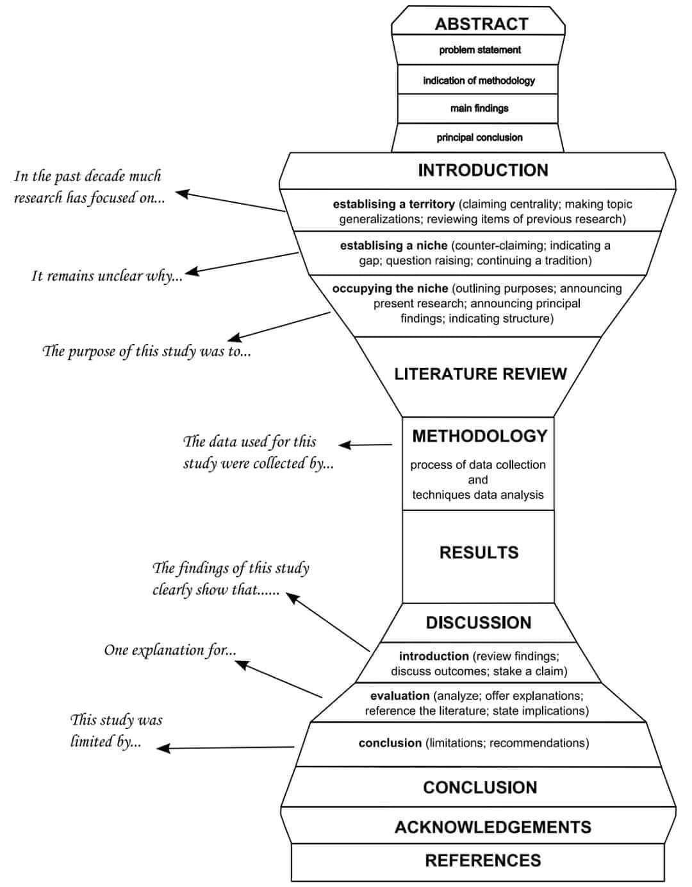

# Структура академічної статті: модель «піскового годинника»

Діаграма нижче — класична модель академічного тексту: фокус звужується від широкого контексту до методології, потім знову розширюється у висновках. Зліва — шаблонні фрази; справа — форма. Пройдемо її на одному прикладі: стаття *«Perspective Maintenance in Kubernetes Cluster Monitoring: Remediating Failures Before They Strike»*. **Perspective maintenance** тут — не синхронізація дашбордів, а режим, коли команду бачить аварію ще до того, як вона вразила production, і встигає її виправити.

---

**Abstract.** У типовому K8s-кластері (36 вузлів, ~900 Pod-ів) більшість P1-інцидентів у нашій вибірці (n=31 за вісім місяців) мали передвісники за 20–90 хвилин до першого user-facing timeout — зростання `container_memory_working_set_bytes`, drift у `kube_pod_status_ready`, попередження `FailedScheduling`. Ми виміряли, як команди переходять від реактивного on-call до *perspective maintenance*: випереджувального виявлення та remediation до порушення SLO (внутрішня ціль надійності, напр. «99,9% запитів без 5xx»). Метод — 90 днів Prometheus-метрик + журнал змін, що не потрапили в post-mortem. Результат: у кластері з формалізованим «випереджувальним вікном» 61% потенційних відмов було закрито до ескалації; median lead time — 34 хв до гіпотетичного impact. Висновок: мета *perspective maintenance* — не швидше будити людину о 3:00, а не допускати дзвінка взагалі.

**Introduction — establishing a territory.** Kubernetes рідко вражає без попередження: між memory drift у Pod і першим timeout для користувача часто проходить до години — сигнал уже в кластері, impact ще ні. *In the past decade much research has focused on observability in cloud-native systems* — і майже весь цей напрям зводиться до одного: не втратити момент, коли стало погано. Зібрати метрики, підняти on-call, розібрати post-mortem. Ця частина території зайнята **попередніми роботами**: галузь уже вміє фіксувати, що зламалось. Наша новизна — не тут.

**Introduction — establishing a niche.** *It remains unclear why* однаково налаштовані кластери різняться за кількістю нічних P1: у кластері A `payments-api` падає на OOMKill без попередження, у кластері B той самий патерн memory drift видно за годину — Pod перезапускають, limits піднімають, deploy відкочують, поки ingress ще віддає 200. Література добре описує detection latency; слабко — *anticipatory remediation*: бачити аварію на підході й закривати її до impact.

**Introduction — occupying the niche.** *The purpose of this study was to* визначити сигнали та практики perspective maintenance у трьох production-кластерах, порахувати частку інцидентів, нейтралізованих до порушення SLO, і запропонувати мінімальний набір recording rules + runbook-кроків для випередження. Далі — огляд літератури, метод, результати, обговорення.

**Literature review.** Роботи з predictive monitoring і anomaly detection (AIOps, Prophet, seasonal decomposition на TSDB) наближаються до прогнозу; chaos engineering і failure injection перевіряють стійкість *після* контрольованого удару. Canary analysis і progressive delivery зменшують blast radius, але не замінюють щоденне «тримання перспективи» — звичку дивитись не на `up==1`, а на *траєкторію* toward failure. Прогалина: мало емпірики про операційні ритуали, коли on-call закриває тікет із міткою `preempted`, а не `incident`. Наше дослідження заповнює цей зазор.

**Methodology.** *The data used for this study were collected by* експорт 90 днів метрик (scrape 15s), 31 post-mortem і 19 «тихих» записів у change log — випадки, коли деградацію усунули без ескалації. Критерій perspective maintenance: технічний сигнал (наприклад, restart count > 2 за 10 хв або memory slope > порогу) з’явився *до* `http_requests_total{status="5xx"}` або `probe_success==0`, і remediation завершено в тому ж вікні. Кластери: два production (fintech), один staging як контроль без випереджувальних правил. Порівняння: частка pre-impact fixes, lead time, false-positive rate на превентивні алерти.

**Results.** У кластері без perspective maintenance 94% подій досягали user-facing SLO breach; після впровадження пари recording rules (`predict_linear` на disk usage, rate на OOMKilled containers, `kube_pod_container_status_restarts_total` з вікном 15m) і runbook-кроку «fix on yellow, not on red» — 61% аномалій закрито до 5xx. Типовий кейс: `node_filesystem_avail_bytes` на `/var/lib/kubelet` падає на 1.2%/год — PVC розширено о 14:00, о 16:30 би зупинився scheduler; post-mortem не писали, бо користувачі нічого не помітили. Інший: HPA додав репліки після ручного порогу на RPS-derivative, а не після latency spike. False positives на превентивні алерти — 12%; прийнятно для команди з error budget.

**Discussion — introduction.** *The findings of this study clearly show that* perspective maintenance — це зсув часової осі моніторингу назад: не «що впало», а «що впаде, якщо не чіпнути за N хвилин». K8s цьому сприяє й заважає: kube-state-metrics дає ранні події (`FailedScheduling`, `Unhealthy`), але агрегований «зелений» дашборд приховує drift, поки не стане пізно.

**Discussion — evaluation.** *One explanation for* успішного випередження — комбінація похідних метрик (slope, not snapshot) і культури змін без очікування P1: rollback canary при першому аномальному restart, а не при повному CrashLoopBackOff. Це узгоджується з ідеєю weak signals у distributed systems. Наслідок: бюджет on-call варто рахувати не лише MTTR, а й кількість «аварій, яких не було»; превентивний алерт дешевший за pager о третій ночі.

**Discussion — conclusion of section.** *This study was limited by* трьома кластерами, ручною розміткою «чи встигли б ударити», та доменом fintech (передбачувані піки навантаження). Рекомендація: додати в on-boarding розділ «жовтий ≠ OK»; перевірити, чи k8s_llm-асистент може пропонувати remediation на основі траєкторії, а не лише пояснювати вже впалий Pod.

**Conclusion.** Моніторинг Kubernetes досяг зрілості в «бачити поломку». Perspective maintenance — наступний крок: **бачити поломку до удару і вже мати patch у production**. Формалізація випереджувальних правил зменшила share of SLO breaches майже вдвічі. Ширший висновок: надійність — не лише швидке відновлення, а дисципліна не допускати аварії туди, де її побачить користувач.

**Acknowledgements.** Автори дякують SRE-команді за журнали «тихих» фіксів, рецензенту за уточнення визначення perspective maintenance, та колегам з `#kubernetes-ops` за приклади pre-impact remediation.

**References.** Burns, B., Beda, J. — *Kubernetes*; Google — *Site Reliability Engineering*; CNCF Observability Whitepaper; Beyer et al. — weak signals; Prometheus docs — `predict_linear`, recording rules; внутрішні change logs [anon.]; Robeyns, P. — anticipatory governance (для теоретичного обґрунтування випередження).

---

Діаграма «піскового годинника» тут не декорація. Abstract і Conclusion говорять про одну проблему — аварії, яких користувач не побачив; Methodology — найвужча точка, де треба чесно визначити, що вважати «встигли виправити до impact». Шаблонні фрази зліва на малюнку — маршрутні знаки; зміст вище — приклад під вашу термінологію. Логіка та сама: звуження до «як виміряли», розширення до «що це змінює в SRE».
