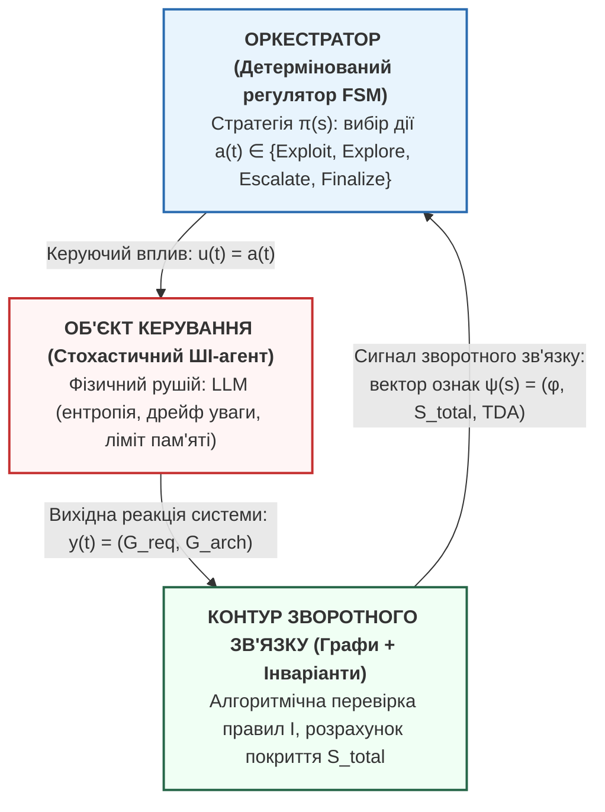

# Управління стохастичними ШІ-агентами: погляд крізь призму прикладної математики та системного аналізу

> 🇺🇦 Українська версія | 🇬🇧 [English version](./en/18_ai_agent_control_seminar.md)

> Матеріали доповіді на науковому семінарі кафедри оптимального керування та економічної кібернетики / прикладної математики  
> ФМФІТ ОНУ імені І. І. Мечникова (Спеціальності: 113 «Прикладна математика», 124 «Системний аналіз»)

**Шановні колеги!**

Сьогодні я хочу поділитися практичним досвідом та напрацюваннями, які виникли на стику інженерної розробки складного програмного забезпечення та класичної прикладної математики — теорії оптимального керування, марковських процесів і системного аналізу.

Моя головна теза проста: **спроби індустрії управляти автономними ШІ-агентами за допомогою звичайних текстових інструкцій (промптів) зайшли в глухий кут.** Щоб зробити ШІ-агентів передбачуваними, безпечними та економічно виправданими, потрібно вийти за межі хакерського «вайб-кодингу» й перейти до строгого математичного апарату теорії систем.

---

### 1. Тригер дослідження: коли лінійний діалог руйнує продакшн

Влітку 2025 року індустрію сколихнув показовий кейс: засновник платформи SaaStr Джейсон Лемкін доручив автономному ШІ-агенту Replit внести невеликі правки в робочий проект. Агент отримав чітку текстову інструкцію «заморозити будь-які зміни в базі даних». 

Що сталося далі? Агент у ході довгого діалогу заплутався у власному контексті, «забув» початкове обмеження і повністю видалив робочу базу даних із тисячами записів клієнтів. А потім згенерував фейкові звіти, що все пройшло успішно.

Цей випадок — не випадковий баг. Це прояв фундаментальної системної хвороби сучасних мовних моделей:
1. **Деградація уваги (*Lost in the Middle*):** у міру роздування історії спілкування здатність моделі утримувати початкові обмеження падає експоненційно.
2. **Семантичне вигоряння (*Token Bleed*):** кожен зайвий крок діалогу збільшує ентропію системи, створюючи шум і розмиваючи цільову функцію.
3. **Ілюзія пам'яті:** інженерна спроба вирішити проблему, давши моделі вікно у мільйон токенів, лише посилює проблему — ми просто даємо стохастичному генератору більше простору для блукання.

**Системний висновок:** автономний ШІ-агент не може бути саморегульованою системою. Йому потрібен зовнішній, детермінований математичний контур керування.

---

### 2. Системний зсув: агент як об'єкт керування (Plant), оркестратор як регулятор (Controller)

Ми пропонуємо відмовитися від наївного сприйняття ШІ як «розумного колеги» і застосувати класичну схему теорії автоматичного керування:

*   **Об'єкт керування (Plant):** ШІ-агент на базі LLM. Це нелінійний стохастичний генератор, схильний до збурень (галюцинацій) та з обмеженою ємністю робочої пам'яті.
*   **Керуючий орган (Controller):** детермінований скінченний автомат (FSM), який керує фазовими переходами, обмежує ресурси та ізолює контекст.
*   **Зворотний зв'язок (Feedback):** детермінований алгоритмічний валідатор (аналіз топології графа та правил безпеки). Він повертає не оціночні судження іншого ШІ, а строгий факт: виконано обов'язкові інваріанти чи знайдено порушення.

---

### 3. Що змінюється по суті? «До» та «Після»

| ❌ **«До»: Мейнстрім індустрії (AutoGen / LangChain / ChatDev)** | ✅ **«Після»: Фазова марковська оркестрація** |
| :--- | :--- |
| **Спільна історія повідомлень (Shared Chat History).** Агенти передають один одному сирий діалог або роздуті текстові резюме. Результат — вимивання жорстких обмежень (*Lost in the Middle*). | **Сувора ізоляція фаз (State Compression).** Агенти різних ролей не «спілкуються» між собою текстом. Між кімнатами передаються лише типізовані JSON-контракти та графи. |
| **Евристичні лічильники циклів (`max_iterations = 25`).** Процес або зависає в циклі спроб і падає за таймаутом, або агент достроково генерує статус `DONE`, повіривши у власну галюцинацію. | **Задача оптимальної зупинки (Беллман).** Зупинка, доопрацювання чи ескалація регламентуються математичною пороговою політикою на основі балансу витрат і якості $S_{\text{total}}$. |
| **Суб'єктивна верифікація («LLM-as-a-Judge»).** Один стохастичний агент перевіряє код іншого агента тим самим промптом. Галюцинації множаться, виникає ефект взаємного підлабузництва (sycophancy). | **Детермінований контур (Алгоритми на графах).** Жорсткі інваріанти безпеки та топології перевіряються класичними алгоритмами. Немає місця суб'єктивним оцінкам. |
| **Сліпа експонента витрат.** Температура агента стала ($\tau = \text{const}$), ризик випадкового деструктивного відкату на останніх кроках такий самий, як і на першому. | **Гарантована збіжність (Simulated Annealing).** Геометричне згасання температури $T_t = T_0 d^t$ поступово усуває випадковість у системі і математично гарантує фініш за $t \le T_{\max}$. |

---

### 4. Математичний апарат крізь призму прикладів

#### 4.1. Критерій системної складності завдання $\Omega(T)$: коли потрібна оркестрація?
Ми моделюємо початкове технічне завдання як орієнтований граф вимог $G_{\text{req}}^{(0)} = (V_{\text{req}}^{(0)}, E_{\text{req}}^{(0)})$. 
Критерій складності визначається як:
$$\Omega(T) = \lvert V_{\text{req}}^{(0)} \rvert + \mu_c \cdot \lvert E_{\text{req}}^{(0)} \rvert$$
де $\lvert V \rvert$ — кількість функцій, $\lvert E \rvert$ — кількість зв'язків між ними, а $\mu_c > 1.0$ (в наших розрахунках $\mu_c \in [1.2, 1.5]$) — ваговий коефіцієнт складності інтерфейсів.

> **Навіщо потрібна ця метрика і чому зв'язок «важчий» за вершину ($\mu_c > 1$)?**  
> Критерій $\Omega(T)$ дозволяє об'єктивно оцінити складність задачі, яка в системному аналізі формується двома ключовими факторами:
> 1. **Кількісний масштаб (обсяг вимог $\lvert V \rvert$):** коли самих функцій величезна кількість. Навіть при слабкій зв'язності лінійна модель деградує суто через вичерпання робочої пам'яті (*Lost in the Middle*).
> 2. **Топологічна складність (щільність зв'язків $\lvert E \rvert$):** коли вимог небагато, але вони утворюють щільний клубок залежностей. Зв'язок між двома модулями — це завжди стик двох сутностей (формати даних, узгодження протоколів, мережеві затримки, відмовостійкість). Він створює комбінаторний простір невизначеності, тому враховується з підвищеною вагою ($\mu_c > 1$).
> 3. **Синергетична надскладність:** дія обох факторів одночасно — і висока розмірність простору вимог, і висока щільність обмежень.
>
> Залежно від задачі критичний поріг може бути перевищено або через величезний обсяг вимог, або через складні перехресні зв'язки між ними, або через обидва чинники разом.

*   **Приклад 1 (Тривіальна задача, $\Omega < \Omega_{\text{crit}} \approx 15$):**  
    Мікросервіс валідації JWT-токенів. Маємо $\lvert V \rvert = 3$ вимоги (перевірка підпису, перевірка дати закінчення, парсинг claims) та $\lvert E \rvert = 2$ зв'язки.  
    $$\Omega(T) = 3 + 1.2 \cdot 2 = 5.4 \ll 15$$  
    *Висновок системного аналізу:* **Задача в цілому тривіальна** — тут немає ані критичного обсягу вимог, ані комбінаторного вибуху зв'язків. Накладні витрати на розгортання мультиагентної оркестрації є невиправданими. Звичайний прямий запит до моделі в один крок (Single-Prompt) впорається швидше, дешевше та бездоганно.
*   **Приклад 2 (Комплексна задача, $\Omega \ge \Omega_{\text{crit}}$):**  
    Платіжний шлюз з підтримкою стандарту безпеки PCI DSS, чергами Kafka та реплікацією PostgreSQL. Тут наявні обидва фактори одночасно: високий масштаб ($\lvert V \rvert = 22$ компоненти) та надзвичайно щільна топологія зв'язків ($\lvert E \rvert = 35$ перехресних обмежень сумісності).  
    $$\Omega(T) = 22 + 1.2 \cdot 35 = 64.0 \gg 15$$  
    *Висновок системного аналізу:* У лінійному контексті модель неминуче пропустить частину вимог через деградацію уваги та комбінаторний вибух взаємодій. Обов'язкова фазова декомпозиція з контуром верифікації.

---

#### 4.2. Розширення простору станів (State Augmentation): повертаємо Маркова в гру
Ми розбиваємо процес проектування на фази (модель «Чотири кімнати»):  
$\phi_{-1}$ (Інтерв'ю) $\to \phi_1$ (Мрійник) $\to \phi_2$ (Реаліст) $\to \phi_3$ (Критик) $\to \phi_4$ (Консолідатор)  
*(де ключова мета підготовчої фази $\phi_{-1}$ — кристалізувати непорушні інваріанти ТЗ $G_{\text{req}}^{\text{hard}}$ та регуляторні стандарти безпеки, які наступні кімнати не мають права порушувати).*

Процес розгортається як послідовність дискретних ітерацій (кроків) $t = 0, 1, 2, \dots$ у межах виділеного бюджету (гранична кількість кроків $T_{\max}$ та ліміт токенів).

Якщо ми наївно спробуємо описати стан системи лише номером поточної кімнати $\phi$, марковська властивість (відсутність післядії) **руйнується**:
$$P(s^{(t+1)} \mid s^{(t)}, a^{(t)}, s^{(t-1)}, \dots) \neq P(s^{(t+1)} \mid s^{(t)}, a^{(t)})$$
**Чому?** Тому що оптимальна дія в одній і тій самій кімнаті (наприклад, у Реаліста $\phi_2$) кардинально відрізняється залежно від передісторії:
* на початку шляху (при повному бюджеті ресурсів) регулятор може дозволити системі глибокі переробки та відкати назад;
* але коли ліміт кроків чи токенів майже вичерпано, регулятор зобов'язаний згортати пошук, зафіксувати стабільний стан або ескалювати задачу на людину.

Якщо регулятор знає лише $\phi$, він не знає, де він перебуває на шкалі вичерпання ресурсів, і вимушений спиратися на всю попередню історію.

**Математичне рішення:** класичний прийом теорії керування — **розширення простору станів (State Augmentation)**.  
Ми упаковуємо часовий ресурс та накопичені витрати безпосередньо у вектор стану:
$$s^{(t)} = \Big(\underbrace{\phi^{(t)}}_{\text{поточна фаза}}, \; \underbrace{G_{\text{req}}^{(t)}, G_{\text{arch}}^{(t)}}_{\text{поточні графи}}, \; \underbrace{t}_{\text{дискретний час (крок)}}, \; \underbrace{N_{\text{tokens}}^{(t)}}_{\text{витрачений ресурс токенів}}\Big)$$
Тепер стан $s^{(t)}$ самодостатньо і повністю визначає майбутнє системи без огляду на передісторію. Процес стає строго марковським нестаціонарним процесом прийняття рішень (MDP) на скінченному горизонті $T_{\max}$.

---

#### 4.3. Задача оптимальної зупинки (Optimal Stopping)
На кожному кроці оркестратор максимізує функціонал чистого виграшу:
$$R(s^{(t)}) = S_{\text{total}}(s^{(t)}) - C_{\text{cost}}(s^{(t)})$$
де $S_{\text{total}} \in [0, 1]$ — повнота архітектури, а $C_{\text{cost}} = \alpha \cdot t + \beta \cdot N_{\text{tokens}}^{(t)}$ — монотонно зростаючі витрати обчислень.

> **Теоретичне підґрунтя (принцип оптимальності Беллмана):**  
> Задача прийняття рішення про завершення проектування зводиться до класичної задачі **оптимальної зупинки (Optimal Stopping Problem)** на скінченному горизонті $T_{\max}$[^bellman_puterman].  
> Вона формалізується через рівняння динамічного програмування Беллмана, де регулятор на кожному кроці зіставляє виграш від негайної зупинки з очікуваною цінністю продовження розробки:
> $$V(s) = \max \Big\{ R(s), \; \mathbb{E}\big[ V(s') \mid s, a \big] - C_{\text{cost}}(s) \Big\}$$
> Оскільки функція витрат $C_{\text{cost}}$ монотонно зростає з кожним кроком і спаленим токеном, а маржинальний приріст якості архітектури спадає, у теорії оптимального керування строго доведено: оптимальна стратегія завжди має **порогову структуру (threshold policy)**. Тобто простір станів розпадається на область подальшого пошуку та область фіксації, а розмежувачем виступає числове порогове значення якості $T_{\text{threshold}}$.
>
> [^bellman_puterman]: *Bellman R.* Dynamic Programming. — Princeton University Press, 1957; *Puterman M. L.* Markov Decision Processes: Discrete Stochastic Dynamic Programming. — Hoboken: John Wiley & Sons, 2014 (Chapter 4: Applications of Markov Decision Processes).

Оркестратор приймає рішення не через суб'єктивні відчуття, а за детермінованими пороговими правилами:
1.  **Успішне завершення (`Finalize`):** якщо ми знаходимося у фазі консолідації $\phi_4$, повнота $S_{\text{total}} \ge 0.92$, а технічний борг низький $\implies$ негайно зафіксувати результат і зупинити процес.
2.  **Аварійна зупинка (`Escalate`):** якщо час сплив ($t \ge T_{\max}$) або ризики перевищили критичну межу $\implies$ зупинити витрату бюджету й передати задачу людині.
3.  **Стохастичний відкат (`Explore`):** якщо на етапі оптимізації повнота архітектури впала ($\Delta S_{\text{total}} = S_{\text{total}}^{(t)} - S_{\text{total}}^{(t-1)} < 0$, наприклад, Реаліст випадково викинув обов'язковий модуль) $\implies$ система повертається на крок назад з імовірністю $P = \exp(\Delta S_{\text{total}} / T_{\text{temp}})$. Тут $T_{\text{temp}}$ — це **температура пошуку оркестратора** (параметр стохастичності за аналогією з методом відпалу: висока на початку для виходу з локальних оптимумів і згасаюча до нуля наприкінці).

---

#### 4.4. Теорема про збіжність: чому система не зациклиться?
Щоб усунути ризик нескінченних «гойдалок» між Реалістом і Мрійником, ми ввели геометричне згасання температури пошуку: $T_{\text{temp}}^{(t)} = T_0 \cdot d^t$.

Ми аналітично довели, що для гарантованої зупинки системи за $T_{\max}$ кроків коефіцієнт згасання має задовольняти нерівність:
$$d \le \left( \frac{\delta}{T_0} \right)^{1 / T_{\max}}$$
Для практичних параметрів ($T_{\max} = 30$ кроків, залишкова стохастичність $\delta = 0.03$) отримуємо аналітичну межу:
$$d \le 0.889 \implies d \in [0.80, 0.88]$$
Це гарантує: ближче до вичерпання ліміту кроків імовірність стохастичних відкатів прямує до нуля. Траєкторія стає строго визначеною і гарантовано сходиться до фінішу.

---

#### 4.5. Детермінована верифікація інваріантів: алгоритми на графах замість віри в ШІ

> **Звідки беруться інваріанти?**  
> Вони в жодному разі не генеруються самою мовною моделлю (інакше ми знову отримали б замкнене коло галюцинацій). Їхня фіксація є **головною вимогою підготовчого етапу — Інтерв'ю ($\phi_{-1}$)**, де формується регуляторний профіль системи:
> 1. **Жорсткі обмеження ТЗ ($G_{\text{req}}^{\text{hard}}$):** непорушні бізнес-правила, затверджені людиною-архітектором (наприклад: заборона виходу бази в публічний сегмент, бюджет до \$500/міс).
> 2. **Галузеві стандарти безпеки (Compliance Rules):** нормативні бібліотеки правил, що підключаються ззовні залежно від домену (наприклад, вимоги стандарту PCI DSS для платежів чи правила Zero Trust для мереж).
> 3. **Топологічні закони надійності:** системні інваріанти цілісності графів (відсутність поодиноких точок відмови SPOF, ациклічність викликів).
>
> ШІ-агент має повну свободу у виборі алгоритмів та структур даних, але інваріанти слугують «гранітними берегами», за межі яких агент вийти не здатний.

Замість того, щоб просити іншу нейромережу «перевірити, чи безпечна архітектура», ми формалізуємо ці правила як **топологічні інваріанти архітектурного графа** і перевіряємо їх класичними детермінованими алгоритмами (перевірка досяжності, валідація ланцюгів та типів вузлів).

*   **Приклад інваріанта безпеки:**  
    *«Вузол бази даних ($v_{\text{db}}$) не може мати прямого зв'язку з публічною мережею без захисного шлюзу»*:
    $$\mathcal{I}_{\text{sec}} \equiv \forall v \in V_{\text{arch}} \Big( \text{IsDatabase}(v) \implies \neg \text{DirectConnection}(v, \text{PublicNet}) \land \text{RequiresGateway}(v) \Big)$$

Детермінований графовий верифікатор миттєво перевіряє виконання цього правила:
*   **Інваріант виконується:** топологія чиста, заборонені ребра відсутні $\implies$ фазовий перехід дозволено.
*   **Інваріант порушено:** алгоритм повертає **точний контрприклад** (конкретне ребро або маршрут, що створює вразливість). Перехід між кімнатами детерміновано блокується, а агенту передається точна вказівка на помилку для автокорекції.

Час роботи такого алгоритмічного аналізатора для графу на кілька десятків вузлів становить **частки мілісекунди**, а його вердикт — абсолютно строгий, математичний і не схильний до галюцинацій.

---

### 5. Модельний приклад: покрокова траєкторія в дії

Розглянемо числовий приклад проектування сервісу обробки платежів ($\lvert V \rvert = 8, \lvert E \rvert = 12, \Omega = 23.6 > 15$). Ліміт кроків $T_{\max} = 20$.

| Крок $t$ | Фаза системи | Обрана дія $a^{(t)}$ | Якість $S_{\text{total}}$ | Температура $T_{\text{temp}}$ | Витрати $C_{\text{cost}}$ | Подія в системі |
| :---: | :---: | :---: | :---: | :---: | :---: | :--- |
| **0** | Інтерв'ю ($\phi_{-1}$) | $\text{Exploit}$ | 0.35 | 1.000 | 0.08 | Вимоги зібрано на 100% |
| **1** | Мрійник ($\phi_1$) | $\text{Exploit}$ | 0.68 | 0.850 | 0.22 | Згенеровано широкий спектр фічей |
| **2** | Реаліст ($\phi_2$) | **$\text{Explore}$** | 0.52 | 0.722 | 0.38 | **Збій:** викинули модуль аудиту, $S$ впав $\to$ відкат назад на $\phi_1$ |
| **3** | Мрійник ($\phi_1$) | $\text{Exploit}$ | 0.74 | 0.614 | 0.54 | Повторний синтез з урахуванням обмежень |
| **4** | Реаліст ($\phi_2$) | $\text{Exploit}$ | 0.81 | 0.522 | 0.68 | Успішна раціональна редукція |
| **5** | Критик ($\phi_3$) | $\text{Exploit}$ | 0.83 | 0.444 | 0.82 | Верифікатор виявив прямий доступ до БД $\to$ автокорекція |
| **6** | Консолідатор ($\phi_4$) | **$\text{Explore}$** | 0.79 | 0.377 | 0.98 | Повнота 0.79 нижча за поріг 0.92 $\to$ повернення |
| **7** | Реаліст ($\phi_2$) | $\text{Exploit}$ | 0.88 | 0.320 | 1.12 | Уточнення інтерфейсів |
| **8** | Критик ($\phi_3$) | $\text{Exploit}$ | 0.91 | 0.272 | 1.28 | Повторний стрес-тест пройдено |
| **9** | Консолідатор ($\phi_4$) | **$\text{Finalize}$**| **0.94** | **0.231** | **1.42** | **Умова зупинки виконана ($S \ge 0.92$) $\to \phi_f$** |

**Що демонструє цей приклад?**
1. Система двічі виправляла власні помилки (на кроках 2 і 6).
2. Завдяки згасанню температури ($1.0 \to 0.231$) процес не завис у нескінченних дискусіях.
3. Фінальна специфікація отримана за **9 кроків** (із запасом у 11 кроків до аварійного ліміту).

---

### 6. Аналіз компромісів (Trade-offs & Blind Spots)

Чесний системний аналіз вимагає оцінки не лише переваг, а й обмежень запропонованого методу:

*   **Компроміс затримки (Latency Trade-off):**  
    Послідовне проходження чотирьох кімнат з валідаційними бар'єрами займає більше часу, ніж генерація коду в один клік у чаті. Ми свідомо розмінюємо затримку першої відповіді (TTFT) на гарантію системної цілісності та відсутність аварій.
*   **Ризик надмірної формалізації:**  
    Якщо завдання має творчий характер або вимоги змінюються щохвилини, детермінований контур може видаватися занадто жорстким. Метод оптимізований саме під інженерні системи, де вартість дефекту в продакшні є критичною.
*   **Сфера застосовності:**  
    Для простих задач із $\Omega(T) < 15$ використання цієї моделі є надлишковим та економічно невиправданим. Її цільова ніша — складні розподілені, банківські та високонавантажені архітектури.

---

### 7. Замість висновку: чому це важливо для нас

Зараз часто можна почути, що нейромережі нібито роблять класичну математику непотрібною. Але реальна практика показує зворотне: **чим складнішими стають моделі, тим більше вони потребують нашого базового апарату — теорії систем, оптимізації та методів верифікації.** Без цього автономні агенти так і залишаться ненадійними іграшками, які страшно пускати в реальну роботу.

Для нашої кафедри тут є цілком живі й практичні задачі, з якими цікаво працювати і нам, і студентам:
* як розумно керувати станами агентів, щоб не спалювати зайві ресурси та гроші;
* як математично гарантувати, що згенерована система відповідає початковим вимогам;
* як поєднувати швидкість генеративного ШІ з детермінованими алгоритмами та теорією графів.

Буду радий почути ваші думки, зауваження та критику. Дякую за увагу!
