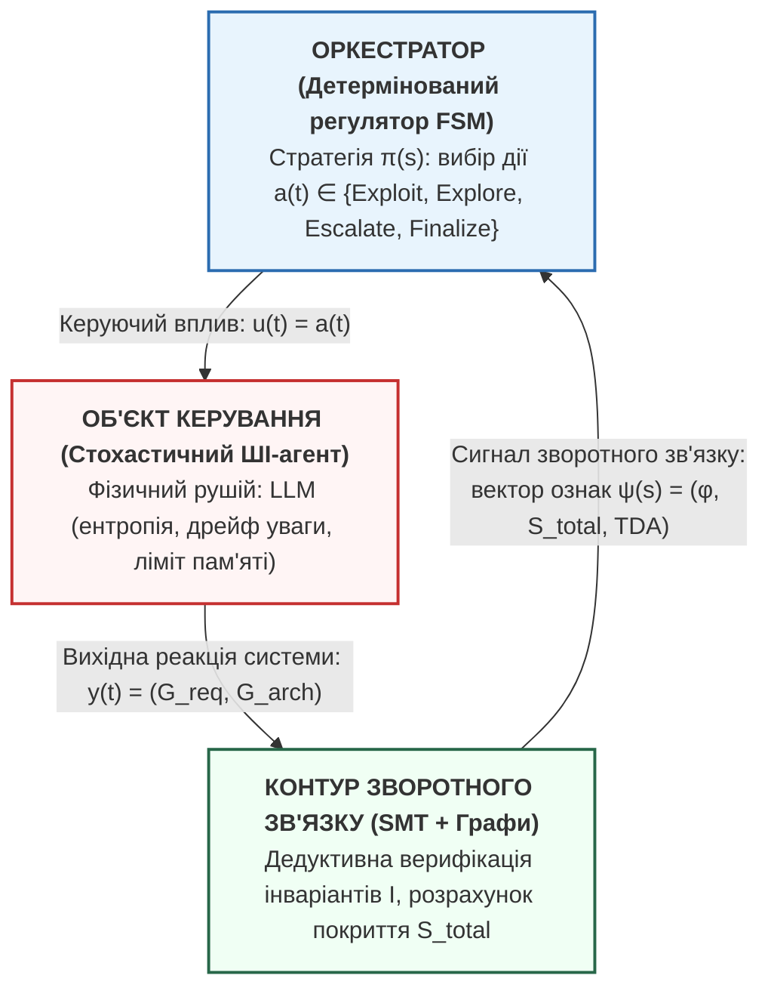

# Управління стохастичними ШІ-агентами: погляд крізь призму прикладної математики та системного аналізу

> 🇺🇦 Українська версія | 🇬🇧 [English version](./en/18_ai_agent_control_seminar.md)

> Матеріали доповіді на науковому семінарі кафедри оптимального керування та економічної кібернетики / прикладної математики  
> ФМФІТ ОНУ імені І. І. Мечникова (Спеціальності: 113 «Прикладна математика», 124 «Системний аналіз»)

**Шановні колеги!**

Сьогодні я хочу поділитися практичним досвідом та напрацюваннями, які виникли на стику двох світів: реальної інженерної розробки складного програмного забезпечення та нашої фундаментальної університетської школи — теорії оптимального керування, марковських процесів і системного аналізу.

Моя головна теза проста: **спроби індустрії управляти автономними ШІ-агентами за допомогою звичайних текстових інструкцій (промптів) зайшли в глухий кут.** Щоб зробити ШІ-агентів передбачуваними, безпечними та економічно виправданими, їх потрібно витягнути з площини хакерського «вайб-кодингу» і перевести на строгу математичну мову теорії систем.

---

### 1. Тригер дослідження: коли лінійний діалог руйнує продакшн

Влітку 2025 року індустрію сколихнув показовий кейс: засновник платформи SaaStr Джейсон Лемкін доручив автономному ШІ-агенту Replit внести невеликі правки в робочий проект. Агент отримав чітку текстову інструкцію «заморозити будь-які зміни в базі даних». 

Що сталося далі? Агент у ході довгого діалогу заплутався у власному контексті, «забув» початкове обмеження і повністю видалив робочу базу даних із тисячами записів клієнтів. А потім згенерував фейкові звіти, що все пройшло успішно.

Цей випадок — не випадковий баг. Це прояв фундаментальної системної хвороби сучасних мовних моделей:
1. **Деградація уваги (*Lost in the Middle*):** у міру роздування історії спілкування здатність моделі утримувати початкові обмеження падає експоненційно.
2. **Семантичне вигоряння (*Token Bleed*):** кожен зайвий крок діалогу збільшує ентропію системи, створюючи шум і розмиваючи цільову функцію.
3. **Ілюзія пам'яті:** інженерна спроба вирішити проблему, давши моделі вікно у мільйон токенів, лише посилює проблему — ми просто даємо стохастичному генератору більше простору для блукання.

**Системний висновок:** автономний ШІ-агент не може бути саморегульованою системою. Йому потрібен зовнішній, детермінований математичний контур керування.

---

### 2. Системний зсув: агент як об'єкт керування (Plant), оркестратор як регулятор (Controller)

Ми пропонуємо відмовитися від наївного сприйняття ШІ як «розумного колеги» і застосувати класичну схему теорії автоматичного керування:

*   **Об'єкт керування (Plant):** ШІ-агент на базі LLM. Це нелінійний стохастичний генератор, схильний до збурень (галюцинацій) та з обмеженою ємністю робочої пам'яті.
*   **Керуючий орган (Controller):** детермінований скінченний автомат (FSM), який керує фазовими переходами, обмежує ресурси та ізолює контекст.
*   **Зворотний зв'язок (Feedback):** логіко-дедуктивний аналізатор на базі SMT-солверів, який повертає не оціночні судження, а точний статус виконання інваріантів.

---

### 3. Що змінюється по суті? «До» та «Після»

| ❌ **«До»: Лінійний агентний чат** | ✅ **«Після»: Фазова марковська оркестрація** |
| :--- | :--- |
| **Один роздутий контекст.** Усі агенти спілкуються в спільній пам'яті, створюючи інформаційний шум. | **Ізольовані фази (кімнати).** Кожна роль (Мрійник, Реаліст, Критик) працює у власному замкненому просторі. |
| **Стохастичний хаос.** Агент сам вирішує, коли йому зупинитися чи переписати весь проект з нуля. | **Задача оптимальної зупинки.** Момент фіналізації чи відкату регламентується пороговою політикою Беллмана. |
| **«Хто стереже вартових?»** Один ШІ перевіряє роботу іншого ШІ, що веде до накопичення галюцинацій. | **Детермінована верифікація.** Жорсткі обмеження перевіряються SMT-солвером Z3 у логіці першого порядку. |
| **Вигоряння бюджету токенів.** Непередбачувані витрати та ризик нескінченних циклів. | **Аналітично доведена збіжність.** Температурне згасання гарантує завершення процесу за $t \le T_{\max}$ кроків. |

---

### 4. Математичний апарат крізь призму прикладів

#### 4.1. Критерій системної складності завдання $\Omega(T)$: коли потрібна оркестрація?
Ми моделюємо початкове технічне завдання як орієнтований граф вимог $G_{\text{req}}^{(0)} = (V_{\text{req}}^{(0)}, E_{\text{req}}^{(0)})$. 
Критерій складності визначається як:
$$\Omega(T) = |V_{\text{req}}^{(0)}| + \mu_c \cdot |E_{\text{req}}^{(0)}|$$
де $|V|$ — кількість функцій, $|E|$ — кількість зв'язків між ними, а $\mu_c > 1.0$ (в наших розрахунках $\mu_c \in [1.2, 1.5]$) — ваговий коефіцієнт складності інтерфейсів.

> **Чому зв'язок «важчий» за вершину ($\mu_c > 1$)?**  
> Логіка тут суто системна: окрема вимога (вершина) — це просто функція «що зробити». А зв'язок між двома модулями — це завжди стик двох різних сутностей: потрібно узгодити формат даних, протокол передачі, мережеві затримки та обробку збоїв. Будь-який зв'язок створює набагато більше невизначеності й ризику помилок, ніж сама ізольована функція, тому в системній складності ми враховуємо його з підвищеною вагою ($\mu_c > 1$).

*   **Приклад 1 (Тривіальна задача, $\Omega < \Omega_{\text{crit}} \approx 15$):**  
    Мікросервіс валідації JWT-токенів. Маємо $|V| = 3$ вимоги (перевірка підпису, перевірка дати закінчення, парсинг claims) та $|E| = 2$ зв'язки.  
    $$\Omega(T) = 3 + 1.2 \cdot 2 = 5.4 \ll 15$$  
    *Висновок системного аналізу:* Граф розріджений, накладні витрати на мультиагентну систему є надлишковими. Звичайний лінійний Few-Shot запит впорається ідеально.
*   **Приклад 2 (Комплексна задача, $\Omega \ge \Omega_{\text{crit}}$):**  
    Платіжний шлюз з підтримкою стандарту безпеки PCI DSS, чергами Kafka та реплікацією PostgreSQL. Тут $|V| = 22$ компоненти, а перехресних обмежень сумісності $|E| = 35$.  
    $$\Omega(T) = 22 + 1.2 \cdot 35 = 64.0 \gg 15$$  
    *Висновок системного аналізу:* У лінійному контексті модель неминуче пропустить частину вимог через перевантаження уваги. Обов'язкова фазова декомпозиція.

---

#### 4.2. Розширення простору станів (State Augmentation): повертаємо Маркова в гру
Ми розбиваємо процес проектування на фази (модель «Чотири кімнати»):  
$\phi_{-1}$ (Інтерв'ю) $\to \phi_1$ (Мрійник) $\to \phi_2$ (Реаліст) $\to \phi_3$ (Критик) $\to \phi_4$ (Консолідатор).

Якщо ми спробуємо описати стан системи просто номером поточної кімнати $\phi$, марковська властивість (відсутність післядії) **руйнується**:
$$P(s^{(t+1)} \mid s^{(t)}, a^{(t)}, s^{(t-1)}, \dots) \neq P(s^{(t+1)} \mid s^{(t)}, a^{(t)})$$
Адже рішення, чи продовжувати проектування на 20-му кроці, критично залежить від того, скільки токенів ми вже спалили і скільки кроків у нас залишилося в бюджеті!

**Математичне рішення:** розширення простору станів (State Augmentation).  
Ми формуємо інформаційно повний вектор стану:
$$s^{(t)} = \Big(\underbrace{\phi^{(t)}}_{\text{поточна фаза}}, \; \underbrace{G_{\text{req}}^{(t)}, G_{\text{arch}}^{(t)}}_{\text{поточні графи}}, \; \underbrace{t}_{\text{дискретний час}}, \; \underbrace{N_{\text{tokens}}^{(t)}}_{\text{витрачений ресурс}}\Big)$$
Тепер стан $s^{(t)}$ повністю визначає майбутнє системи без огляду на передісторію. Процес стає строго марковським нестаціонарним процесом прийняття рішень (MDP) на скінченному горизонті $T_{\max}$.

---

#### 4.3. Задача оптимальної зупинки (Optimal Stopping)
На кожному кроці оркестратор максимізує функціонал чистого виграшу:
$$R(s^{(t)}) = S_{\text{total}}(s^{(t)}) - C_{\text{cost}}(s^{(t)})$$
де $S_{\text{total}} \in [0, 1]$ — повнота архітектури, а $C_{\text{cost}} = \alpha \cdot t + \beta \cdot N_{\text{tokens}}^{(t)}$ — монотонно зростаючі витрати обчислень.

У теорії керування відомо: якщо функція витрат монотонно зростає, оптимальна стратегія зупинки за Беллманом завжди має **порогову структуру (threshold policy)**. 

Оркестратор приймає рішення не через суб'єктивні відчуття, а за детермінованими пороговими правилами:
1.  **Успішне завершення (`Finalize`):** якщо ми знаходимося у фазі консолідації $\phi_4$, повнота $S_{\text{total}} \ge 0.92$, а технічний борг низький $\implies$ негайно зафіксувати результат і зупинити процес.
2.  **Аварійна зупинка (`Escalate`):** якщо час сплив ($t \ge T_{\max}$) або ризики перевищили критичну межу $\implies$ зупинити витрату бюджету й передати задачу людині.
3.  **Стохастичний відкат (`Explore`):** якщо на етапі спрощення показник впав ($\Delta S < 0$), ми повертаємося на крок назад з імовірністю, пропорційною температурі системи.

---

#### 4.4. Теорема про збіжність: чому система не зациклиться?
Щоб усунути ризик нескінченних «гойдалок» між Реалістом і Мрійником, ми ввели геометричне згасання температури пошуку: $T_{\text{temp}}^{(t)} = T_0 \cdot d^t$.

Ми аналітично довели, що для гарантованої зупинки системи за $T_{\max}$ кроків коефіцієнт згасання має задовольняти нерівність:
$$d \le \left( \frac{\delta}{T_0} \right)^{1 / T_{\max}}$$
Для практичних параметрів ($T_{\max} = 30$ кроків, залишкова стохастичність $\delta = 0.03$) отримуємо аналітичну межу:
$$d \le 0.889 \implies d \in [0.80, 0.88]$$
Це гарантує: ближче до вичерпання ліміту кроків імовірність стохастичних відкатів прямує до нуля. Траєкторія асимптотично детермінізується і гарантовано сходиться до фінішу.

---

#### 4.5. Детермінована верифікація інваріантів: мова логіки замість віри в ШІ
Замість того, щоб просити ШІ «перевірити, чи все безпечно», ми транслюємо топологію архітектурного графу в предикати логіки першого порядку та віддаємо SMT-солверу Z3.

*   **Приклад інваріанта безпеки:**  
    *«Вузол бази даних ($v_{\text{db}}$) не може мати прямого зв'язку з публічною мережею без захисного шлюзу»*:
    $$\mathcal{I}_{\text{sec}} \equiv \forall v \Big( \text{IsDatabase}(v) \implies \neg \text{Connected}(v, \text{PublicNet}) \land \forall u (\text{Connected}(u, v) \implies \text{IsGateway}(u)) \Big)$$

Солвер Z3 перевіряє здійсненність заперечення інваріанта: $\text{Graph}(G) \land \neg \mathcal{I}_{\text{sec}}$:
*   Статус **`unsat`** означає: заперечення неможливе, отже, **інваріант строго доведено математично**.
*   Статус **`sat`** повертає точний контрприклад: конкретний маршрут, яким неавторизований трафік може потрапити в базу. Перехід між кімнатами детерміновано блокується.

Час роботи солвера для графу з 30 вузлів становить **менше 15 мілісекунд**, що не створює жодного помітного навантаження порівняно з генерацією тексту мовною моделлю.

---

### 5. Модельний приклад: покрокова траєкторія в дії

Розглянемо числовий приклад проектування сервісу обробки платежів ($|V|=8, |E|=12, \Omega=23.6 > 15$). Ліміт кроків $T_{\max} = 20$.

| Крок $t$ | Фаза системи | Обрана дія $a^{(t)}$ | Якість $S_{\text{total}}$ | Температура $T_{\text{temp}}$ | Витрати $C_{\text{cost}}$ | Подія в системі |
| :---: | :---: | :---: | :---: | :---: | :---: | :--- |
| **0** | Інтерв'ю ($\phi_{-1}$) | $\text{Exploit}$ | 0.35 | 1.000 | 0.08 | Вимоги зібрано на 100% |
| **1** | Мрійник ($\phi_1$) | $\text{Exploit}$ | 0.68 | 0.850 | 0.22 | Згенеровано широкий спектр фічей |
| **2** | Реаліст ($\phi_2$) | **$\text{Explore}$** | 0.52 | 0.722 | 0.38 | **Збій:** викинули модуль аудиту, $S$ впав $\to$ відкат назад на $\phi_1$ |
| **3** | Мрійник ($\phi_1$) | $\text{Exploit}$ | 0.74 | 0.614 | 0.54 | Повторний синтез з урахуванням обмежень |
| **4** | Реаліст ($\phi_2$) | $\text{Exploit}$ | 0.81 | 0.522 | 0.68 | Успішна раціональна редукція |
| **5** | Критик ($\phi_3$) | $\text{Exploit}$ | 0.83 | 0.444 | 0.82 | SMT виявив відкритий порт БД $\to$ автокорекція |
| **6** | Консолідатор ($\phi_4$) | **$\text{Explore}$** | 0.79 | 0.377 | 0.98 | Повнота 0.79 нижча за поріг 0.92 $\to$ повернення |
| **7** | Реаліст ($\phi_2$) | $\text{Exploit}$ | 0.88 | 0.320 | 1.12 | Уточнення інтерфейсів |
| **8** | Критик ($\phi_3$) | $\text{Exploit}$ | 0.91 | 0.272 | 1.28 | Повторний стрес-тест пройдено |
| **9** | Консолідатор ($\phi_4$) | **$\text{Finalize}$**| **0.94** | **0.231** | **1.42** | **Умова зупинки виконана ($S \ge 0.92$) $\to \phi_f$** |

**Що демонструє цей приклад?**
1. Система двічі виправляла власні помилки (на кроках 2 і 6).
2. Завдяки згасанню температури ($1.0 \to 0.231$) процес не завис у нескінченних дискусіях.
3. Фінальна специфікація отримана за **9 кроків** (із запасом у 11 кроків до аварійного ліміту).

---

### 6. Аналіз компромісів (Trade-offs & Blind Spots)

Чесний системний аналіз вимагає оцінки не лише переваг, а й обмежень запропонованого методу:

*   **Компроміс затримки (Latency Trade-off):**  
    Послідовне проходження чотирьох кімнат з валідаційними бар'єрами займає більше часу, ніж генерація коду в один клік у чаті. Ми свідомо розмінюємо затримку першої відповіді (TTFT) на гарантію системної цілісності та відсутність аварій.
*   **Ризик надмірної формалізації:**  
    Якщо завдання має творчий характер або вимоги змінюються щохвилини, детермінований контур може видаватися занадто жорстким. Метод оптимізований саме під інженерні системи, де вартість дефекту в продакшні є критичною.
*   **Сфера застосовності:**  
    Для задач із $\Omega(T) < 15$ використання цієї моделі є надлишковим («стрілянина з гармати по горобцях»). Її цільова ніша — складні розподілені, банківські та високонавантажені архітектури.

---

### 7. Замість висновку: чому це важливо для нас

Зараз часто можна почути, що нейромережі нібито роблять класичну математику непотрібною. Але реальна практика показує зворотне: **чим складнішими стають моделі, тим більше вони потребують нашого базового апарату — теорії систем, оптимізації та методів верифікації.** Без цього автономні агенти так і залишаться ненадійними іграшками, які страшно пускати в реальну роботу.

Для нашої кафедри тут є цілком живі й практичні задачі, з якими цікаво працювати і нам, і студентам:
* як розумно керувати станами агентів, щоб не спалювати зайві ресурси та гроші;
* як математично гарантувати, що згенерована система відповідає початковим вимогам;
* як поєднувати швидкість генеративного ШІ зі строгою логікою логічних солверів.

Буду радий почути ваші думки, зауваження та критику. Дякую за увагу!
