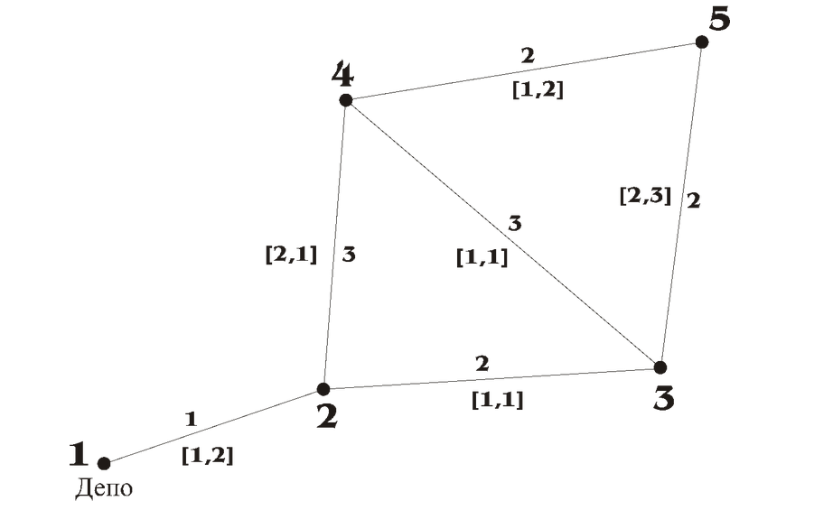

# Задача пошуку найкоротшого шляху з обмеженнями на ресурси (ESPPRC)

## Постановка задачі

Нехай $G=\left(V,A\right)$ - граф, де $A$ — множина дуг і $V = \{v_1, \dots, v_n\}$ — множина вузлів, що включає вузол відправлення (з якого виходимо) $p$ і вузол призначення $d$ (в який потрібно потрапити). 

Вартість $c_{\text{ij}}$ пов'язана з кожною дугою $\left(v_i,v_j\right){\in}A$. 

Нехай $L$ - число ресурсів і $d_{\text{ij}^l}\ge 0$ - споживання ресурсу $l$ по дузі $\left(v_i,v_j\right)$. З кожним вузлом $v_i$ і кожним ресурсом $l$ пов'язані два невід'ємні значення $a_{i^l}$ і $b_{i^l}$, такі, що споживання ресурсу $l$ на маршруті від $p$ до $v_i$ обмежене інтервалом $\left[a_{i^l},b_{i^l}\right]$. Якщо споживання ресурсу $l$ нижче ніж $a_{i^l}$, коли маршрут досягає $v_i$, споживання встановлюється в $a_{i^l}$. 

Зазначимо, що це природно для ресурсу часу, але також дозволяє нам вводити обмеження місткості, визначаючи інтервали $\left[0,Q\right]$ на вузлах, де $Q$ - межа місткості.

**Мета** полягає в тому, щоб отримати мінімальний за вартістю елементарний маршрут від $p$ до $d$, який задовольняє всім обмеженням ресурсів.

---

## Алгоритм коригування міток для вирішення задачі ESPPRC

### Визначення міток маршрутів

**Означення ХХ.2.1:** З кожним маршрутом $X_{\text{pi}}$ від вузла відправлення $p$ до вузла $v_i$, пов'язаний стан $R_i=\left(T_{i^1},T_{i^2},\ldots ,T_{i^L},s_i,V_{i^1},\ldots ,V_{i^n}\right)$, що відповідає кількості кожного ресурсу, який використовується маршрутом, числу відвіданих вузлів, і вектору відвідування ($V_{i^k}=1$, якщо маршрут відвідує вузол $v_k$, 0 в іншому випадку). 

**Означення ХХ.2.2:** Нехай $X_{\text{pi}}^{'}$ і $X^{\ast _{\text{pi}}}$ - два різні маршрути від $p$ до $v_i$ зі пов'язаними мітками $\left(R_i^{'},C_i^{'}\right)$, $\left(R_{i^{\ast }},C_{i^{\ast }}\right)$. $X_{\text{pi}}^{'}$ **домінує** над $X^{\ast _{\text{pi}}}$ якщо і тільки якщо $C_i^{'}\le C^{\ast _i}$, $s_i^{'}\le s^{\ast _i}$, $T_{i^l}^{'}\le T_{i^{\ast l}}$ для $l=1,\ldots ,L$, $V^{k_i}\le V^{\ast k_i}$ для $k=1,\ldots ,n$, і $\left(R_i^{'},C_i^{'}\right)\neq \left(R_{i^{\ast }},C_{i^{\ast }}\right)$. 

Зазначимо, що $s_i=\sum _{K=1}^nV_{i^K}$ і що цей ресурс необхідний тільки для обчислювальних цілей, оскільки мітка не може домінувати над іншою міткою, якщо вона відвідала більше вузлів.

Принцип алгоритму полягає в наступному: всі недоміновані маршрути є продовженням недомінованих маршрутів і, щоб отримати оптимальне рішення задачі, необхідно розглядати тільки недоміновані маршрути (Desrochers [7]). Дійсно, продовження домінованого маршруту $X_{\text{pi}}$ з дугою $(v_i,v_j)$ закінчується маршрутом, який або домінується, або дорівнює продовженню $X_{\text{pj}}^{'}$ маршруту $X_{\text{pi}}^{'}$, який домінує над маршрутом $X_{\text{pi}}$. 

Це визначення міток гарантує, що ми генеруємо тільки мітки, які відповідають елементарним шляхам, і ми отримуємо оптимальне рішення задачі. Однак розмір простору станів значно збільшується і доводиться генерувати та зберігати багато міток під час знаходження рішення. 

### Покращення визначення міток

Розглянемо інше визначення міток, щоб обмежити їх число під час розв'язання. Нехай ми будемо розглядати частковий маршрут і пов'язану з ним мітку. У попередньому визначенні вузли, що належать маршруту, були збережені у векторі відвідування мітки. Оскільки ці вузли були вже відвідані, вони не можуть бути відвідані в жодному продовженні відповідного маршруту. Крім того, можуть бути інші вузли, які не можуть бути відвідані в жодному продовженні відповідного маршруту, через обмеження ресурсів. 

Принцип нового визначення в тому, щоб більш ефективно визначати, які вузли не можуть бути відвідані незалежно від причини. Назвемо такі вузли **недосяжними**. Коли мітка продовжена, ресурси відвідування, що відповідають вузлам, які не можуть бути досягнуті (або тому що вони були вже відвідані, або через обмеження ресурсу) будуть використані. 

Ця алгоритмічна модифікація є обчислювально привабливою, оскільки відношення домінування стає більш помітним, як показується в наступному прикладі.

#### Приклад (домінування)

Розглянемо приклад ESPPRC: дано два вузли $v_1$, $v_2$ і дві мітки $\lambda _2^a=\left(10,s_2^a,0,1,C_2^a\right)$ і $\lambda _2^b=\left(5,s_2^b,1,1,C_2^b\right)$ на вузлі $v_2$. Ресурси відповідають часу, числу відвіданих вузлів і вектору відвідування, обмеженого $\{v_1,v_2\}$. Припустимо, що $s_2^b\le s_2^a$, $C_2^b\le C_2^a$ і що $V_2^{\text{kb}}\le V_2^{\text{ka}}$ для всіх інших вузлів графа. Також припустимо, що мітка $\lambda _2^a$ не може бути продовжена на вузол $v_1$ через обмеження ресурсу часу. 

З відношенням домінування попереднього розділу, жодна з цих двох міток не домінує над іншою. Проте можна з упевненістю сказати, що будь-яке продовження $\lambda _2^a$ до вузла призначення може бути скопійовано і для мітки $\lambda _2^b$, і що маршрут, який виходить з продовження мітки $\lambda _2^a$, буде більш дорогим. Тому, використовуючи поняття недосяжності, мітки стають $\lambda _2^a=\left(10,s_2^a,1,1,C_2^a\right)$ і $\lambda _2^b=\left(5,s_2^b,1,1,C_2^b\right)$. Виходить, що мітка $\lambda _2^b$ домінує над міткою $\lambda _2^a$. 

#### Недосяжність і лемма про недомінованість рішення

**Означення ХХ.2.3:** Для кожного маршруту $X_{\text{pi}}$ від вузла відправлення $p$ до вузла $v_i{\in}V$, вузол $v_k$, як кажуть, є **недосяжним**, якщо він уже включений в $X_{\text{pi}}$ або якщо існує ресурс $l{\in}\left\{1,...,L\right\}$, що задовольняє $T_i^l+d_{\text{ik}}^l>b_k^l$ (що означає, що поточне значення споживання перешкоджає досягненню вузла $v_k$).

**Означення ХХ.2.4:** З кожним шляхом $X_{\text{pi}}$ від вузла відправлення $p$ до вузла $v_i{\in}V$, пов'язаний стан $R_i=\left(T_{i^1},T_{i^2},\ldots ,T_{i^L},s_i,V_{i^1},\ldots ,V_{i^n}\right)$, що відповідає кількості ресурсів, які використовуються маршрутом, числу недосяжних вузлів і вектору недосяжних вузлів, визначених як $V_i^K=1$ якщо вузол $v_k$ недосяжний. 

Кажуть, що вузол є недосяжним, коли він не може бути досягнутий безпосередньо використовуючи вихідну дугу. Це також означає, що не існує жодного маршруту, який дозволить досягти цього вузла, оскільки введено нерівність трикутника для ресурсів. Зазначимо також, що все ще $s_i=\sum _{k=1}^nV_i^K$. 

З вищезгаданими означеннями, ми можемо зберегти те ж саме відношення домінування і тільки розглядати недоміновані маршрути.

**Лемма (про недомінованість рішення):** Під час виконання модифікованого алгоритму, ми повинні тільки розглядати недоміновані маршрути.

Даний алгоритм модифікації міток легко реалізувати. Дійсно, при розширенні мітки, необхідно тільки перерахувати множину недосяжних вузлів. Для цього оцінюємо здійсненність продовження мітки через кожну вихідну дугу. Зазначимо також, що час обчислення залежить від числа ресурсів $L$. Коли $L$ занадто велике, визначення недосяжного вузла може бути адаптоване для обмеження часу обчислення, можна тільки перераховувати недосяжні вузли для деякої підмножини ресурсів. В іншому випадку, коли $L$ мале, потрібно не набагато більше часу, щоб визначити недосяжні вузли, ніж зберігати вузли, які були відвідані. Повний опис алгоритму дається нижче. 

---

## Псевдокод алгоритму

Введемо наступні позначення:

* $\Lambda _i$: Список міток на вузлі $v_i$.
* $\text{Succ}\left(v_i\right)$: Множина вузлів, пов'язаних з вузлом $v_i$.
* $E$: Список узлів для розгляду.
* $\text{Extend}\left(\lambda _i,v_j\right)$: Функція, яка повертає мітку, що виходить з розширення з мітки $\lambda _i{\in}\Lambda $ до вузла $v_j$, коли розширення можливе, нульове значення в іншому випадку. Функція спочатку оновлює споживання ресурсів $l=1,\ldots ,L$. Якщо обмеження ресурсу задоволені, вона досліджує набір вихідних дуг, щоб оновити вектор недосяжних вузлів і число недосяжних вузлів. 
* $F_{\text{ij}}$: Множина міток, що є розширенням від вузла $v_i$ до вузла $v_j$.
* $\text{EFF}\left(\Lambda \right)$: Процедура, яка зберігає тільки недоміновані мітки в списку міток $\Lambda $.

Тепер опишемо процедуру $\text{Espprc}(p)$, яка визначає всі недоміновані маршрути, що починаються у вузлі $p$ до будь-якого з вузлів графа.

```pseudocode
Espprc(p)
 1  Ініціалізація
 2  Λ_p ← {(0,...,0)}
 3  для всіх v_i ∈ V\{p}
 4    Λ_i ← ∅
 5  E = {p}
 6
 7  повторювати
 8    Дослідження послідовників вузла
 9    Виберемо v_i ∈ E
10    для всіх v_j ∈ Succ(v_i)
11      Fi_j ← ∅
12      для всіх λ_i = (T_i^1,...,T_i^L, s_i, V_i^1,...,V_i^L, C_i) ∈ Λ_i
13        якщо V_i^j = 0
14          тоді F_ij ← F_ij ∪ {Extend(λ_i, v_j)}
15      Λ_j ← EFF(F_ij ∪ Λ_j)
16      якщо Λ_j змінилося
17        тоді E ← E ∪ {v_j}
18    Зменшення E
19    E ← E\{v_i}
20  вихід якщо E = ∅
````

Час виконання цього алгоритму безпосередньо пов'язаний зі структурою графа, числом вузлів і щільністю обмежень ресурсу. Якщо задача сильно обмежена, то можна вирішувати досить великі проблеми.

-----

## Приклад (мережа)

Розглянемо наступну мережу з заданими вартостями руху по дугах (число над дугою), споживанням ресурсів (вказано в квадратних дужках через кому для кожного виду ресурсу) і вікнами споживання ресурсів (прийнято для всіх ресурсів однаковим: 4 для першого ресурсу і 6 для другого):



Потрібно визначити оптимальний елементарний шлях від депо (вузол 1) до вузла 5. Процедура $\text{Espprc}$ видала наступні два паретто-оптимальних рішення:

$$
\Delta_1 = \left[4,5,4,1,1,0,1,1,11\right]
$$
$$
\Delta_2 = \left[4,6,4,1,1,1,0,1,9\right]
$$Тут цифри в квадратних дужках означають наступне: споживання першого ресурсу, споживання другого ресурсу, число відвіданих вузлів, вектор відвідування вузлів (1 якщо вузол відвіданий, 0 інакше) і вартість руху від депо до пункту призначення і назад (назад без урахування ресурсів). Як бачимо, у нас вийшла наступна ситуація: маршрут 1 споживає менше ресурсу 2, але дорожчий за вартістю руху, тоді як маршрут 2 дорожчий за ресурсом 2, але дешевший за вартістю руху.

Якщо ж ввести в якості вікон споживання ресурсів 4 для першого ресурсу і 5 для другого, то відповідь буде всього одна:

$$
\Delta_1 = \left[4,5,4,1,1,0,1,1,11\right]
$$
і маршрут 2 буде відкинутий, оскільки не може досягти пункту призначення через обмеження по ресурсу 2.