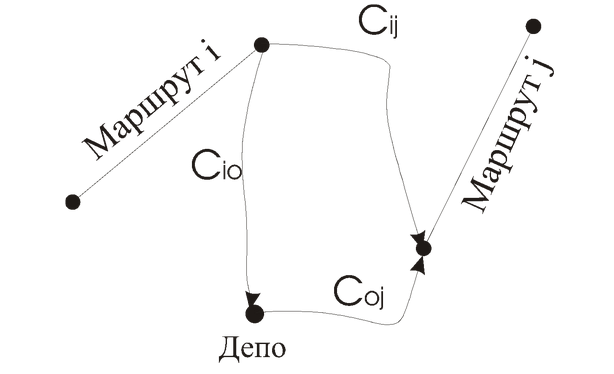

# Метод економії (Savings Method, SA)

## Вступ

Популярним алгоритмом для вирішення VRP та VRPTW є **SA (Savings Method)**. Цей алгоритм був розроблений Кларком та Райтом (Clarke і Wright) [1] на основі ідей Данцига та Рамзера (Dantzig і Ramser) [2], і його зазвичай називають **алгоритмом Кларка-Райта**.

Напочатку, в SA кожному клієнту для задоволення його потреб присвоюється окремий маршрут (тобто, маршрути `Депо -> Клієнт_i -> Депо`). Послідовно алгоритм намагається зменшити транспортні витрати, **агрегуючи два маршрути в один**. На кожній ітерації ми агрегуємо допустиму комбінацію маршрутів, яка дає **максимальну економію** транспортних витрат. Алгоритм припиняє роботу, коли не існує допустимих агрегацій маршрутів, які б призводили до зменшення транспортних витрат.

---

## Допустимість і псевдокод алгоритму

Для **VRP** (задачі без вікон часу) допустимість означає, що загальне завантаження (попит) двох маршрутів не перевищує місткості транспортного засобу, і що загальний час руху не перевищує загального допустимого часу для ТЗ. Оскільки відоме завантаження та тривалість кожного маршруту, можна за скінченний час визначити тривалість та завантаження агрегованого маршруту, а отже, перевірити допустимість.

Коли алгоритм SA використовується для **VRPTW** (з вікнами часу), необхідно додатково враховувати вікна часу. Допустимість за завантаженням можна перевірити за скінченний час, однак, крім цього, необхідно перевірити, що обслуговування кожного клієнта відбудеться у його вікні часу. Це можна зробити, визначивши час обслуговування для комбінації маршрутів $i$ і $j$.

Нехай $k_i$ - число клієнтів у маршруті $i$. На обчислення комбінації двох маршрутів $i$ і $j$ буде потрібно $O\left(k_i+k_j\right)$ часу. Оскільки максимальне число клієнтів у маршруті дорівнює $n$, то складність $O\left(n\right)$.

### Формула економії (Прибутковість)

Коли комбінація двох маршрутів $i$ (що закінчується клієнтом $i$) та $j$ (що починається з клієнта $j$) є допустимою, ми повинні обчислити прибутковість (економію). Результуюча вартість або прибутковість $sav_{\text{ij}}$ визначається формулою:

$$
sav_{\text{ij}} = c_{\text{io}} + c_{\text{oj}} - c_{\text{ij}} - C \cdot \mathit{\Delta W}
$$

де:
* $c_{\text{io}}$ - вартість руху від останнього клієнта маршруту $i$ до депо (o).
* $c_{\text{oj}}$ - вартість руху від депо (o) до першого клієнта маршруту $j$.
* $c_{\text{ij}}$ - вартість руху від останнього клієнта маршруту $i$ до першого клієнта маршруту $j$.
* $\mathit{\Delta W}$ - збільшення часу очікування через об'єднання двох маршрутів.
* $C$ - вартість однієї одиниці часу.

На рисунку наведено приклад, що показує, як розраховується прибутковість:



Результуюча вартість може бути обчислена для VRP за скінченний час, оскільки $\mathit{\Delta W}=0$. Однак для VRPTW, $\mathit{\Delta W}$ може бути більше 0.

### Псевдокод

Опишемо алгоритм за допомогою псевдокоду:

```pseudocode
Procedure Savings
begin
    Ініціалізація маршрутів (один клієнт - один маршрут)
    repeat
        ComputeBestSaving (Обчислити найкращу економію)
        if (best saving > 0)
        begin
            Комбінування маршрутів (агрегація)
        end
    until (best saving <= 0)
end
````

### Аналіз складності

1.  **Ініціалізація:** Призначити один маршрут кожному клієнту. Це вимагає $O\left(n\right)$ операцій, де $n$ - загальне число клієнтів.
2.  **Пошук кращої комбінації:** Коли алгоритм шукає кращу комбінацію, необхідно обчислювати $O\left(n^2\right)$ комбінацій маршрутів (економій).
3.  **Перевірка допустимості:**
      * Для **VRP**: Перевірка допустимості та прибутковості займає $O\left(1\right)$ часу.
      * Для **VRPTW**: Перевірка займає $O\left(n\right)$ часу (через перевірку вікон часу).
4.  **Час роботи `ComputeBestSaving`:**
      * Для **VRP**: $O\left(n^2\right)$
      * Для **VRPTW**: $O\left(n^3\right)$
5.  **Об'єднання маршрутів:** Займає $O\left(1\right)$ часу.
6.  **Загальна складність:** Алгоритм матиме принаймні $n-1$ ітерацію.
      * Загальний час для **VRP**: $O\left(n^3\right)$
      * Загальний час для **VRPTW**: $O\left(n^4\right)$

Існує багато варіантів, як збільшити швидкість роботи SA. Один з них - зберігати додаткову інформацію, що дозволяє не обчислювати всі можливі комбінації маршрутів на кожній ітерації.

-----

## Ефективне обчислення результуючої вартості

(Цей метод стосується прискорення SA для VRPTW).

Коли будемо визначати допустимість і прибутковість нового маршруту, необхідно дотримуватися угоди, що транспортні засоби будуть виходити на маршрут **якомога раніше** для досягнення мінімальної тривалості маршруту. (Це призведе до того, що до останнього клієнта кожного маршруту ТЗ прибуває в його нижній межі вікна часу).

1.  Для кожного клієнта обчислимо різницю між часом обслуговування і верхньою межею вікна часу цього клієнта.
2.  Тепер можна визначити **максимальний зсув вперед по часу** для кожного маршруту $i$, позначимо його $\text{PF}_i$, як мінімум цих різниць по всіх клієнтах цього маршруту.
3.  Це означає, що весь маршрут $i$ може бути зсунутий вперед у часі принаймні на $\text{PF}_i$ одиниць часу.

**Перевірка допустимості комбінації $i$ та $j$ ($j$ після $i$):**

1.  Визначаємо мінімально можливий час прибуття до першого клієнта маршруту $j$.
2.  Це час = (час обслуговування останнього клієнта $i$) + (час руху між $i$ та $j$).
3.  Якщо цей час прибуття не пізніше ніж (час обслуговування першого клієнта $j$ + $\text{PF}_j$), тоді комбінація **допустима**.

Коли комбінація допустима, обчислюємо вартість:

  * Якщо **час очікування відсутній** (між $i$ та $j$), то вартість = $c_{\text{io}} + c_{\text{oj}} - c_{\text{ij}}$.
  * Якщо **час очікування присутній**, то зсуваємо клієнтів маршруту $i$ вперед (на $\text{PF}_i$ та час очікування). Час очікування, що залишився, помножений на $C$, необхідно відняти з результуючої вартості.

**Аналіз складності (з ефективним обчисленням):**

  * Початкове обчислення $\text{PF}_i$ для $n$ маршрутів: $O\left(n\right)$.
  * Переобчислення $\text{PF}$ для нового агрегованого маршруту: $O\left(n\right)$.
  * Обчислення результуючої вартості двох маршрутів: $O\left(1\right)$ (оскільки ми зберігаємо $\text{PF}_i$).
  * Підтримка змінних $\text{PF}_i$: $O\left(n\right)$.

Цей метод обчислення результуючої вартості зменшує витрати часу SA для **VRPTW** з $O\left(n^4\right)$ до $O\left(n^3\right)$.