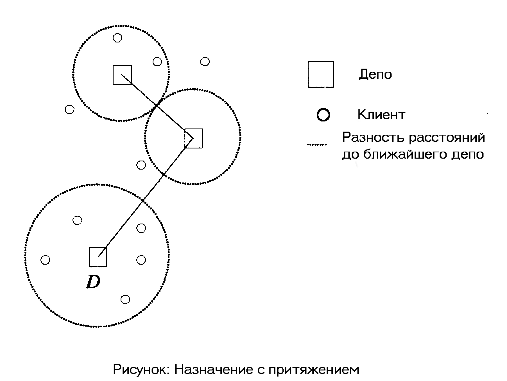
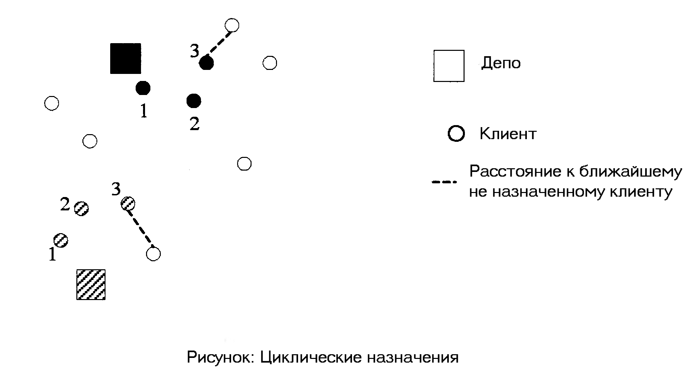
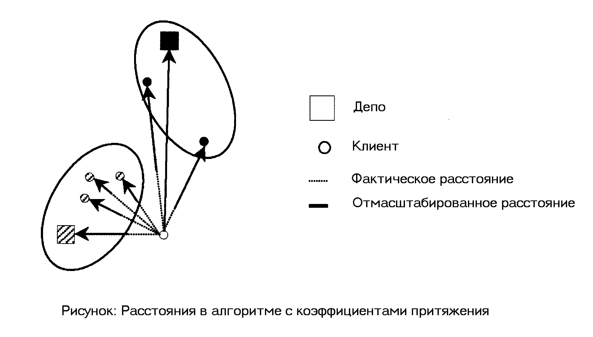
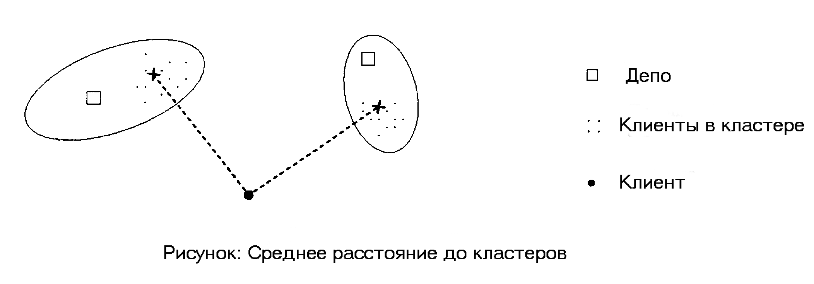

# Задача VRP з кількома депо (MDVRP)

У цій главі будуть розглянуті двохетапні алгоритми для вирішення задачі VRP з кількома депо. А саме: на першому етапі ми об'єднаємо клієнтів у кластери для кожного депо, а потім, на другому етапі, розподілимо продукцію — побудуємо маршрути з кожного депо.

Перший крок алгоритму – кластеризація клієнтів – вирішується за допомогою **Алгоритмів Призначення (АН)**.

---

## Вступ

Міжнародна класифікація задачі VRP з кількома депо – **MDVRP (multi-depot VRP)**. Задача MDVRP є **NP-повною задачею**.

У задачі MDVRP кожен транспортний засіб (ТЗ) повинен вийти з депо і повернутися в це ж депо, і число ТЗ для кожного депо знаходиться між заданими мінімальним та максимальним значеннями.

Задачу MDVRP можна розглядати як задачу кластеризації в тому сенсі, що відповіддю є множина ТЗ, які обслуговують клієнтів у кластері, пов'язаному з депо. Ця задача може бути вирішена у **два етапи**:

1.  Клієнти призначаються до депо (об'єднуються у кластер, пов'язаний з депо);
2.  Клієнти зв'язуються з депо маршрутами.

В ідеалі, набагато ефективніше розглядати ці два етапи разом, але коли вирішуються великомасштабні задачі, цей підхід вимагає все більше і більше обчислювальних ресурсів. Тому для уникнення підвищених обчислювальних витрат розіб'ємо загальну задачу на підзадачі та розглянемо їх окремо.

---

## Алгоритми призначення (АН)

Зазначимо, що задача об'єднання в кластери (задача призначення) і задача розподілу в кластері (побудова маршрутів від депо до клієнтів у цьому кластері) залежні одна від одної. При призначенні клієнтів до депо необхідно враховувати, щоб не була перевищена місткість депо (у тому сенсі, що в депо не буде достатньо продукції для задоволення попиту клієнтів, призначених у кластер цього депо).

Розглянемо наступні АН:

* Призначення, використовуючи терміновість;
* Циклічні призначення;
* Призначення, використовуючи кластеризацію [10];
* Призначення, використовуючи транспортну задачу [13].

Вищеперелічені алгоритми по-різному призначають клієнта до кластера, пов'язаного з депо, проте у всіх них спільна схема роботи:

```pseudocode
Поки всі клієнти не призначені до депо
begin
    визначити наступного клієнта,
    який буде призначений, враховуючи
    обмеження на місткість депо
end
````

### Призначення з використанням терміновості

У цьому алгоритмі клієнти з **найвищою терміновістю** призначаються першими. Використання поняття "терміновість" для клієнтів – це спосіб попередньо визначити певне відношення між клієнтами.

Для цього класу алгоритму існує кілька методів:

  * Паралельний алгоритм призначення [10];
  * Спрощений алгоритм призначення [9];
  * Алгоритм призначення з притяганням [11].

Вони відрізняються між собою тим, як обчислюється терміновість.

#### Загальна процедура АН (Псевдокод)

  * Кожен клієнт належить до одного з множин: $A$ (призначений) або $\text{NA}$ (не призначений).
  * Кожне депо належить до одного з множин: $\text{DS}$ (попит задоволений) або $\text{DNS}$ (попит не задоволений).
  * Призначення клієнта до депо допустиме, якщо:
    1.  Депо належить $\text{DNS}$;
    2.  Клієнт належить $\text{NA}$.
  * Терміновість клієнта $c_j$ визначається функцією $\mu_j$, яка характеризується застосовуваним АН.

<!-- end list -->

```pseudocode
Procedure GeneralUrgency()
begin
    while <NA ≠ ∅>
    begin
        for <всіх c_j ∈ NA>
        begin
            <обчислити μ_j для c_j>;
        end for;
        
        while <NA ≠ ∅> and <не ∃ d ∈ DNS з задоволеним попитом>
        begin
            <визначити с* ∈ NA / що відповідає максимальному μ_j>;
            <призначити с* до найближчого, допустимого депо>;
            <NA := NA \ {с*}>;
            <A := A ∪ {с*}>;
        end while;

        if <NA ≠ ∅> and <∃ d ∈ DNS / тобто не задоволений попит цього депо>
        {
            // Обробка ситуації, коли попит не задоволений
        }
    end while;
end;
```

#### Алгоритм паралельних призначень

Паралельність у назві з'явилася тому, що терміновість для кожного клієнта обчислюється одночасно для всіх депо. Алгоритм порівнює вартість призначення до найближчого депо з вартістю призначення до решти депо. Найбільш терміновий клієнт той, для якого $\mu$ максимальне. Клієнт $c$ з найвищим значенням $\mu$ призначається до найближчого депо.

Терміновість $\mu$ для кожного клієнта розраховується за формулою (1):

$$
\mu_c = d(c,D) - d(c,D^{\ast})
$$  * $d(c,D)$ - відстань між клієнтом $c$ і депо $D$;
* $d(c,D^{\ast})$ - відстань між клієнтом $c$ і *найближчим* депо $D^{\ast}$.

#### Спрощений алгоритм призначення

Цей алгоритм є найбільш загальним варіантом АН, що зустрічаються в літературі [1]. Як і в інших алгоритмах, що використовують терміновість, найбільш терміновим є той клієнт, для якого $\mu$ максимальне. У цьому алгоритмі розглядається **тільки два депо** при розрахунку терміновості: порівнюються вартості призначення до найближчого депо і до *другого найближчого* депо.

Формула (2):

$$\\mu\_c = d(c,D^{'}) - d(c,D^{\\ast})
$$  \* $d(c,D^{'})$ - відстань між клієнтом $c$ і *другим найближчим* депо;

  * $d(c,D^{\ast})$ - відстань між клієнтом $c$ і *найближчим* депо.

Відмінності паралельного та спрощеного алгоритмів продемонстровано на рисунку:

#### Призначення з притяганням

У цьому алгоритмі клієнти "притягуються" до депо з **найвищим незадоволеним попитом**.

1.  Спочатку необхідно визначити депо $D^{\ast}$ з найвищим незадоволеним попитом.
2.  Потім, терміновість клієнта обчислюється як різниця відстаней між цим клієнтом та найближчим депо ($D$) і між цим клієнтом та $D^{\ast}$.

Формула (3):

$$
\mu_c = d(c,D^{\ast}) - d(c,D)
$$Значення терміновості показує, наскільки краще призначити клієнта до найближчого депо, ніж до $D^{\ast}$. На наступному рисунку показано, як визначається $D^{\ast}$:



### Циклічні призначення

Для цього класу алгоритмів задача полягає у циклічному призначенні одного клієнта за один крок до кожного депо. Спочатку алгоритм призначає кожному депо його найближчого клієнта. Потім призначає найближчого клієнта до останнього призначеного клієнта депо. Загалом, призначення клієнтів, що залишилися, є дуже скрутним.



### Призначення з використанням кластеризації

Цей клас алгоритмів будує компактні кластери для кожного депо. Кластер – множина, що містить депо та клієнтів, призначених цьому депо. Розглянемо два алгоритми цього класу.

#### Коефіцієнти притягання

У цьому алгоритмі клієнти об'єднуються в кластер за допомогою визначення коефіцієнтів притягання до вже призначених клієнтів та депо. Ці коефіцієнти масштабують відстань.

* Якщо коефіцієнт \< 1, це зменшує відстань (притягує).
* Якщо коефіцієнт \> 1, відстань стає більшою (відштовхує).
* Якщо коефіцієнт = 1, відстань незмінна.

Цей алгоритм сильно залежить від вибору коефіцієнтів притягання, а їх вибір залежить від кожної конкретної задачі, і поки немає методів оптимального вибору коефіцієнтів.



#### Трьохкритеріальна кластеризація

Цей алгоритм є варіантом алгоритму, розглянутого в [2]. Критерії, що використовуються в цьому алгоритмі, включають:

* Середня відстань до кластера;
* Різниця середньої відстані до клієнтів у кластерах;
* Відстань до найближчого клієнта в кожному кластері.



### Транспортна задача

**Транспортна задача** передбачає визначення, яка кількість вантажу буде відправлена між депо і клієнтами, з даною пропозицією депо і попитом клієнтів, **мінімізуючи загальні транспортні витрати** [13]. Кожен клієнт обслуговується принаймні одним депо, це і дає можливість призначити клієнтів до депо.

Алгебраїчна модель транспортної задачі має вигляд:

$$
\min \sum_{i=1}^{n} \sum_{j=1}^{m} x_{ij} \cdot c_{ij}
$$
за умов:
$$
\sum_{i=1}^{n} x_{ij} \ge b_j \quad \forall j
$$
$$
\sum_{j=1}^{m} x_{ij} \le a_i \quad \forall i
$$Тут:

* $m$ - число депо, $n$ - число клієнтів.
* $a_i$ - пропозиція депо $i$.
* $b_j$ - попит клієнта $j$.
* $c_{ij}$ - вартість одиниці вантажу між депо $i$ і клієнтом $j$.
* $x_{ij}$ - результуючі змінні: кількість відправленого вантажу між депо $i$ і клієнтом $j$.
$$