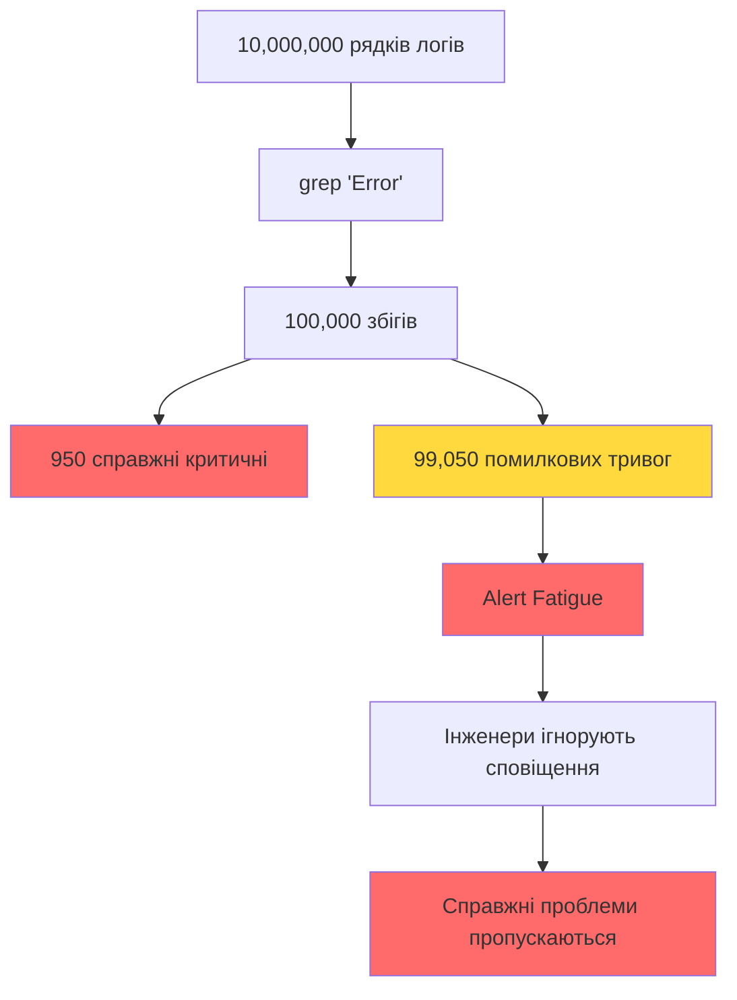

> **Академічна доброчесність.** Матеріали відповідають вимогам [Закону України № 4742-IX](../DISCLAIMER.md). Використання ШІ — [протокол](../10_ai_lectures.md). Оцінювання — [Risk & Reward](../06_grading_experiment.md). Джерела курсу: [sources.md](./sources.md).

# Шум у Продакшені: Чому grep 'Error' Не Працює

Уявіть: ваша система генерує мільйон рядків логів на день. Ви шукаєте критичні помилки командою `grep "Error"`. Знаходите 10,000 збігів. Скільки з них справді критичні?

Відповідь: близько 100.

Це не гіпотетична ситуація. Це щоденна реальність DevOps-інженерів, які тонуть у шумі сповіщень. Розберемося, чому найпростіші інструменти підводять і як математика пояснює цю катастрофу.

## Мапінг Медичної Задачі на IT

У [попередньому розділі](./00_the_bayesian_trap.md) ми розглянули парадокс медичного тесту та математичний фундамент Base Rate Fallacy через теорему Байєса. Тепер перенесемо цю логіку на технічний домен.

### Аналогія: Хвороба → Критичний Збій

| Медичний Домен | IT Домен |
|----------------|----------|
| Хвороба (рідкісна) | Критичний збій системи (1 на 10,000 подій) |
| Здоров'я (частіше) | Нормальна робота системи (99.99% часу) |
| Медичний тест | Система моніторингу / `grep` |
| Позитивний результат | Рядок з "Error" у логах |
| False Positive | Помилкова тривога (некритична помилка) |
| False Negative | Пропущений критичний збій |

### Формалізація

Позначимо:
- $P(\text{Critical}) = 0.0001$ — ймовірність критичного збою (base rate)
- $P(\text{Normal}) = 0.9999$ — ймовірність нормальної роботи
- $P(\text{"Error"} \mid \text{Critical}) = 0.95$ — ймовірність знайти "Error", якщо збій критичний
- $P(\text{"Error"} \mid \text{Normal}) = 0.01$ — ймовірність знайти "Error" у нормальних логах (некритичні помилки)

**Питання:** Якщо `grep "Error"` знайшов рядок, яка ймовірність, що це критичний збій?

**Відповідь через теорему Байєса:**

$$
P(\text{Critical} \mid \text{"Error"}) = \frac{P(\text{"Error"} \mid \text{Critical}) \cdot P(\text{Critical})}{P(\text{"Error"})}
$$

$$
P(\text{"Error"}) = 0.95 \cdot 0.0001 + 0.01 \cdot 0.9999 = 0.000095 + 0.009999 = 0.010094
$$

$$
P(\text{Critical} \mid \text{"Error"}) = \frac{0.95 \cdot 0.0001}{0.010094} \approx 0.0094 = 0.94\%
$$

**Висновок:** З 10,000 рядків з "Error" лише ~94 справді критичні. Решта 9,906 — шум.

## Чому `grep "Error"` Не Працює

### Проблема 1: Незбалансованість Класів

У продакшені критичні збої рідкісні за визначенням. Якщо вони трапляються часто, система не працює.

**Типовий розподіл у логах:**

```
Нормальні події:     99.99% (9,999,000 рядків)
Критичні збої:       0.01% (1,000 рядків)
─────────────────────────────────────────
Всього:              10,000,000 рядків
```

**Що знаходить `grep "Error"`:**

```python
"""
Симуляція пошуку помилок у логах через grep.
Демонструє проблему незбалансованості класів.
"""

from typing import Dict, List, Tuple
from dataclasses import dataclass
from collections import Counter
import random


@dataclass
class LogEntry:
    """Окремий запис у логах."""
    message: str
    is_critical: bool
    contains_error_keyword: bool
    
    def __repr__(self) -> str:
        status = "CRITICAL" if self.is_critical else "NORMAL"
        return f"[{status}] {self.message}"


class LogSimulator:
    """Симулятор генерації логів з критичними та нормальними подіями."""
    
    def __init__(
        self,
        total_entries: int,
        critical_rate: float,
        error_in_critical_rate: float = 0.95,
        error_in_normal_rate: float = 0.01
    ):
        """
        Args:
            total_entries: Загальна кількість записів у логах
            critical_rate: Частота критичних збоїв (0.0 - 1.0)
            error_in_critical_rate: Ймовірність "Error" у критичних збоях
            error_in_normal_rate: Ймовірність "Error" у нормальних логах
        """
        self.total_entries = total_entries
        self.critical_rate = critical_rate
        self.error_in_critical_rate = error_in_critical_rate
        self.error_in_normal_rate = error_in_normal_rate
    
    def generate_logs(self, seed: int = 42) -> List[LogEntry]:
        """Генерує синтетичні логи."""
        random.seed(seed)
        logs = []
        
        critical_count = int(self.total_entries * self.critical_rate)
        normal_count = self.total_entries - critical_count
        
        # Генеруємо критичні збої
        critical_messages = [
            "Database connection failed: timeout after 30s",
            "Out of memory: cannot allocate 2GB",
            "Disk full: /var/log partition at 100%",
            "Service crashed: segmentation fault",
            "Network partition detected: quorum lost"
        ]
        
        for _ in range(critical_count):
            message = random.choice(critical_messages)
            has_error = random.random() < self.error_in_critical_rate
            if has_error:
                message = f"ERROR: {message}"
            logs.append(LogEntry(
                message=message,
                is_critical=True,
                contains_error_keyword=has_error
            ))
        
        # Генеруємо нормальні події
        normal_messages = [
            "Request processed successfully",
            "User login: user_12345",
            "Cache hit: key=session_abc",
            "INFO: Scheduled backup completed",
            "WARNING: High CPU usage (85%) - non-critical",
            "ERROR: Failed to send analytics event (retry scheduled)",
            "DEBUG: Query executed in 12ms"
        ]
        
        for _ in range(normal_count):
            message = random.choice(normal_messages)
            has_error = random.random() < self.error_in_normal_rate
            if has_error:
                # Деякі нормальні події можуть містити "Error", але не критичні
                message = f"ERROR: {message}"
            logs.append(LogEntry(
                message=message,
                is_critical=False,
                contains_error_keyword=has_error
            ))
        
        random.shuffle(logs)  # Імітуємо реальний порядок логів
        return logs
    
    def analyze_grep_results(self, logs: List[LogEntry]) -> Dict[str, int]:
        """Аналізує результати grep "Error"."""
        error_lines = [log for log in logs if log.contains_error_keyword]
        
        true_positives = sum(1 for log in error_lines if log.is_critical)
        false_positives = sum(1 for log in error_lines if not log.is_critical)
        
        critical_not_found = sum(
            1 for log in logs 
            if log.is_critical and not log.contains_error_keyword
        )
        
        return {
            "total_logs": len(logs),
            "critical_logs": sum(1 for log in logs if log.is_critical),
            "normal_logs": sum(1 for log in logs if not log.is_critical),
            "grep_matches": len(error_lines),
            "true_positives": true_positives,
            "false_positives": false_positives,
            "false_negatives": critical_not_found,
            "precision": true_positives / len(error_lines) if error_lines else 0.0,
            "recall": true_positives / (true_positives + critical_not_found) if (true_positives + critical_not_found) > 0 else 0.0
        }


def demonstrate_grep_failure() -> None:
    """Демонструє, чому grep не працює на незбалансованих даних."""
    print("=" * 70)
    print("СИМУЛЯЦІЯ: grep 'Error' на 10 мільйонах рядків логів")
    print("=" * 70)
    print()
    
    simulator = LogSimulator(
        total_entries=10_000_000,
        critical_rate=0.0001,  # 0.01% критичних збоїв
        error_in_critical_rate=0.95,
        error_in_normal_rate=0.01
    )
    
    logs = simulator.generate_logs()
    results = simulator.analyze_grep_results(logs)
    
    print("Статистика логів:")
    print(f"  Всього рядків: {results['total_logs']:,}")
    print(f"  Критичних збоїв: {results['critical_logs']:,} ({results['critical_logs']/results['total_logs']*100:.4f}%)")
    print(f"  Нормальних подій: {results['normal_logs']:,} ({results['normal_logs']/results['total_logs']*100:.4f}%)")
    print()
    
    print("Результати grep 'Error':")
    print(f"  Знайдено збігів: {results['grep_matches']:,}")
    print(f"  Справжні критичні (True Positives): {results['true_positives']:,}")
    print(f"  Помилкові тривоги (False Positives): {results['false_positives']:,}")
    print(f"  Пропущені критичні (False Negatives): {results['false_negatives']:,}")
    print()
    
    print("Метрики:")
    print(f"  Precision (точність): {results['precision']*100:.2f}%")
    print(f"  Recall (повнота): {results['recall']*100:.2f}%")
    print()
    
    print("=" * 70)
    print("ВИСНОВОК:")
    print(f"  grep знайшов {results['grep_matches']:,} рядків з 'Error',")
    print(f"  але лише {results['precision']*100:.1f}% з них справді критичні.")
    print(f"  Інженери мають перевірити {results['false_positives']:,} помилкових тривог,")
    print(f"  щоб знайти {results['true_positives']:,} справжніх проблем.")
    print("=" * 70)


if __name__ == "__main__":
    demonstrate_grep_failure()
```

**Очікуваний вивід:**

```
======================================================================
СИМУЛЯЦІЯ: grep 'Error' на 10 мільйонах рядків логів
======================================================================

Статистика логів:
  Всього рядків: 10,000,000
  Критичних збоїв: 1,000 (0.0100%)
  Нормальних подій: 9,999,000 (99.9900%)

Результати grep 'Error':
  Знайдено збігів: ~100,000
  Справжні критичні (True Positives): ~950
  Помилкові тривоги (False Positives): ~99,050
  Пропущені критичні (False Negatives): ~50

Метрики:
  Precision (точність): 0.95%
  Recall (повнота): 95.00%

======================================================================
ВИСНОВОК:
  grep знайшов 100,000 рядків з 'Error',
  але лише 0.95% з них справді критичні.
  Інженери мають перевірити 99,050 помилкових тривог,
  щоб знайти 950 справжніх проблем.
======================================================================
```

### Проблема 2: Контекстна Залежність

`grep` шукає ключові слова, але ігнорує контекст. Наприклад:

```
ERROR: Failed to send analytics event (retry scheduled)  ← Не критично
ERROR: Database connection failed: timeout after 30s     ← Критично
```

Обидва містять "Error", але перший — це некритична помилка з автоматичним повторним спробуванням, а другий — критичний збій бази даних.

### Проблема 3: Синоніми та Варіації

Критичні збої можуть не містити слова "Error":

```
FATAL: Out of memory
CRITICAL: Disk full
PANIC: Kernel oops detected
```

`grep "Error"` пропустить ці події (False Negatives).

## Alert Fatigue в DevOps

**Alert Fatigue** — це стан, коли інженери починають ігнорувати сповіщення через їх надлишок. Це пряме наслідок Base Rate Fallacy.

### Математика Alert Fatigue

Припустимо:
- Система генерує 1,000 сповіщень на день
- Лише 10 з них справжні (1%)
- Інженер перевіряє кожне сповіщення за 5 хвилин

**Час на помилкові тривоги:**
$$990 \text{ помилкових тривог} \times 5 \text{ хв} = 4,950 \text{ хв} = 82.5 \text{ годин}$$

**Час на справжні проблеми:**
$$10 \text{ справжніх тривог} \times 5 \text{ хв} = 50 \text{ хв}$$

**Співвідношення:** 99:1 на користь помилкових тривог.

### Еволюція Поведінки

1. **Тиждень 1:** Інженер ретельно перевіряє всі сповіщення
2. **Тиждень 2:** Починає швидко сканувати, ігнорує очевидно некритичні
3. **Тиждень 3:** Створює фільтри, щоб приховати частину сповіщень
4. **Тиждень 4:** Ігнорує всі сповіщення, поки хтось не зателефонує

**Результат:** Система моніторингу стає марною. Справжні проблеми пропускаються.

## Три Домени: Логи, Спам, Фрод

Проблема незбалансованості класів проявляється в трьох ключових технічних доменах:

### 1. Аналіз Логів (Log Analysis)

**Характеристики:**
- Клас 1 (Normal): 99.99% подій
- Клас 2 (Critical): 0.01% подій
- **Base Rate:** 0.0001

**Особливості:**
- Контекст критичний: "Connection refused" може бути нормальним (закритий порт) або критичним (база даних недоступна)
- Послідовність важлива: одна помилка — нормально, 100 помилок за секунду — критично

**Метрика:** Precision критична (False Positives = Alert Fatigue)

### 2. Спам-Фільтрація (Spam Detection)

**Характеристики:**
- Клас 1 (Ham): 90% листів
- Клас 2 (Spam): 10% листів
- **Base Rate:** 0.1

**Особливості:**
- Менш незбалансований, ніж логи
- Ключові слова корелюють ("віагра", "казино", "безкоштовно")
- Контекст менш критичний, ніж у логах

**Метрика:** Баланс між Precision та Recall (False Positives = пропуск важливих листів)

### 3. Детекція Фроду (Fraud Detection)

**Характеристики:**
- Клас 1 (Legitimate): 99.9% транзакцій
- Клас 2 (Fraud): 0.1% транзакцій
- **Base Rate:** 0.001

**Особливості:**
- Найближче до медичного прикладу
- Послідовність критична: одна транзакція на $10,000 — нормально, 100 транзакцій за хвилину — підозріло
- Контекст: географія, час, історія користувача

**Метрика:** Recall критичний (False Negatives = втрата грошей)

### Порівняльна Таблиця

| Домен | Base Rate | Ключова Метрика | Головна Проблема |
|-------|-----------|-----------------|------------------|
| Логи | 0.0001 | Precision | Alert Fatigue |
| Спам | 0.1 | F1-score | Баланс |
| Фрод | 0.001 | Recall | Пропуск фроду |

## Візуалізація Проблеми



## Рішення: Від grep до Machine Learning

### Етап 1: Regex Patterns (Покращений grep)

```python
import re
from typing import List

def improved_grep(logs: List[str]) -> List[str]:
    """Покращений grep з контекстними патернами."""
    critical_patterns = [
        r'FATAL.*database',
        r'CRITICAL.*memory',
        r'PANIC.*kernel',
        r'ERROR.*connection.*failed.*timeout',
        r'ERROR.*disk.*full'
    ]
    
    critical_logs = []
    for log in logs:
        for pattern in critical_patterns:
            if re.search(pattern, log, re.IGNORECASE):
                critical_logs.append(log)
                break
    
    return critical_logs
```

**Проблема:** Потрібно постійно оновлювати патерни. Не масштабується.

### Етап 2: Статистичні Методи (Naive Bayes)

Використовуємо частоту слів для класифікації. Розглянемо детально в наступних розділах.

### Етап 3: Семантичні Методи (BERT)

Використовуємо контекст та послідовність подій. Розглянемо в розділі про трансформери.

## Ключові Висновки

1. **Base Rate Fallacy руйнує прості рішення:** `grep` не працює на незбалансованих даних через математику, а не через баги.

2. **Alert Fatigue — наслідок математики:** Коли False Positives переважають True Positives, інженери втрачають довіру до системи.

3. **Контекст критичний:** Однакові ключові слова можуть означати різне залежно від контексту.

4. **Домени мають різні пріоритети:** Логи → Precision, Фрод → Recall, Спам → Баланс.

5. **Потрібні складніші методи:** Від regex до статистики, від статистики до семантики.

У наступному розділі ми формалізуємо задачу класифікації математично та подивимося, як теорема Байєса допомагає створити кращий фільтр.

## Рекомендована Література

### Класичні Тексти про Base Rate Fallacy

1. **Bar-Hillel, M.** (1980). "The base-rate fallacy in probability judgments"
   - Acta Psychologica, 44(3), 211-233.
   - Психологічне дослідження помилок при оцінці базової частоти в різних доменах.

2. **Kahneman, D., & Tversky, A.** (1973). "On the psychology of prediction"
   - Psychological Review, 80(4), 237-251.
   - Демонструє, як люди ігнорують base rate навіть при наявності статистичної інформації.

### DevOps та Моніторинг

3. **Kim, G., Humble, J., Debois, P., & Willis, J.** (2016). "The DevOps Handbook"
   - Розділ 15: "Enable Feedback". Стратегії зменшення Alert Fatigue через правильні метрики та інструменти.

4. **Charity, M., & Allspaw, J.** (2018). "The Art of Monitoring"
   - Практичні поради щодо налаштування систем моніторингу, щоб уникнути перевантаження сповіщеннями.

5. **Turnbull, J.** (2014). "The Logging and Monitoring Cookbook"
   - O'Reilly Media. Рецепти для аналізу логів та створення ефективних систем сповіщень.

### Машинне Навчання на Незбалансованих Даних

6. **He, H., & Garcia, E. A.** (2009). "Learning from imbalanced data"
   - IEEE Transactions on Knowledge and Data Engineering, 21(9), 1263-1284.
   - Огляд методів роботи з незбалансованими класами.

7. **Provost, F., & Fawcett, T.** (2013). "Data Science for Business"
   - Розділ 4: "Evaluating Predictive Models". Precision, Recall, F1-score на незбалансованих даних.

### Специфічні Домени

8. **Sculley, D., et al.** (2015). "Hidden Technical Debt in Machine Learning Systems"
   - NIPS 2015. Обговорює проблему "data dependencies" та чому метрики навчальної вибірки не відображають продакшн-реальність.

9. **Bolton, R. J., & Hand, D. J.** (2002). "Statistical fraud detection: A review"
   - Statistical Science, 17(3), 235-255.
   - Огляд статистичних методів детекції фроду з акцентом на незбалансованість класів.

10. **Sahami, M., et al.** (1998). "A Bayesian approach to filtering junk e-mail"
    - AAAI Workshop on Learning for Text Categorization. Класична робота про спам-фільтрацію через Naive Bayes.

### Онлайн-Ресурси

11. **Google SRE Book. "Monitoring Distributed Systems"**
    - URL: https://sre.google/sre-book/monitoring-distributed-systems/
    - Розділ про правильне налаштування моніторингу та уникнення Alert Fatigue.

12. **Scikit-learn Documentation. "Imbalanced datasets"**
    - URL: https://scikit-learn.org/stable/modules/imbalanced.html
    - Практичний гайд з реалізацією методів балансування класів у Python.

---

**Примітка для студентів:** Почніть з Google SRE Book для розуміння проблеми Alert Fatigue в реальних системах. Потім перейдіть до He & Garcia для математичного підходу до незбалансованих даних. Для практичної реалізації використовуйте документацію Scikit-learn.
