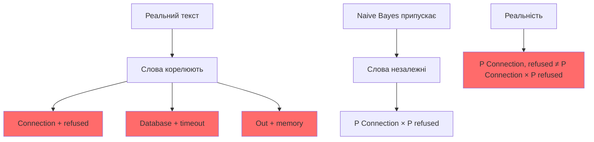

# Наївний Байєс: Чому Він Працює для Спаму, але Провалюється на Логах

"Наївний" — це не образ. Це точний математичний термін, який описує ключове припущення алгоритму: слова в тексті незалежні одне від одного.

Це припущення зазвичай хибне. Але дивовижним чином Naive Bayes працює добре для спаму та погано для технічних логів. Розберемося, чому.

## Припущення Незалежності: Чому "Наївне"

### Математичне формулювання

У попередньому розділі ми використовували формулу:

$$
P(w_1, w_2, \ldots, w_n \mid c) = \prod_{i=1}^{n} P(w_i \mid c)
$$

Це означає: ймовірність спільної появи слів дорівнює добутку ймовірностей окремих слів.

**Припущення незалежності:**

$$
P(w_i, w_j \mid c) = P(w_i \mid c) \cdot P(w_j \mid c)
$$

для будь-яких $i \neq j$.

### Чому Це "Наївне"

У реальному тексті слова **корелюють**. Наприклад:

- "Connection" часто з'являється разом з "refused"
- "Database" часто з'являється разом з "timeout"
- "Out" часто з'являється разом з "memory"

**Реальна ймовірність:**

$$
P(\texttt{"Connection"}, \texttt{"refused"} \mid \text{Critical}) \neq P(\texttt{"Connection"} \mid \text{Critical}) \cdot P(\texttt{"refused"} \mid \text{Critical})
$$

Наївний Байєс ігнорує цю кореляцію.

### Візуалізація Проблеми



## Multinomial vs Bernoulli Naive Bayes

### Дві Моделі, Два Підходи

Naive Bayes має дві основні варіації, які по-різному моделюють появу слів у тексті:

1. **Multinomial Naive Bayes** — враховує частоту слів
2. **Bernoulli Naive Bayes** — враховує лише факт наявності слова

### Multinomial Naive Bayes

**Ідея:** Кожне слово може з'явитися кілька разів, і частота важлива.

**Формалізація:**

Для документа $d$ з $n$ словами, де слово $w_i$ з'являється $x_i$ разів:

$$
P(d \mid c) = \frac{(\sum_{i=1}^{|V|} x_i)!}{\prod_{i=1}^{|V|} x_i!} \prod_{i=1}^{|V|} P(w_i \mid c)^{x_i}
$$

де $V$ — словник, $x_i$ — кількість разів, що слово $w_i$ з'являється в документі.

**Спрощення (ігноруємо факторіали, бо вони однакові для всіх класів):**

$$
P(d \mid c) \propto \prod_{i=1}^{|V|} P(w_i \mid c)^{x_i}
$$

**Оцінка ймовірності слова:**

$$
P(w_i \mid c) = \frac{\text{count}(w_i, c) + \alpha}{\sum_{j=1}^{|V|} \text{count}(w_j, c) + \alpha \cdot |V|}
$$

де $\alpha$ — Лапласове згладжування.

**Коли використовувати:**
- Довгі документи (листи, статті)
- Частота слів важлива ("віагра" з'являється 5 разів у спамі)
- Спам-фільтрація, класифікація документів

### Bernoulli Naive Bayes

**Ідея:** Важлива лише наявність слова, а не його частота.

**Формалізація:**

Для документа $d$, де $x_i \in \{0, 1\}$ — індикатор наявності слова $w_i$:

$$
P(d \mid c) = \prod_{i=1}^{|V|} P(w_i \mid c)^{x_i} \cdot (1 - P(w_i \mid c))^{1-x_i}
$$

**Оцінка ймовірності слова:**

$$
P(w_i \mid c) = \frac{\text{documents}(w_i \in d, c) + \alpha}{\text{total documents}(c) + \alpha \cdot 2}
$$

де $\text{documents}(w_i \in d, c)$ — кількість документів класу $c$, що містять слово $w_i$.

**Коли використовувати:**
- Короткі документи (логи, твіти)
- Факт наявності важливіший за частоту
- Класифікація логів, детекція аномалій

### Порівняння на Прикладах

**Приклад 1: Спам-лист**

```
Текст: "віагра віагра віагра казино безкоштовно"
```

**Multinomial:**
- "віагра" з'являється 3 рази → $P(\text{"віагра"} \mid \text{Spam})^3$
- Частота важлива: 3 входження сильніше, ніж 1

**Bernoulli:**
- "віагра" присутнє (1) → $P(\text{"віагра"} \mid \text{Spam})^1$
- Частота не важлива: 3 входження = 1 входження

**Висновок:** Для спаму Multinomial краще, бо повторення слів ("віагра" 5 разів) — сильний індикатор.

**Приклад 2: Технічний лог**

```
Лог 1: "ERROR: Connection refused"
Лог 2: "ERROR ERROR ERROR: Connection refused"
```

**Multinomial:**
- Лог 2 має більшу вагу через 3 "ERROR"
- Але обидва описують одну проблему!

**Bernoulli:**
- Обидва мають однакову вагу (наявність "ERROR" та "Connection refused")
- Краще відображає семантику

**Висновок:** Для логів Bernoulli краще, бо факт наявності помилки важливіший за кількість повторень.

### Математичне Порівняння

**Multinomial для логу:**

$$
P(\text{Critical} \mid \text{"ERROR ERROR ERROR"}) \propto P(\text{Critical}) \cdot P(\text{"ERROR"} \mid \text{Critical})^3
$$

**Bernoulli для того ж логу:**

$$
P(\text{Critical} \mid \text{"ERROR ERROR ERROR"}) \propto P(\text{Critical}) \cdot P(\text{"ERROR"} \mid \text{Critical})^1 \cdot (1 - P(\text{"ERROR"} \mid \text{Critical}))^0
$$

**Різниця:** Multinomial "переоцінює" повторення, Bernoulli фокусується на наявності.

### Реалізація: Порівняння Моделей

```python
"""
Порівняння Multinomial та Bernoulli Naive Bayes на логах.
Демонструє, чому Bernoulli краще для коротких технічних логів.
"""

from sklearn.naive_bayes import MultinomialNB, BernoulliNB
from sklearn.feature_extraction.text import CountVectorizer
from sklearn.metrics import classification_report, confusion_matrix
import numpy as np


def compare_models(X_train, y_train, X_test, y_test):
    """
    Порівнює Multinomial та Bernoulli Naive Bayes.
    """
    print("=" * 70)
    print("ПОРІВНЯННЯ: MULTINOMIAL vs BERNOULLI NAIVE BAYES")
    print("=" * 70)
    print()
    
    # Multinomial: використовує CountVectorizer (частота слів)
    multinomial_vectorizer = CountVectorizer(binary=False)  # Частота
    X_train_multi = multinomial_vectorizer.fit_transform(X_train)
    X_test_multi = multinomial_vectorizer.transform(X_test)
    
    multinomial_model = MultinomialNB(alpha=1.0)
    multinomial_model.fit(X_train_multi, y_train)
    y_pred_multi = multinomial_model.predict(X_test_multi)
    
    # Bernoulli: використовує CountVectorizer(binary=True) (наявність)
    bernoulli_vectorizer = CountVectorizer(binary=True)  # Тільки наявність
    X_train_bern = bernoulli_vectorizer.fit_transform(X_train)
    X_test_bern = bernoulli_vectorizer.transform(X_test)
    
    bernoulli_model = BernoulliNB(alpha=1.0)
    bernoulli_model.fit(X_train_bern, y_train)
    y_pred_bern = bernoulli_model.predict(X_test_bern)
    
    print("MULTINOMIAL NAIVE BAYES:")
    print("-" * 70)
    print(classification_report(y_test, y_pred_multi))
    print()
    
    print("BERNOULLI NAIVE BAYES:")
    print("-" * 70)
    print(classification_report(y_test, y_pred_bern))
    print()
    
    # Аналіз на конкретних прикладах
    print("АНАЛІЗ НА ПРИКЛАДАХ:")
    print("-" * 70)
    
    test_examples = [
        "ERROR: Connection refused",
        "ERROR ERROR ERROR: Connection refused",  # Повторення
        "Connection established successfully",
        "Database timeout after 30 seconds"
    ]
    
    for example in test_examples:
        # Multinomial
        X_example_multi = multinomial_vectorizer.transform([example])
        prob_multi = multinomial_model.predict_proba(X_example_multi)[0]
        pred_multi = multinomial_model.predict(X_example_multi)[0]
        
        # Bernoulli
        X_example_bern = bernoulli_vectorizer.transform([example])
        prob_bern = bernoulli_model.predict_proba(X_example_bern)[0]
        pred_bern = bernoulli_model.predict(X_example_bern)[0]
        
        print(f"\nТекст: '{example}'")
        print(f"  Multinomial: {pred_multi} (prob: {prob_multi})")
        print(f"  Bernoulli:   {pred_bern} (prob: {prob_bern})")
        
        # Показуємо різницю в обробці повторень
        if "ERROR" in example:
            error_count = example.count("ERROR")
            print(f"  Примітка: 'ERROR' з'являється {error_count} раз(и)")
            print(f"    Multinomial враховує частоту ({error_count}x)")
            print(f"    Bernoulli враховує лише наявність (1x)")
    
    print()
    print("=" * 70)
    print("ВИСНОВОК:")
    print("  Для технічних логів Bernoulli краще, бо:")
    print("  - Факт наявності помилки важливіший за частоту")
    print("  - 'ERROR ERROR ERROR' та 'ERROR' описують одну проблему")
    print("  - Multinomial переоцінює повторення")
    print("=" * 70)


# Використання (припускаємо, що дані вже підготовлені)
# compare_models(X_train, y_train, X_test, y_test)
```

### Вибір Моделі: Практичні Рекомендації

**Multinomial Naive Bayes використовуйте, коли:**

1. **Довгі документи:** Листи, статті, рецензії
2. **Частота важлива:** Повторення слів несе інформацію
3. **Приклади:** Спам-фільтрація, класифікація новин, sentiment analysis

**Bernoulli Naive Bayes використовуйте, коли:**

1. **Короткі документи:** Логи, твіти, коментарі
2. **Наявність важливіша:** Факт появи слова важливіший за частоту
3. **Приклади:** Класифікація логів, детекція аномалій, класифікація коротких повідомлень

### Гібридний Підхід

**Ідея:** Комбінувати обидві моделі для різних типів слів.

**Приклад:**

```python
class HybridNaiveBayes:
    """
    Гібридна модель: Multinomial для важливих слів,
    Bernoulli для службових слів.
    """
    
    def __init__(self):
        self.important_words = {"ERROR", "CRITICAL", "FATAL", "timeout", "refused"}
        self.multinomial_model = MultinomialNB()
        self.bernoulli_model = BernoulliNB()
    
    def fit(self, X_train, y_train):
        # Multinomial для важливих слів
        X_important = self._extract_important_words(X_train)
        self.multinomial_model.fit(X_important, y_train)
        
        # Bernoulli для всіх слів
        X_all = self._extract_all_words(X_train)
        self.bernoulli_model.fit(X_all, y_train)
    
    def predict(self, X_test):
        # Комбінуємо прогнози
        pred_multi = self.multinomial_model.predict_proba(X_test)
        pred_bern = self.bernoulli_model.predict_proba(X_test)
        
        # Середнє зважене
        combined = 0.7 * pred_multi + 0.3 * pred_bern
        return np.argmax(combined, axis=1)
```

## Чому Це Працює для Спаму

### Приклад: "Віагра" та "Казино"

**Спам-лист:** "Віагра казино безкоштовно виграй мільйон"

**Наївний Байєс обчислює:**

$$
P(\text{Spam} \mid \text{"віагра"}, \text{"казино"}) \propto P(\text{Spam}) \cdot P(\text{"віагра"} \mid \text{Spam}) \cdot P(\text{"казино"} \mid \text{Spam})
$$

**Чому це працює, навіть якщо слова корелюють?**

1. **Обидва слова сильні індикатори спаму:**
   - $P(\text{"віагра"} \mid \text{Spam}) \approx 0.8$ (висока)
   - $P(\text{"казино"} \mid \text{Spam}) \approx 0.7$ (висока)

2. **У нормальних листах обидва рідкісні:**
   - $P(\text{"віагра"} \mid \text{Ham}) \approx 0.001$ (дуже низька)
   - $P(\text{"казино"} \mid \text{Ham}) \approx 0.002$ (дуже низька)

3. **Добуток все одно дає правильний порядок:**

$$
P(\text{Spam} \mid \text{"віагра"}, \text{"казино"}) \propto 0.1 \cdot 0.8 \cdot 0.7 = 0.056
$$

$$
P(\text{Ham} \mid \text{"віагра"}, \text{"казино"}) \propto 0.9 \cdot 0.001 \cdot 0.002 = 0.0000018
$$

**Співвідношення:** $\frac{0.056}{0.0000018} \approx 31{,}111$ — настільки велике, що помилка від незалежності не критична.

### Математичне пояснення

Навіть якщо реальна ймовірність:

$$
P(\text{"віагра"}, \text{"казино"} \mid \text{Spam}) = 0.6
$$

(вища за добуток $0.8 \cdot 0.7 = 0.56$), але:

$$
P(\text{"віагра"}, \text{"казино"} \mid \text{Ham}) = 0.000001
$$

(набагато нижча за добуток $0.001 \cdot 0.002 = 0.000002$).

**Відношення ймовірностей:**

$$
\frac{P(\text{Spam} \mid \text{"віагра"}, \text{"казино"})}{P(\text{Ham} \mid \text{"віагра"}, \text{"казино"})} \approx \frac{0.6}{0.000001} = 600{,}000
$$

Наївний Байєс дає:

$$
\frac{0.56}{0.000002} = 280{,}000
$$

**Висновок:** Порядок величини правильний, навіть якщо точне значення неточне. Для бінарної класифікації (Spam/Ham) цього достатньо.

## Чому Це Провалюється на Логах

### Приклад: "Connection" та "Refused"

**Критичний лог:** "Connection refused: database unavailable"

**Нормальний лог:** "Connection established successfully"

**Проблема:** Слово "Connection" з'являється в обох, але значення залежить від контексту.

### Математичний аналіз

**Наївний Байєс обчислює:**

$$
P(\text{Critical} \mid \text{"Connection"}, \text{"refused"}) \propto P(\text{Critical}) \cdot P(\text{"Connection"} \mid \text{Critical}) \cdot P(\text{"refused"} \mid \text{Critical})
$$

**Проблема 1: "Connection" не специфічне**

- $P(\text{"Connection"} \mid \text{Critical}) \approx 0.3$ (середнє)
- $P(\text{"Connection"} \mid \text{Normal}) \approx 0.4$ (вище!)

"Connection" частіше з'являється в нормальних логах, ніж у критичних.

**Проблема 2: "Refused" без контексту**

- $P(\text{"refused"} \mid \text{Critical}) \approx 0.2$
- $P(\text{"refused"} \mid \text{Normal}) \approx 0.01$

"Refused" — сильний індикатор, але не достатній сам по собі.

**Добуток:**

$$
P(\text{Critical} \mid \text{"Connection"}, \text{"refused"}) \propto 0.0001 \cdot 0.3 \cdot 0.2 = 0.000006
$$

$$
P(\text{Normal} \mid \text{"Connection"}, \text{"refused"}) \propto 0.9999 \cdot 0.4 \cdot 0.01 = 0.0039996
$$

**Співвідношення:** $\frac{0.000006}{0.0039996} \approx 0.0015$ — на користь Normal!

**Реальність:** "Connection refused" разом — це **завжди** критично. Реальна ймовірність:

$$
P(\text{Critical} \mid \text{"Connection"}, \text{"refused"}) \approx 0.95
$$

**Висновок:** Наївний Байєс помиляється на 3 порядки величини.

### Чому Це Критично для Логів

1. **Контекст важливий:** "Connection refused" ≠ "Connection established"
2. **Послідовність важлива:** Порядок слів має значення
3. **Фрази важливі:** "Out of memory" — це фраза, а не два незалежні слова

**Приклад провалу:**

```
Лог 1: "Connection refused: database unavailable"  ← Критично
Лог 2: "Connection established: database ready"     ← Нормально
```

Наївний Байєс може класифікувати обидва як Normal, бо:
- "Connection" частіше в Normal
- "database" може бути в обох
- Ігнорує фразу "refused" vs "established"

## Лапласове Згладжування

### Проблема нульових ймовірностей

Якщо слово $w$ не зустрічалося в навчальних даних класу $c$, то:

$$
P(w \mid c) = 0
$$

**Наслідок:** Весь добуток стає нулем:

$$
P(c \mid w_1, w_2, \ldots, w_n) \propto P(c) \cdot 0 \cdot \ldots = 0
$$

Навіть якщо інші слова вказують на клас $c$.

**Приклад:**

Навчальні дані не містили слова "segmentation". Новий лог: "segmentation fault detected".

$$
P(\text{Critical} \mid \text{"segmentation"}, \text{"fault"}) \propto P(\text{Critical}) \cdot 0 \cdot P(\text{"fault"} \mid \text{Critical}) = 0
$$

Але "segmentation fault" — це **завжди** критично!

### Рішення: Лапласове згладжування

**Ідея:** Додаємо невелику константу $\alpha$ до кожної частоти.

**Формула:**

$$
P(w \mid c) = \frac{\text{count}(w, c) + \alpha}{\sum_{w' \in V} \text{count}(w', c) + \alpha \cdot |V|}
$$

де:
- $\alpha$ — параметр згладжування (зазвичай $\alpha = 1$)
- $V$ — словник (всі унікальні слова)
- $|V|$ — розмір словника

**Інтерпретація:** Уявімо, що ми додали $\alpha$ входжень кожного слова до кожного класу перед підрахунком.

### Математичне обґрунтування

**Без згладжування:**

$$
P(w \mid c) = \frac{\text{count}(w, c)}{\sum_{w' \in V} \text{count}(w', c)}
$$

**Проблема:** Якщо $\text{count}(w, c) = 0$, то $P(w \mid c) = 0$.

**Зі згладжуванням:**

$$
P(w \mid c) = \frac{\text{count}(w, c) + \alpha}{\sum_{w' \in V} \text{count}(w', c) + \alpha \cdot |V|}
$$

**Властивості:**

1. Якщо $\text{count}(w, c) = 0$, то $P(w \mid c) = \frac{\alpha}{\sum_{w'} \text{count}(w', c) + \alpha \cdot |V|} > 0$
2. Якщо $\text{count}(w, c) > 0$, то оцінка зміщується, але залишається розумною
3. $\sum_{w \in V} P(w \mid c) = 1$ (ймовірності нормалізовані)

### Вибір Параметра $\alpha$

**$\alpha = 1$ (Laplace smoothing):**
- Найпоширеніший вибір
- Додає "псевдо-спостереження" кожного слова

**$\alpha < 1$ (Lidstone smoothing):**
- Менше зміщення для частіших слів
- Більше впливу на рідкісні слова

**$\alpha > 1$:**
- Більше згладжування
- Менше впливу рідкісних слів

**Практичне правило:** Почніть з $\alpha = 1$, потім налаштуйте на валідаційному наборі.

## Реалізація з Лапласовим Згладжуванням

```python
"""
Покращена реалізація Naive Bayes з детальним аналізом помилок.
Демонструє проблеми з контекстно-залежними словами.
Використовує Bernoulli Naive Bayes для логів (наявність важливіша за частоту).
"""

from typing import Dict, List, Tuple
from collections import Counter, defaultdict
import math
from dataclasses import dataclass


@dataclass
class WordAnalysis:
    """Аналіз окремого слова для класу."""
    word: str
    class_label: str
    count: int
    probability: float
    log_probability: float


class ImprovedNaiveBayes:
    """
    Покращений Naive Bayes з детальним аналізом.
    """
    
    def __init__(self, smoothing: float = 1.0):
        self.smoothing = smoothing
        self.vocabulary: set = set()
        self.class_counts: Counter = Counter()
        self.word_counts: Dict[str, Counter] = defaultdict(Counter)
        self.total_documents = 0
        self.total_words_per_class: Dict[str, int] = defaultdict(int)
    
    def fit(self, documents: List[str], labels: List[str]) -> None:
        """Навчання класифікатора."""
        self.total_documents = len(documents)
        
        for doc, label in zip(documents, labels):
            self.class_counts[label] += 1
            tokens = self._tokenize(doc)
            self.vocabulary.update(tokens)
            
            for token in tokens:
                self.word_counts[label][token] += 1
                self.total_words_per_class[label] += 1
    
    def _tokenize(self, text: str) -> List[str]:
        """Токенізація."""
        return text.lower().split()
    
    def _calculate_likelihood(
        self, 
        word: str, 
        class_label: str
    ) -> float:
        """Обчислює P(word | class) з Лапласовим згладжуванням."""
        word_count = self.word_counts[class_label][word]
        total_words = self.total_words_per_class[class_label]
        vocab_size = len(self.vocabulary)
        
        numerator = word_count + self.smoothing
        denominator = total_words + self.smoothing * vocab_size
        
        return numerator / denominator if denominator > 0 else 0.0
    
    def analyze_word_contributions(
        self, 
        document: str, 
        class_label: str
    ) -> List[WordAnalysis]:
        """
        Аналізує внесок кожного слова в ймовірність класу.
        Корисно для дебагу та розуміння помилок.
        """
        tokens = self._tokenize(document)
        analyses = []
        
        for token in tokens:
            if token not in self.vocabulary:
                continue
            
            prob = self._calculate_likelihood(token, class_label)
            log_prob = math.log(prob) if prob > 0 else float('-inf')
            
            count = self.word_counts[class_label][token]
            
            analyses.append(WordAnalysis(
                word=token,
                class_label=class_label,
                count=count,
                probability=prob,
                log_probability=log_prob
            ))
        
        return sorted(analyses, key=lambda x: abs(x.log_probability), reverse=True)
    
    def predict_with_analysis(
        self, 
        document: str
    ) -> Tuple[str, Dict[str, float], Dict[str, List[WordAnalysis]]]:
        """
        Класифікує документ з детальним аналізом внеску слів.
        
        Returns:
            (predicted_class, probabilities, word_analyses)
        """
        tokens = self._tokenize(document)
        classes = list(self.class_counts.keys())
        
        log_probs = {}
        word_analyses = {}
        
        for class_label in classes:
            prior = self.class_counts[class_label] / self.total_documents
            log_prior = math.log(prior) if prior > 0 else float('-inf')
            
            log_likelihood_sum = 0.0
            analyses = []
            
            for token in tokens:
                if token not in self.vocabulary:
                    continue
                
                prob = self._calculate_likelihood(token, class_label)
                log_prob = math.log(prob) if prob > 0 else float('-inf')
                log_likelihood_sum += log_prob
                
                count = self.word_counts[class_label][token]
                analyses.append(WordAnalysis(
                    word=token,
                    class_label=class_label,
                    count=count,
                    probability=prob,
                    log_probability=log_prob
                ))
            
            log_probs[class_label] = log_prior + log_likelihood_sum
            word_analyses[class_label] = sorted(
                analyses, 
                key=lambda x: abs(x.log_probability), 
                reverse=True
            )
        
        # Нормалізація
        max_log_prob = max(log_probs.values())
        exp_probs = {
            label: math.exp(log_prob - max_log_prob)
            for label, log_prob in log_probs.items()
        }
        total = sum(exp_probs.values())
        probabilities = {
            label: prob / total
            for label, prob in exp_probs.items()
        }
        
        predicted_class = max(probabilities, key=probabilities.get)
        
        return predicted_class, probabilities, word_analyses


def demonstrate_spam_vs_logs() -> None:
    """
    Демонструє, чому Naive Bayes працює для спаму,
    але провалюється на технічних логах.
    """
    print("=" * 70)
    print("НАЇВНИЙ БАЙЄС: СПАМ vs ЛОГИ")
    print("=" * 70)
    print()
    
    # Спам-дані
    spam_docs = [
        "віагра казино безкоштовно виграй",
        "казино віагра мільйон виграй",
        "віагра дешево казино зараз"
    ]
    spam_labels = ["spam"] * 3
    
    ham_docs = [
        "зустріч завтра конференц-зал",
        "проект завершено успішно",
        "звіт готовий перевір"
    ]
    ham_labels = ["ham"] * 3
    
    spam_classifier = ImprovedNaiveBayes(smoothing=1.0)
    spam_classifier.fit(spam_docs + ham_docs, spam_labels + ham_labels)
    
    print("ТЕСТ 1: Спам-фільтрація")
    print("-" * 70)
    test_spam = "віагра казино"
    pred, probs, analyses = spam_classifier.predict_with_analysis(test_spam)
    
    print(f"Документ: '{test_spam}'")
    print(f"Передбачений клас: {pred}")
    print(f"Ймовірності: {probs}")
    print()
    print("Внесок слів для класу 'spam':")
    for analysis in analyses['spam'][:5]:
        print(f"  '{analysis.word}': count={analysis.count}, "
              f"P={analysis.probability:.4f}, log_P={analysis.log_probability:.2f}")
    print()
    
    # Логи
    critical_docs = [
        "Connection refused database unavailable",
        "Connection timeout database error",
        "Connection failed database down"
    ]
    critical_labels = ["critical"] * 3
    
    normal_docs = [
        "Connection established database ready",
        "Connection successful database online",
        "Connection opened database connected"
    ]
    normal_labels = ["normal"] * 3
    
    log_classifier = ImprovedNaiveBayes(smoothing=1.0)
    log_classifier.fit(critical_docs + normal_docs, critical_labels + normal_labels)
    
    print("ТЕСТ 2: Класифікація логів")
    print("-" * 70)
    test_critical = "Connection refused database"
    pred, probs, analyses = log_classifier.predict_with_analysis(test_critical)
    
    print(f"Документ: '{test_critical}'")
    print(f"Передбачений клас: {pred}")
    print(f"Ймовірності: {probs}")
    print()
    print("Внесок слів для класу 'critical':")
    for analysis in analyses['critical'][:5]:
        print(f"  '{analysis.word}': count={analysis.count}, "
              f"P={analysis.probability:.4f}, log_P={analysis.log_probability:.2f}")
    print()
    print("Внесок слів для класу 'normal':")
    for analysis in analyses['normal'][:5]:
        print(f"  '{analysis.word}': count={analysis.count}, "
              f"P={analysis.probability:.4f}, log_P={analysis.log_probability:.2f}")
    print()
    
    print("=" * 70)
    print("ВИСНОВОК:")
    print("  Для спаму: слова 'віагра' та 'казино' сильні індикатори,")
    print("    навіть якщо вони корелюють, добуток правильний порядок.")
    print()
    print("  Для логів: слово 'Connection' частіше в Normal,")
    print("    тому навіть з 'refused' класифікатор може помилитися.")
    print("    Контекст ('refused' vs 'established') критичний!")
    print("=" * 70)


if __name__ == "__main__":
    demonstrate_spam_vs_logs()
```

## Ключові Висновки

1. **"Наївність" = Незалежність:** Припущення, що слова незалежні, зазвичай хибне, але не завжди критичне.

2. **Multinomial vs Bernoulli:** Вибір моделі критичний. Multinomial для спаму (частота важлива), Bernoulli для логів (наявність важливіша за частоту).

3. **Працює для спаму:** Коли слова — сильні індикатори класу, навіть помилка від незалежності не змінює порядок величини. Multinomial краще, бо повторення слів несе інформацію.

4. **Провалюється на логах:** Коли контекст критичний ("Connection refused" vs "Connection established"), незалежність руйнує класифікацію. Bernoulli краще, бо факт наявності помилки важливіший за кількість повторень.

5. **Лапласове згладжування:** Запобігає нульовим ймовірностям для невідомих слів, але не вирішує проблему контексту.

6. **Потрібні складніші методи:** Для технічних логів потрібні моделі, які враховують послідовність та контекст (трансформери).

У наступному розділі ми подивимося, як перейти від підрахунку слів до розуміння змісту через векторні представлення.

## Рекомендована Література

### Класичні Роботи про Naive Bayes

1. **Domingos, P., & Pazzani, M.** (1997). "On the optimality of the simple Bayesian classifier under zero-one loss"
   - Machine Learning, 29(2-3), 103-130.
   - Демонструє, чому Naive Bayes часто працює добре, навіть коли припущення незалежності порушені.

2. **Rish, I.** (2001). "An empirical study of the naive Bayes classifier"
   - IJCAI Workshop on Empirical Methods in AI. Практичний аналіз, коли Naive Bayes працює, а коли ні.

3. **Zhang, H.** (2004). "The optimality of naive Bayes"
   - AAAI, 1(2), 3.
   - Математичне обґрунтування оптимальності Naive Bayes за певних умов.

### Лапласове Згладжування та Регуляризація

4. **Chen, S. F., & Goodman, J.** (1999). "An empirical study of smoothing techniques for language modeling"
   - Computer Speech & Language, 13(4), 359-394.
   - Порівняння різних методів згладжування, включаючи Laplace, Lidstone, та Kneser-Ney.

5. **Manning, C. D., Raghavan, P., & Schütze, H.** (2008). "Introduction to Information Retrieval"
   - Cambridge University Press. Розділ 13.2: "Naive Bayes text classification". Детальний розбір згладжування.

### Проблеми Контексту та Послідовності

6. **Jurafsky, D., & Martin, J. H.** (2020). "Speech and Language Processing"
   - 3rd Edition. Розділ 4.4: "Optimizing for Sentiment". Обговорює обмеження Naive Bayes для контекстно-залежних задач.

7. **Sebastiani, F.** (2002). "Machine learning in automated text categorization"
   - ACM Computing Surveys, 34(1), 1-47.
   - Огляд методів, включаючи обмеження статистичних підходів.

### Практична Реалізація

8. **Pedregosa, F., et al.** (2011). "Scikit-learn: Machine Learning in Python"
   - Документація: https://scikit-learn.org/stable/modules/naive_bayes.html
   - Реалізація MultinomialNB з автоматичним згладжуванням.

9. **Bird, S., Klein, E., & Loper, E.** (2009). "Natural Language Processing with Python"
   - O'Reilly Media. Розділ 6: "Learning to Classify Text". Практичні приклади з NLTK.

### Альтернативні Підходи

10. **McCallum, A., & Nigam, K.** (1998). "A comparison of event models for naive Bayes text classification"
    - AAAI Workshop on Learning for Text Categorization. **Критично важлива робота** про порівняння Multinomial та Bernoulli моделей. Демонструє, коли яка модель краща.

11. **Wang, S., & Manning, C. D.** (2012). "Baselines and bigrams: Simple, good sentiment and topic classification"
    - ACL. Демонструє, що прості методи часто працюють добре, але не завжди.

### Multinomial vs Bernoulli Naive Bayes

12. **Manning, C. D., Raghavan, P., & Schütze, H.** (2008). "Introduction to Information Retrieval"
    - Cambridge University Press. Розділ 13.3: "The Bernoulli model". Детальне пояснення різниці між моделями.

13. **Scikit-learn Documentation. "Naive Bayes"**
    - URL: https://scikit-learn.org/stable/modules/naive_bayes.html#multinomial-naive-bayes
    - Практичний гайд з використанням MultinomialNB та BernoulliNB.

---

**Примітка для студентів:** Почніть з McCallum & Nigam (1998) — це ключова робота про різницю між Multinomial та Bernoulli моделями. Розуміння цієї різниці критично для вибору правильної моделі: Multinomial для спаму (частота важлива), Bernoulli для логів (наявність важливіша). Потім перейдіть до Domingos & Pazzani для розуміння, чому Naive Bayes працює навіть при порушенні припущень. Для практики використовуйте документацію Scikit-learn та приклади з Manning et al.
