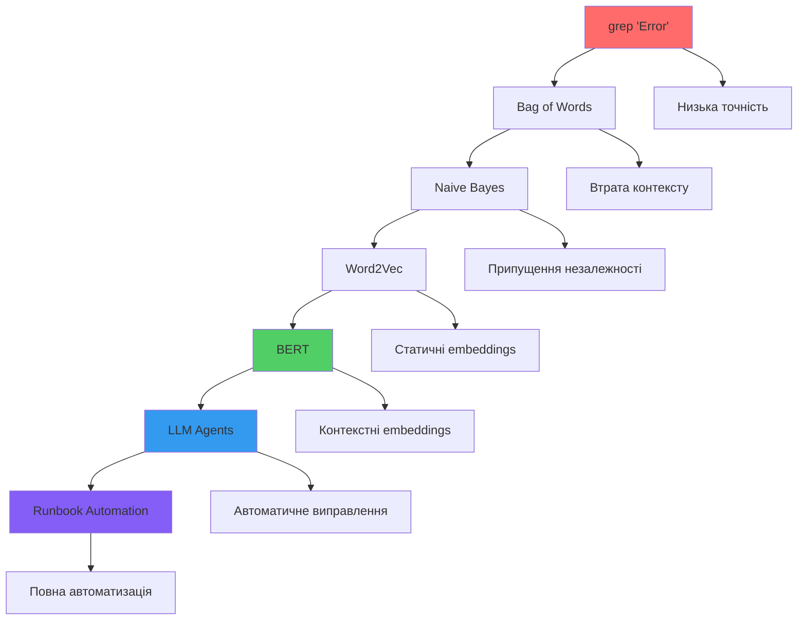

# Підсумки Курсу та Майбутнє: Від Класифікації до Автоматизації

Ми пройшли шлях від теореми Байєса (1763) до трансформерів BERT (2018). Від простого `grep "Error"` до контекстного розуміння технічних логів. Але це лише початок.

Наступний крок: не просто класифікувати помилки, а автоматично їх виправляти. LLM Agents, RAG, та Runbook Automation — це майбутнє AI-SRE.

## Що Ми Вивчили

### Блок 1: Інтуїція та Математична Пастка

**Ключові концепції:**

1. **Base Rate Fallacy:** Рідкісні події вимагають особливої обережності при інтерпретації результатів.

2. **Теорема Байєса:**
   $$P(c | \mathbf{x}) = \frac{P(\mathbf{x} | c) \cdot P(c)}{P(\mathbf{x})}$$

3. **Alert Fatigue:** Коли False Positives переважають True Positives, інженери втрачають довіру до системи.

**Висновок:** Математика пояснює, чому інтуїція підводить при оцінці рідкісних подій.

### Блок 2: Статистичний Підхід

**Ключові концепції:**

1. **Bag of Words:** Текст → Множина токенів → Вектор частот.

2. **Naive Bayes:**
   $$P(c | w_1, w_2, \ldots, w_n) \propto P(c) \prod_{i=1}^{n} P(w_i | c)$$

3. **Припущення незалежності:** Працює для спаму, але провалюється для контекстно-залежних логів.

**Висновок:** Статистичні методи прості та швидкі, але обмежені припущеннями.

### Блок 3: Геометричний Підхід

**Ключові концепції:**

1. **Word Embeddings:** Слова → Вектори в $\mathbb{R}^N$.

2. **Косинусна відстань:**
   $$d_{\cos}(\mathbf{v}_1, \mathbf{v}_2) = 1 - \frac{\mathbf{v}_1 \cdot \mathbf{v}_2}{\|\mathbf{v}_1\| \cdot \|\mathbf{v}_2\|}$$

3. **Self-Attention:**
   $$\text{Attention}(\mathbf{Q}, \mathbf{K}, \mathbf{V}) = \text{softmax}\left(\frac{\mathbf{Q}\mathbf{K}^T}{\sqrt{d_k}}\right) \mathbf{V}$$

4. **BERT:** Контекстні embeddings через bidirectional encoder.

**Висновок:** Геометричні методи враховують семантику та контекст.

### Блок 4: Практикум

**Ключові досягнення:**

1. **Синтетичні дані:** Генерація реалістичних логів без конфіденційної інформації.

2. **Порівняння моделей:** Naive Bayes vs BERT на незбалансованих даних.

3. **Метрики:** Accuracy оманлива, F1-score важливіший для незбалансованих даних.

**Висновок:** Практика підтверджує теорію — BERT краще для контекстно-залежних задач.

## Еволюція Підходів: Візуалізація



## Куди Рухатись Далі

### 1. RAG: Retrieval-Augmented Generation

**Проблема:** BERT класифікує помилки, але не знає, як їх виправляти.

**Рішення:** RAG комбінує пошук в базі знань з генерацією відповідей.

**Архітектура:**

1. **Retrieval:** Пошук релевантної документації з бази знань (runbooks, документація).
2. **Augmentation:** Додавання знайденої інформації до контексту.
3. **Generation:** Генерація інструкцій з виправлення через LLM.

**Приклад:**

```
Помилка: "Database connection timeout"
↓
Retrieval: Знаходить runbook "Troubleshooting Database Timeouts"
↓
Augmentation: Додає контекст до промпту
↓
Generation: "1. Перевірте мережеве з'єднання
             2. Перезапустіть connection pool
             3. Перевірте firewall rules"
```

### 2. LLM Agents для Автоматизації

**Ідея:** LLM не просто класифікує, а виконує дії.

**Архітектура:**

```python
class IncidentAgent:
    """
    LLM Agent для автоматичного виправлення інцидентів.
    """
    
    def __init__(self):
        self.classifier = BERTClassifier()
        self.rag_system = RAGSystem()
        self.action_executor = ActionExecutor()
    
    def handle_incident(self, log: str) -> dict:
        """
        Обробляє інцидент від виявлення до виправлення.
        """
        # 1. Класифікація
        classification = self.classifier.classify(log)
        
        if classification['label'] != 'critical':
            return {'action': 'ignore'}
        
        # 2. Пошук рішення
        solution = self.rag_system.retrieve_and_generate(log)
        
        # 3. Виконання дій (з підтвердженням)
        result = self.action_executor.execute(solution)
        
        return {
            'classification': classification,
            'solution': solution,
            'execution_result': result
        }
```

**Можливості:**

- Автоматичне виправлення простих помилок
- Ескалація складних проблем до людей
- Навчання на історії виправлень

### 3. Runbook Automation

**Проблема:** Runbooks (інструкції з виправлення) часто застарілі або неструктуровані.

**Рішення:** Автоматична генерація та оновлення runbooks через LLM.

**Пайплайн:**

1. **Збір даних:** Історія інцидентів та їх виправлень.
2. **Генерація:** Створення структурованих runbooks через LLM.
3. **Валідація:** Перевірка та затвердження людьми.
4. **Автоматизація:** Виконання runbooks через агентів.

**Приклад Runbook:**

```yaml
incident_type: "Database Connection Timeout"
severity: "critical"
steps:
  - name: "Check network connectivity"
    command: "ping database.internal"
    expected_output: "64 bytes from..."
  - name: "Restart connection pool"
    command: "systemctl restart connection-pool"
    timeout: 30s
  - name: "Verify resolution"
    command: "curl /health"
    expected_status: 200
```

### 4. Multi-Agent Systems

**Ідея:** Кілька спеціалізованих агентів працюють разом.

**Архітектура:**

```python
class MultiAgentSystem:
    """
    Система з кількох спеціалізованих агентів.
    """
    
    def __init__(self):
        self.detection_agent = DetectionAgent()  # Виявлення проблем
        self.diagnosis_agent = DiagnosisAgent()  # Діагностика
        self.remediation_agent = RemediationAgent()  # Виправлення
        self.coordinator = CoordinatorAgent()  # Координація
    
    def handle_incident(self, log: str) -> dict:
        """
        Координована обробка інциденту.
        """
        # 1. Виявлення
        detection = self.detection_agent.detect(log)
        
        # 2. Діагностика
        diagnosis = self.diagnosis_agent.diagnose(detection)
        
        # 3. Виправлення
        remediation = self.remediation_agent.remediate(diagnosis)
        
        # 4. Координація
        result = self.coordinator.coordinate(detection, diagnosis, remediation)
        
        return result
```

## Практичний Приклад: RAG для Runbook Generation

```python
"""
Приклад RAG системи для генерації runbooks.
"""

from typing import List, Dict
import openai  # або інший LLM API
from sentence_transformers import SentenceTransformer
import numpy as np


class RAGRunbookGenerator:
    """
    RAG система для генерації runbooks на основі інцидентів.
    """
    
    def __init__(self, knowledge_base: List[str]):
        """
        Args:
            knowledge_base: База знань (runbooks, документація)
        """
        self.knowledge_base = knowledge_base
        self.encoder = SentenceTransformer('all-MiniLM-L6-v2')
        
        # Створюємо embeddings для бази знань
        self.kb_embeddings = self.encoder.encode(knowledge_base)
    
    def retrieve(self, query: str, top_k: int = 3) -> List[str]:
        """
        Знаходить найбільш релевантні документи з бази знань.
        
        Args:
            query: Запит (наприклад, опис помилки)
            top_k: Кількість документів для повернення
        
        Returns:
            Список релевантних документів
        """
        # Кодуємо запит
        query_embedding = self.encoder.encode([query])[0]
        
        # Обчислюємо косинусну схожість
        similarities = np.dot(self.kb_embeddings, query_embedding) / (
            np.linalg.norm(self.kb_embeddings, axis=1) * 
            np.linalg.norm(query_embedding)
        )
        
        # Знаходимо top_k найбільш схожих
        top_indices = np.argsort(similarities)[-top_k:][::-1]
        
        return [self.knowledge_base[i] for i in top_indices]
    
    def generate_runbook(
        self, 
        incident_description: str,
        incident_type: str
    ) -> str:
        """
        Генерує runbook для інциденту.
        
        Args:
            incident_description: Опис інциденту
            incident_type: Тип інциденту (наприклад, "database_timeout")
        
        Returns:
            Згенерований runbook
        """
        # 1. Retrieval
        relevant_docs = self.retrieve(incident_description)
        
        # 2. Augmentation: Формуємо контекст
        context = "\n\n".join(relevant_docs)
        
        # 3. Generation: Генеруємо runbook через LLM
        prompt = f"""
На основі наступної документації та опису інциденту, створіть структурований runbook для виправлення проблеми.

Тип інциденту: {incident_type}
Опис: {incident_description}

Релевантна документація:
{context}

Створіть runbook у форматі YAML з наступними полями:
- incident_type
- severity
- steps (список кроків з name, command, expected_output)
- rollback_steps (кроки для відкату змін)

Runbook:
"""
        
        # Викликаємо LLM (приклад з OpenAI API)
        response = openai.ChatCompletion.create(
            model="gpt-4",
            messages=[
                {"role": "system", "content": "You are an expert SRE creating runbooks."},
                {"role": "user", "content": prompt}
            ],
            temperature=0.3
        )
        
        return response.choices[0].message.content


# Приклад використання
knowledge_base = [
    "Database timeout usually caused by network issues or connection pool exhaustion.",
    "To fix connection pool: restart service, check max_connections setting.",
    "Network issues: ping database, check firewall rules, verify DNS."
]

generator = RAGRunbookGenerator(knowledge_base)

incident = "Database connection timeout after 30 seconds"
runbook = generator.generate_runbook(incident, "database_timeout")
print(runbook)
```

## Concept Drift: Коли Модель Починає Помилятися

**Критична проблема для AI-SRE:** У технічних системах структура логів змінюється після кожного оновлення ПЗ. Модель класифікації, навчена на старих даних, починає помилятися через зміну формату логів, що вимагає перенавчання.

### Що Таке Concept Drift?

**Визначення:** Concept Drift (зсув концепції) — це явище, коли розподіл даних або зв'язок між ознаками та мітками змінюється з часом, що призводить до деградації якості моделі.

**Для технічних логів:**
- **До оновлення:** Логи мали формат `"Error: connection timeout"`
- **Після оновлення:** Логи мають формат `"ERROR [2024-01-15] Connection timeout detected"`
- **Проблема:** Модель навчена на старому форматі не розпізнає новий формат як "Critical"

### Типи Concept Drift

**1. Sudden Drift (Раптовий зсув):**
- Відбувається після оновлення ПЗ
- Формат логів змінюється миттєво
- **Приклад:** Зміна формату timestamp з `"2024-01-15"` на `"15/01/2024"`

**2. Gradual Drift (Поступовий зсув):**
- Відбувається поступово з часом
- Старий формат поступово замінюється новим
- **Приклад:** Поступове впровадження нового формату логів у різних сервісах

**3. Incremental Drift (Інкрементальний зсув):**
- Постійні невеликі зміни
- **Приклад:** Додавання нових полів до логів (IP-адреси, user IDs)

**4. Recurring Drift (Повторюваний зсув):**
- Старий формат повертається
- **Приклад:** Відкат до попередньої версії ПЗ

### Математична Формалізація

**Оригінальний розподіл (до drift):**
$$P_{\text{old}}(Y | X) = \frac{P_{\text{old}}(X | Y) \cdot P_{\text{old}}(Y)}{P_{\text{old}}(X)}$$

**Новий розподіл (після drift):**
$$P_{\text{new}}(Y | X) = \frac{P_{\text{new}}(X | Y) \cdot P_{\text{new}}(Y)}{P_{\text{new}}(X)}$$

**Умова drift:**
$$P_{\text{old}}(Y | X) \neq P_{\text{new}}(Y | X)$$

**Вимірювання drift:**
- **KL Divergence:** $D_{KL}(P_{\text{old}} || P_{\text{new}})$
- **JS Divergence:** $D_{JS}(P_{\text{old}} || P_{\text{new}})$
- **PSI (Population Stability Index):** $\text{PSI} = \sum_i (P_{\text{old},i} - P_{\text{new},i}) \log \frac{P_{\text{old},i}}{P_{\text{new},i}}$

### Приклад: Concept Drift у Логах

**Сценарій:** Система моніторингу навчена на логах версії 1.0, але після оновлення до версії 2.0 формат логів змінився.

**До оновлення (версія 1.0):**
```
"Error: Database connection timeout"
"Warning: High memory usage"
"Info: Request processed successfully"
```

**Після оновлення (версія 2.0):**
```
"[ERROR] [2024-01-15 10:30:45] Database connection timeout (timeout=30s, retries=3)"
"[WARN] [2024-01-15 10:30:46] High memory usage detected (usage=85%, threshold=80%)"
"[INFO] [2024-01-15 10:30:47] Request processed successfully (duration=120ms)"
```

**Проблема:**
- Модель навчена на простому форматі не розпізнає новий формат
- Нові поля (timestamp, параметри) можуть спричинити помилки класифікації
- Accuracy моделі падає з 95% до 70%

### Методи Виявлення Concept Drift

**1. Статистичні тести:**
- **KS Test (Kolmogorov-Smirnov):** Порівняння розподілів ознак
- **Chi-square Test:** Порівняння розподілів категоріальних ознак
- **PSI:** Вимірювання зміни розподілу

**2. Моніторинг метрик:**
- **Accuracy:** Різке падіння accuracy вказує на drift
- **Precision/Recall:** Зміна балансу між precision та recall
- **F1-score:** Загальна деградація якості

**3. Моніторинг розподілів:**
- **Embedding Space Drift:** Відстань між розподілами embeddings
- **Feature Distribution Drift:** Зміна розподілу окремих ознак

### Практична Реалізація: Детектор Drift

```python
"""
Детектор Concept Drift для технічних логів.
"""
import numpy as np
from scipy import stats
from sklearn.metrics import accuracy_score
from typing import List, Dict, Tuple
import warnings

class ConceptDriftDetector:
    """
    Детектор Concept Drift для моделей класифікації логів.
    """
    
    def __init__(self, threshold: float = 0.1):
        """
        Args:
            threshold: Поріг для виявлення drift (PSI > threshold)
        """
        self.threshold = threshold
        self.reference_distribution = None
        self.reference_embeddings = None
    
    def set_reference(self, embeddings: np.ndarray, labels: np.ndarray):
        """
        Встановлює референсний розподіл (навчальні дані).
        
        Args:
            embeddings: Embeddings з навчального набору
            labels: Мітки з навчального набору
        """
        self.reference_distribution = {
            'embeddings': embeddings,
            'labels': labels,
            'label_distribution': np.bincount(labels) / len(labels)
        }
        self.reference_embeddings = embeddings
    
    def detect_drift_psi(
        self, 
        current_embeddings: np.ndarray,
        current_labels: np.ndarray
    ) -> Tuple[float, bool]:
        """
        Виявляє drift через PSI (Population Stability Index).
        
        Returns:
            (psi_value, is_drift): PSI значення та чи є drift
        """
        if self.reference_distribution is None:
            raise ValueError("Reference distribution not set. Call set_reference() first.")
        
        # Порівнюємо розподіли міток
        ref_dist = self.reference_distribution['label_distribution']
        current_dist = np.bincount(current_labels) / len(current_labels)
        
        # Обчислюємо PSI
        psi = 0.0
        for i in range(len(ref_dist)):
            if ref_dist[i] > 0 and current_dist[i] > 0:
                psi += (current_dist[i] - ref_dist[i]) * np.log(current_dist[i] / ref_dist[i])
        
        is_drift = psi > self.threshold
        
        return psi, is_drift
    
    def detect_drift_ks(
        self,
        current_embeddings: np.ndarray
    ) -> Tuple[float, bool]:
        """
        Виявляє drift через KS Test на embeddings.
        
        Returns:
            (ks_statistic, is_drift): KS статистика та чи є drift
        """
        if self.reference_embeddings is None:
            raise ValueError("Reference embeddings not set. Call set_reference() first.")
        
        # Обчислюємо KS test для кожної розмірності embedding
        ks_stats = []
        for dim in range(current_embeddings.shape[1]):
            ref_values = self.reference_embeddings[:, dim]
            current_values = current_embeddings[:, dim]
            
            ks_stat, p_value = stats.ks_2samp(ref_values, current_values)
            ks_stats.append(ks_stat)
        
        # Середня KS статистика
        avg_ks = np.mean(ks_stats)
        
        # Поріг для KS test (зазвичай 0.1)
        is_drift = avg_ks > 0.1
        
        return avg_ks, is_drift
    
    def detect_drift_accuracy(
        self,
        predictions: np.ndarray,
        true_labels: np.ndarray,
        baseline_accuracy: float = 0.95
    ) -> Tuple[float, bool]:
        """
        Виявляє drift через падіння accuracy.
        
        Args:
            predictions: Передбачення моделі
            true_labels: Істинні мітки
            baseline_accuracy: Базовий рівень accuracy (з навчального набору)
        
        Returns:
            (current_accuracy, is_drift): Поточна accuracy та чи є drift
        """
        current_accuracy = accuracy_score(true_labels, predictions)
        
        # Drift якщо accuracy впала більше ніж на 5%
        accuracy_drop = baseline_accuracy - current_accuracy
        is_drift = accuracy_drop > 0.05
        
        return current_accuracy, is_drift
    
    def detect_drift_combined(
        self,
        current_embeddings: np.ndarray,
        current_labels: np.ndarray,
        predictions: np.ndarray,
        baseline_accuracy: float = 0.95
    ) -> Dict[str, any]:
        """
        Комбінований детектор drift (використовує кілька методів).
        
        Returns:
            Словник з результатами детекції
        """
        results = {}
        
        # PSI drift
        psi, psi_drift = self.detect_drift_psi(current_embeddings, current_labels)
        results['psi'] = psi
        results['psi_drift'] = psi_drift
        
        # KS drift
        ks, ks_drift = self.detect_drift_ks(current_embeddings)
        results['ks'] = ks
        results['ks_drift'] = ks_drift
        
        # Accuracy drift
        accuracy, accuracy_drift = self.detect_drift_accuracy(
            predictions, current_labels, baseline_accuracy
        )
        results['accuracy'] = accuracy
        results['accuracy_drift'] = accuracy_drift
        
        # Загальний висновок
        results['overall_drift'] = psi_drift or ks_drift or accuracy_drift
        
        return results


# Приклад використання
def demonstrate_concept_drift():
    """
    Демонструє виявлення Concept Drift.
    """
    print("=" * 80)
    print("ДЕМОНСТРАЦІЯ CONCEPT DRIFT ДЕТЕКЦІЇ")
    print("=" * 80)
    print()
    
    # Симуляція референсних даних (версія 1.0)
    np.random.seed(42)
    ref_embeddings = np.random.randn(1000, 768)  # 1000 логів, 768-вимірні embeddings
    ref_labels = np.random.binomial(1, 0.01, 1000)  # 1% Critical
    
    # Симуляція нових даних (версія 2.0 - з drift)
    # Новий розподіл трохи змінений
    new_embeddings = np.random.randn(500, 768) + 0.5  # Зсув у розподілі
    new_labels = np.random.binomial(1, 0.02, 500)  # 2% Critical (зміна base rate)
    new_predictions = np.random.binomial(1, 0.015, 500)  # Модель помиляється
    
    # Створюємо детектор
    detector = ConceptDriftDetector(threshold=0.1)
    detector.set_reference(ref_embeddings, ref_labels)
    
    # Виявляємо drift
    results = detector.detect_drift_combined(
        new_embeddings,
        new_labels,
        new_predictions,
        baseline_accuracy=0.95
    )
    
    # Виводимо результати
    print("РЕЗУЛЬТАТИ ДЕТЕКЦІЇ:")
    print("-" * 80)
    print(f"PSI: {results['psi']:.4f} | Drift: {'Так' if results['psi_drift'] else 'Ні'}")
    print(f"KS: {results['ks']:.4f} | Drift: {'Так' if results['ks_drift'] else 'Ні'}")
    print(f"Accuracy: {results['accuracy']:.4f} | Drift: {'Так' if results['accuracy_drift'] else 'Ні'}")
    print()
    print(f"ЗАГАЛЬНИЙ ВИСНОВОК: {'DRIFT ВИЯВЛЕНО' if results['overall_drift'] else 'DRIFT НЕ ВИЯВЛЕНО'}")
    print()
    
    if results['overall_drift']:
        print("РЕКОМЕНДАЦІЇ:")
        print("  1. Зібрати нові дані з поточного формату логів")
        print("  2. Перенавчити модель на нових даних")
        print("  3. Виконати fine-tuning або повне переобучення")
        print("  4. Валідувати модель на тестовому наборі")
    
    print("=" * 80)


if __name__ == "__main__":
    demonstrate_concept_drift()
```

### Стратегії Боротьби з Concept Drift

**1. Періодичне Переобучення (Periodic Retraining):**
- Регулярне перенавчання моделі на нових даних
- **Переваги:** Простота реалізації
- **Недоліки:** Може бути занадто пізно, якщо drift вже відбувся

**2. Адаптивне Навчання (Adaptive Learning):**
- Постійне оновлення моделі на нових даних
- **Переваги:** Модель завжди актуальна
- **Недоліки:** Вимагає більше обчислювальних ресурсів

**3. Ensemble Методи:**
- Комбінація кількох моделей, навчених на різних періодах
- **Переваги:** Стійкість до drift
- **Недоліки:** Складність управління

**4. Online Learning:**
- Навчання моделі в реальному часі на нових даних
- **Переваги:** Швидка адаптація до змін
- **Недоліки:** Ризик overfitting на нових даних

### Практичні Рекомендації для AI-SRE

**1. Моніторинг метрик:**
- Встановіть алерти на падіння accuracy нижче порогу (наприклад, 90%)
- Відстежуйте зміну розподілу міток (PSI > 0.1)

**2. Автоматичне виявлення drift:**
- Інтегруйте детектор drift у пайплайн моніторингу
- Автоматично запускайте переобучення при виявленні drift

**3. Версіонування моделей:**
- Зберігайте версії моделей для різних форматів логів
- Використовуйте A/B тестування для нових моделей

**4. Документація змін:**
- Ведіть журнал змін формату логів
- Зв'язуйте зміни формату з версіями ПЗ

### Ключові Висновки про Concept Drift

1. **Concept Drift неминучий:** У технічних системах формат логів змінюється з часом
2. **Виявлення критично:** Автоматичне виявлення drift дозволяє швидко реагувати на зміни
3. **Перенавчання необхідне:** Модель потребує регулярного оновлення на нових даних
4. **Моніторинг важливий:** Постійний моніторинг метрик допомагає виявити drift на ранніх стадіях

**Для AI-SRE:** Concept Drift — це не баг, а feature технічних систем. Побудова стійкої системи моніторингу вимагає автоматичного виявлення та обробки drift.

## Виклики та Обмеження

### 1. Безпека

**Проблема:** Автоматичне виконання команд може бути небезпечним.

**Рішення:**
- Підтвердження перед виконанням критичних команд
- Sandbox для тестування
- Audit log всіх дій

### 2. Якість Генерації

**Проблема:** LLM можуть генерувати неправильні інструкції.

**Рішення:**
- Валідація через експертів
- A/B тестування на історичних даних
- Feedback loop для покращення

### 3. Залежність від API

**Проблема:** Залежність від зовнішніх LLM API.

**Рішення:**
- Self-hosted моделі (Llama, Mistral)
- Fallback на простіші методи
- Кешування результатів

## Ключові Висновки Курсу

1. **Математика важлива:** Base Rate Fallacy пояснює, чому прості рішення не працюють.

2. **Контекст критичний:** Bag of Words не враховує контекст, BERT — так.

3. **Метрики мають значення:** Accuracy оманлива на незбалансованих даних, F1-score важливіший.

4. **Практика підтверджує теорію:** BERT краще за Naive Bayes для технічних логів.

5. **Майбутнє — автоматизація:** Від класифікації до автоматичного виправлення через LLM Agents.

## Рекомендовані Наступні Кроки

### Для Студентів

1. **Практика:** Реалізуйте повний пайплайн на реальних (анонімізованих) даних.

2. **Експерименти:** Порівняйте різні моделі (DistilBERT, RoBERTa, DeBERTa).

3. **Оптимізація:** Дослідіть методи зменшення розміру моделей (quantization, distillation).

4. **RAG:** Реалізуйте просту RAG систему для генерації runbooks.

### Для Інженерів

1. **Production Deployment:** Розгорніть модель у продакшені з моніторингом.

2. **A/B Testing:** Порівняйте автоматичні runbooks з ручними.

3. **Feedback Loop:** Зберігайте результати для покращення моделей.

4. **Multi-Agent Systems:** Експериментуйте з координованими агентами.

## Рекомендована Література

### RAG та Retrieval

1. **Lewis, P., et al.** (2020). "Retrieval-Augmented Generation for Knowledge-Intensive NLP Tasks"
   - NeurIPS. Оригінальна робота про RAG.

2. **Karpukhin, V., et al.** (2020). "Dense Passage Retrieval for Open-Domain Question Answering"
   - EMNLP. Dense retrieval для RAG.

### LLM Agents

3. **Wang, L., et al.** (2023). "Plan-and-Solve Prompting: Improving Zero-Shot Chain-of-Thought Reasoning by Large Language Models"
   - arXiv. Планування дій через LLM.

4. **Yao, S., et al.** (2022). "ReAct: Synergizing Reasoning and Acting in Language Models"
   - arXiv. Reasoning + Acting для агентів.

### Runbook Automation

5. **Google SRE Book. "Automation"**
   - URL: https://sre.google/sre-book/automation/
   - Практичні поради з автоматизації в SRE.

6. **Charity, M., & Allspaw, J.** (2018). "The Art of Monitoring"
   - O'Reilly Media. Розділ про автоматизацію виправлень.

### Multi-Agent Systems

7. **Wooldridge, M.** (2009). "An Introduction to MultiAgent Systems"
   - 2nd Edition. Wiley. Теоретичні основи multi-agent systems.

8. **Wang, G., et al.** (2023). "AutoGen: Enabling Next-Gen LLM Applications via Multi-Agent Conversation"
   - arXiv. Практична бібліотека для multi-agent систем.

### Production ML

9. **Huyen, C.** (2022). "Designing Machine Learning Systems"
   - O'Reilly Media. Практичний гайд з ML у продакшені.

10. **Sculley, D., et al.** (2015). "Hidden Technical Debt in Machine Learning Systems"
    - NIPS. Проблеми ML у продакшені.

---

**Фінальна Примітка:** Ми пройшли шлях від теореми Байєса до трансформерів. Але найцікавіше попереду: LLM Agents, які не просто розуміють проблеми, а автоматично їх виправляють. Це майбутнє AI-SRE.

**Дякуємо за увагу!**

