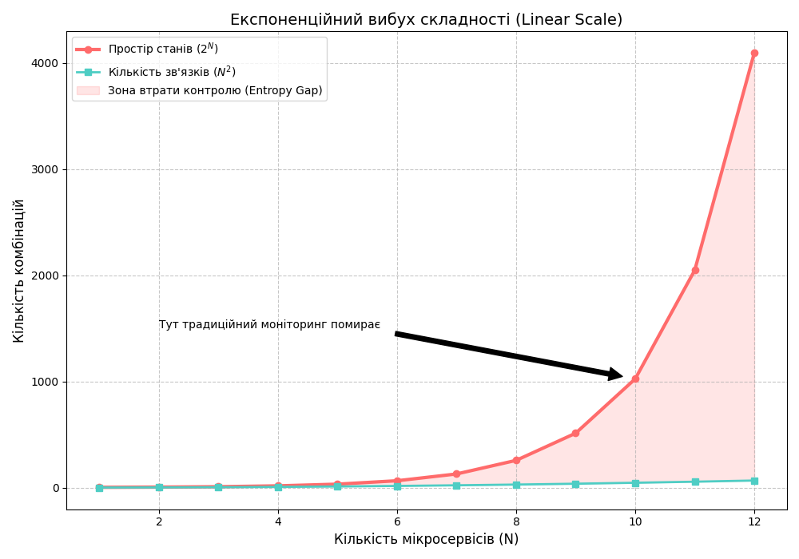

# Прокляття Кардинальності: IT-системи vs Hardware Fabrics

## 1. Метрики заліза vs Контекст софту

При моніторингу високонавантажених систем виникає ілюзія, що більше даних — завжди краще. Але телеметрія заліза (Hardware Fabrics) і прикладного ПЗ (IT-системи) різняться за інформаційною щільністю.

### Характеристики Hardware-метрик:
* **Низька кардинальність:** Назви метрик стабільні (напр., `cpu_usage`, `disk_iops`, `temp_celsius`).
* **Висока частота:** Метрики генеруються мільярдами точок даних на секунду, але їхня семантика обмежена станом конкретного фізичного компонента.
* **Брак контексту:** Метрика `cpu_usage: 99%` на рівні комутатора або сервера не пояснює, **який саме** запит користувача або мікросервіс спричинив це навантаження.

### Характеристики Software-метрик:
* **Екстремальна кардинальність (High Cardinality):** Метрики включають унікальні ідентифікатори (UserID, TraceID, IP-адреси, ContainerID).
* **Семантична щільність:** Один структурований event типу `Order_Failed` з метаданими `site-beta`, `service-consul`, `OOMKilled` несе більше діагностичної цінності, ніж 100,000 рядків сирого дампу завантаження процесора.
* **Проблема "Unknown Unknowns":** Саме в софті через динамічність Kubernetes виникають стани, які неможливо передбачити заздалегідь.

### Математична база: Проблема Cardinality Explosion

Кардинальність — це кількість унікальних комбінацій значень у наборі даних. У системах моніторингу (напр. Prometheus) загальна кількість часових рядів ($T$) обчислюється як декартовий добуток значень усіх міток (labels):

$$T = \prod_{i=1}^{n} |L_i|$$

Де $L_i$ — множина унікальних значень $i$-ї мітки.

**Приклад вибуху розмірності:**
Якщо ви додаєте мітку `user_id` до метрики `http_requests_total` у системі з 1,000,000 користувачів, ви миттєво створюєте 1,000,000 унікальних часових рядів у базі даних (TSDB). Це призводить до:
1. **OOMKilled** системи моніторингу через переповнення індексів.
2. **Alert Fatigue** через неможливість адекватної фільтрації сигналу в такому об'ємі шуму.

## 2. Математика вибуху простору станів у розподілених системах

У розподілених системах (напр., Kubernetes) складність діагностики зростає не лінійно, а експоненційно відносно кількості компонентів та їхніх зв'язків. Це створює умови для виникнення емерджентної поведінки, яку неможливо виявити через прості пороги (thresholds).

### Комбінаторний вибух взаємодій

Розглянемо систему з $N$ мікросервісів. Якщо кожен сервіс може перебувати лише у двох станах (Healthy/Unhealthy), то загальна кількість станів системи становить $2^N$. Проте в реальності стан системи визначається не лише станом вузлів, а й станом зв'язків між ними.

Якщо кожен сервіс взаємодіє з іншими, кількість можливих ребер у графі зв'язків становить:
$$E_{max} = \frac{N(N-1)}{2}$$

Кількість сценаріїв відмов, пов'язаних із затримками (latency) або втратами пакетів на цих ребрах, зростає як $O(2^{N^2})$. Це пояснює, чому статичні дашборди, налаштовані на "відомі" помилки, неспроможні покрити простір станів сучасної інфраструктури.

### Формалізація складності через ентропію спостережень

Ентропія Шеннона ($H$) для системи моніторингу, що збирає метрики, визначає кількість невизначеності:
$$H(X) = -\sum_{i=1}^{n} P(x_i) \log P(x_i)$$

Де $P(x_i)$ — ймовірність перебування системи в стані $x_i$. У високонавантажених системах з високою кардинальністю (High Cardinality) кількість можливих станів $n$ настільки велика, що $H(X)$ прямує до максимуму. 

**Висновок для інженера:**
Через математичну природу розподілених систем, ви не можете "вилікувати" систему додаванням нових алертів. Ви маєте використовувати підхід **Observability**, який дозволяє фільтрувати цей шум та шукати аномалії в просторі високої розмірності за допомогою статистичних методів та ML.

## 3. Практичні наслідки для інженера: Як вижити в ентропійному розриві

### Факт

Коли швидкість зростання простору станів $O(2^N)$ перевищує швидкість додавання нових дашбордів, інженер потрапляє в "сліпу зону". Моніторинг (Monitoring) перетворюється на "звалище даних", де пошук причини аварії займає години замість хвилин.

### Рекомендація: Стратегії приборкання складності

1. **Відмова від "All-at-once" Моніторингу (Monitoring):** Замість спроб візуалізувати кожен окремий контейнер, використовуйте агрегацію на основі сервісних сутностей. Фокусуйтесь на Критичних метриках (Golden Signals).

> **Golden Signals** — чотири фундаментальні показники (Затримка (Latency), Трафік (Traffic), Помилки (Errors), Насиченість (Saturation)), що визначають працездатність системи.

2. **Перехід до структурованих подій (Structured Events):** Один багатий на контекст event (наприклад, JSON-об'єкт із `user_id`, `endpoint`, `latency`, `cluster_id`) має більшу діагностичну цінність, ніж 100 окремих метрик. Це дозволяє аналізувати Невідомі невідомі (Unknown Unknowns) шляхом довільної фільтрації.
3. **Розумне семплювання (Sampling):** У високонавантажених системах збір 100% даних про успішні запити створює надлишковий шум. Зберігайте 1% успішних подій для статистики та 100% помилок для діагностики.

### Ризик: Прокляття кардинальності в Prometheus

Додавання унікальних значень (наприклад, `user_id` або `order_id`) у мітки (labels) Prometheus миттєво призводить до **Cardinality Explosion**. Кожна нова мітка зі значенням $K$ збільшує обсяг оперативної пам'яті, що споживає TSDB, у $K$ разів. Це найчастіша причина падіння систем Моніторингу (Monitoring) (OOMKilled) у Kubernetes-кластерах.

### Варто знати

Існує думка, що для критичної інфраструктури (Hardware Fabrics, Core Network) надмірний збір сирих метрик без софтового контексту є виправданим. Для L1-інженерів "шум" у вигляді температурних датчиків або CRC-помилок на портах є "сигналом" про деградацію заліза. Проте для SRE та розробників додатків ці дані залишаються вторинними, доки вони не корелюють із Затримкою (Latency) запиту користувача.

---