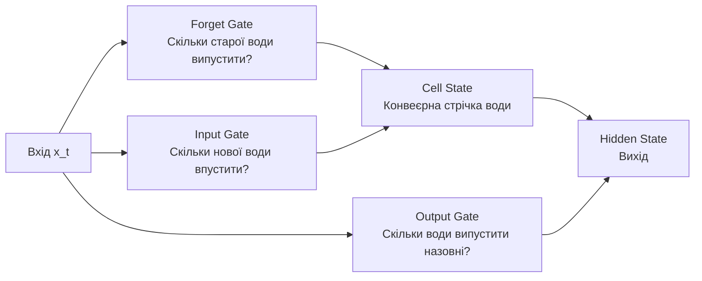
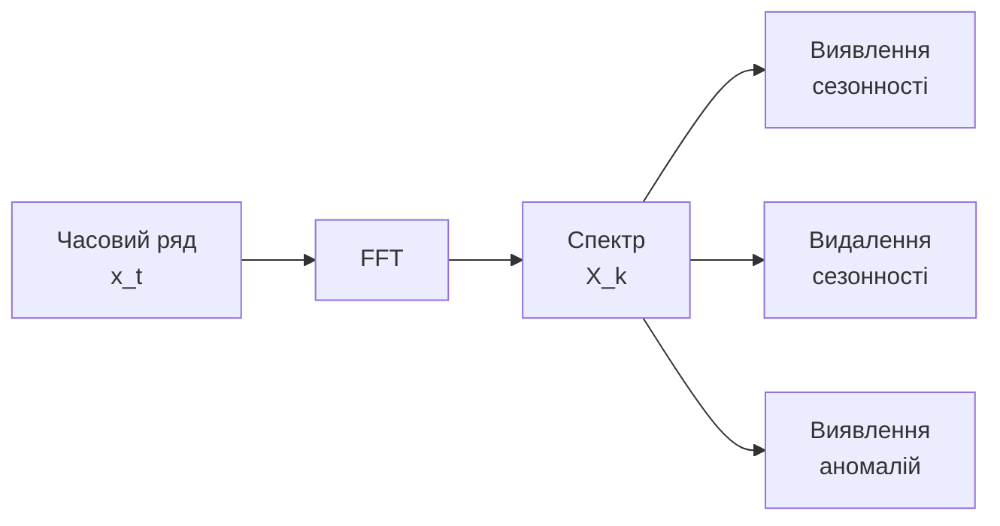
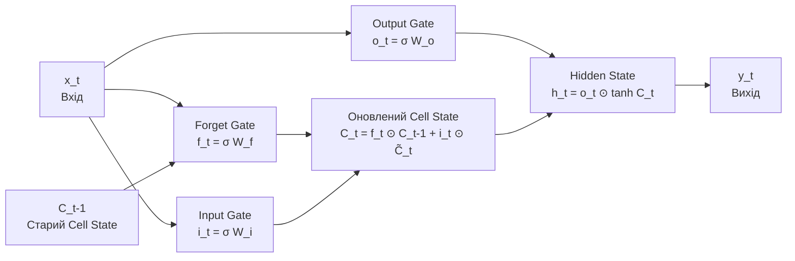

# Глосарій термінів: Мост між математикою та IT-системами

## Навіщо цей глосарій?

Цей курс об'єднує дві світи: **математику** (яку ви знаєте) та **IT-системи** (які можуть бути новими). Багато термінів мають різні значення в різних контекстах. Цей глосарій допоможе вам:

1. **Розрізнити "ложних друзів"** — терміни, що звучать знайомо, але означають щось інше
2. **Зрозуміти контекст IT-систем** через аналогії з реальним світом
3. **Перевести математичні концепції** на мову інтуїції

---

## Розділ 1: "Ложні друзі" (False Friends)

### 🔴 ПАМ'ЯТЬ (Memory)

**Проблема:** Це слово має **три різні значення** в цьому курсі!

#### 1. Пам'ять як апаратне забезпечення (RAM)
**Що це:** Фізична частина комп'ютера, де зберігаються дані під час роботи.

**Аналогія:** Як робочий стіл — чим більше стіл, тим більше паперів можна розкласти одночасно.

**У контексті курсу:** Коли ми говоримо "Memory usage = 80%", це означає, що 80% фізичної пам'яті комп'ютера зайнято.

#### 2. Пам'ять як статистична залежність (Long-Range Dependence)
**Що це:** Властивість часового ряду, коли майбутнє значення залежить від минулих значень.

**Аналогія:** Як "інерція" у фізиці. Якщо ви високий сьогодні, ви маєте тенденцію залишатися високим завтра (на відміну від випадкового підкидання монети).

**У контексті курсу:** Показник Херста $H > 0.5$ означає, що система має "пам'ять" — минуле впливає на майбутнє.

**Математично:** Якщо $X_t$ (значення на кроці $t$) корелює з $X_{t-k}$ (значення $k$ кроків тому), то є пам'ять.

#### 3. Пам'ять як внутрішній стан LSTM (Cell State / Hidden State)
**Що це:** Внутрішні змінні нейронної мережі, які зберігають інформацію про попередні кроки.

**Аналогія:** Як конспект лекції — ви записуєте важливе, щоб використати пізніше.

**У контексті курсу:** LSTM має "Cell State" (конвеєрна стрічка інформації) та "Hidden State" (поточний вихід).

---

### 🔴 ХАОС (Chaos)

**Проблема:** У повсякденній мові "хаос" = безлад. У математиці — це щось інше!

#### 1. Хаос у повсякденній мові
**Що це:** Безлад, випадковість, відсутність порядку.

**Приклад:** "У кімнаті хаос" = все розкидано.

#### 2. Детермінований хаос (Deterministic Chaos)
**Що це:** Система, що поводиться **випадково**, хоча правила її роботи **повністю детерміновані** (немає випадковості в формулах).

**Аналогія:** Як метеорологія. Погода виглядає випадковою, але підпорядковується фізичним законам. Проблема в тому, що малі помилки в початкових умовах експоненційно зростають.

**У контексті курсу:** Логістичне відображення $x_{n+1} = r x_n (1 - x_n)$ при $r > 3.569$ є хаотичним — кожен крок визначений, але поведінка виглядає випадковою.

**Ключова ідея:** Навіть якщо ви знаєте точну формулу, ви не можете передбачити далеке майбутнє через чутливість до початкових умов.

---

### 🔴 ШУМ (Noise)

**Проблема:** У повсякденній мові "шум" = звук. У математиці — це випадкові відхилення.

#### 1. Шум як звук
**Що це:** Акустичні коливання, які ми чуємо.

**Приклад:** Шум на вулиці, шум вентилятора.

#### 2. Шум як стохастичне відхилення (Stochastic Noise)
**Що це:** Випадкові відхилення від очікуваного значення.

**Аналогія:** Як похибка вимірювання. Навіть якщо ви вимірюєте температуру точно, кожне вимірювання трохи відрізняється через неточність приладу.

**У контексті курсу:**
- **Білий шум (White Noise):** Випадкові відхилення, які не корелюють з попередніми значеннями. Як випадкові помилки вимірювання.
- **Кольоровий шум:** Шум з певною структурою (наприклад, "рожевий шум" має більше низьких частот).

**Математично:** $\epsilon_t \sim \mathcal{N}(0, \sigma^2)$ — нормально розподілені випадкові величини з нульовим середнім.

---

### 🔴 ВОРОТА (Gate)

**Проблема:** У логіці "gate" = логічний елемент (AND/OR). У LSTM — це щось інше!

#### 1. Логічні ворота (Logic Gates)
**Що це:** Елементи цифрової логіки, що виконують булеві операції.

**Приклад:** AND gate — вихід = 1, якщо обидва входи = 1.

#### 2. Ворота в LSTM (Gates)
**Що це:** Нейронні механізми, що контролюють потік інформації (скільки пропустити, скільки заблокувати).

**Аналогія:** Як **фізичні вентилі** (valves) у гідравлічній системі:
- **Forget Gate (Вентиль забуття):** Скільки старої води випустити
- **Input Gate (Вхідний вентиль):** Скільки нової води впустити
- **Output Gate (Вихідний вентиль):** Скільки води випустити назовні

**У контексті курсу:** LSTM використовує сигмоїдну функцію $\sigma(z)$ для gates, яка дає значення від 0 до 1 (0 = закрито, 1 = відкрито).

**Математично:** $f_t = \sigma(W_f \cdot [h_{t-1}, x_t] + b_f)$ — forget gate обчислює, скільки інформації зберегти.

---

### 🔴 ПОРОГ (Threshold)

**Проблема:** У повсякденній мові "поріг" = межа входу. У статистиці — це критичне значення.

#### 1. Поріг як фізична межа
**Що це:** Межа, через яку потрібно переступити.

**Приклад:** Поріг дверей.

#### 2. Поріг як статистичне критичне значення
**Що це:** Значення, при перевищенні якого ми робимо висновок про аномалію.

**Аналогія:** Як швидкість на спідометрі. Якщо швидкість > 120 км/год, спрацьовує алерт (поріг = 120).

**У контексті курсу:**
- **Статичний поріг:** Фіксоване значення (наприклад, CPU > 80% = алерт)
- **Динамічний поріг:** Значення, що змінюється залежно від контексту (наприклад, $\mu + 3\sigma$, де $\mu$ та $\sigma$ обчислюються на основі історичних даних)

**Математично:** Якщо $|y_t - \hat{y}_t| > \mu_{\text{error}} + 3\sigma_{\text{error}}$, то виявлена аномалія.

---

## Розділ 2: Контекст IT-систем (Domain Knowledge)

### 🖥️ Що таке IT-система?

**Аналогія:** Як фабрика:
- **Сервер (Server):** Машина, що виконує роботу (як верстат на фабриці)
- **Клієнт (Client):** Той, хто просить виконати роботу (як замовник)
- **Запит (Request):** Завдання, яке клієнт надсилає серверу (як замовлення)
- **Відповідь (Response):** Результат роботи сервера (як готовий виріб)

**У контексті курсу:** Ми моніторимо "здоров'я" серверів, як лікарі моніторять здоров'я пацієнтів.

---

### 📊 Метрики (Metrics)

**Що це:** Числові показники, що описують стан системи.

**Аналогія:** Як показники здоров'я:
- **Температура тіла** → **CPU utilization** (скільки процесора використовується)
- **Тиск** → **Memory usage** (скільки пам'яті зайнято)
- **Пульс** → **Network latency** (швидкість відповіді)

**Типові метрики:**
- **CPU usage (%):** Скільки відсотків процесора зайнято (0-100%)
- **Memory usage (%):** Скільки відсотків пам'яті зайнято (0-100%)
- **Network latency (ms):** Час відповіді на мережевий запит (мілісекунди)
- **Disk I/O (MB/s):** Швидкість читання/запису на диск
- **Network I/O (MB/s):** Швидкість передачі даних через мережу

**У контексті курсу:** Ми аналізуємо ці метрики як часові ряди, щоб передбачити проблеми.

---

### ⚠️ Інцидент (Incident)

**Що це:** Подія, коли система перестає працювати або працює неправильно.

**Аналогія:** Як серцевий напад — раптова подія, що потребує негайної уваги.

**Типові інциденти:**
- **OOM (Out of Memory):** Системі не вистачає пам'яті, вона "падає"
- **CPU overload:** Процесор перевантажений, система зависає
- **Network failure:** Мережа не працює, запити не проходять

**У контексті курсу:** Ми намагаємося **передбачити** інцидент за 30+ хвилин до того, як він станеться.

---

### 🚨 Алерт (Alert)

**Що це:** Повідомлення про потенційну проблему.

**Аналогія:** Як сигнал тривоги — попереджає про небезпеку.

**У контексті курсу:** Система автоматично надсилає алерт, коли виявлена аномалія (наприклад, помилка реконструкції > поріг).

---

### 🔄 Деплой (Deploy / Deployment)

**Що це:** Процес встановлення нового коду або оновлення системи.

**Аналогія:** Як оновлення програми на телефоні — старий код замінюється новим.

**У контексті курсу:** Після деплою поведінка системи може змінитися (concept drift), тому модель потрібно перенавчати.

---

### 🐳 Kubernetes та Pod

**Kubernetes:** Система для управління контейнерами (програмами, що працюють ізольовано).

**Pod:** Найменша одиниця в Kubernetes — контейнер або група контейнерів, що працюють разом.

**Аналогія:** 
- **Kubernetes** = диспетчер таксі (управляє машинами)
- **Pod** = одна машина (контейнер з програмою)

**У контексті курсу:** Ми моніторимо метрики pod'ів (CPU, Memory) і намагаємося передбачити, коли pod "впаде".

---

### 📈 SRE (Site Reliability Engineering)

**Що це:** Інженерна дисципліна, що забезпечує надійність IT-систем.

**Аналогія:** Як інженер з безпеки на фабриці — забезпечує, щоб все працювало безпечно та надійно.

**Основні завдання SRE:**
- Моніторинг системи
- Виявлення проблем
- Автоматизація виправлень
- Планування масштабування

**У контексті курсу:** Ми будуємо інструменти для SRE — системи предиктивного моніторингу.

---

### 🔍 Моніторинг (Monitoring)

**Що це:** Постійне спостереження за станом системи.

**Аналогія:** Як моніторинг серцебиття в лікарні — постійно відстежуються показники.

**Типи моніторингу:**
- **Реактивний:** Виявляє проблеми після того, як вони сталися
- **Предиктивний:** Передбачає проблеми до того, як вони стануться (наш курс!)

---

### 📊 Prometheus / Grafana

**Prometheus:** Система збору та зберігання метрик.

**Grafana:** Інструмент для візуалізації метрик (графіки, дашборди).

**Аналогія:**
- **Prometheus** = база даних з показниками здоров'я
- **Grafana** = екран монітора, де лікар бачить графіки

**У контексті курсу:** Ми можемо експортувати дані з Prometheus для аналізу.

---

## Розділ 3: Математичні концепції через аналогії

### 📐 Показник Херста ($H$)

**Що це:** Число від 0 до 1, що вимірює "пам'ять" часового ряду.

**Аналогія 1: "Шорсткість" берегової лінії**
- $H = 0.5$: Як піщаний пляж — гладкий, передбачуваний
- $H > 0.5$: Як скелястий берег — шорсткий, з "пам'яттю" про попередні зміни
- $H < 0.5$: Як хвилі — швидко повертаються до середнього

**Аналогія 2: "Упертість" тренду**
- $H = 0.5$: Випадкове блукання — немає тренду, кожен крок незалежний
- $H > 0.5$: "Упертий" тренд — якщо зростає, має тенденцію продовжувати зростати
- $H < 0.5$: "Непостійний" тренд — швидко повертається до середнього (mean-reverting)

**Математично:** $R/S \sim (n/2)^H$, де $R$ — діапазон, $S$ — стандартне відхилення.

**У контексті курсу:** Метрики з $H > 0.7$ мають сильну пам'ять і можна передбачати. Метрики з $H \approx 0.5$ — випадковий шум, не варто витрачати ресурси на прогнозування.

---

### 🧠 LSTM: "Гідравлічна система" управління інформацією

**Що це:** Нейронна мережа, що може "запам'ятовувати" інформацію на довгий час.

**Аналогія: Гідравлічна система з вентилями**



**Компоненти:**

1. **Cell State ($C_t$):** Конвеєрна стрічка інформації
   - **Аналогія:** Труба з водою, що тече з часом
   - **Властивість:** Інформація може текти через багато кроків без втрат

2. **Forget Gate ($f_t$):** Вентиль забуття
   - **Аналогія:** Дренажний клапан — скільки старої води випустити
   - **Математично:** $f_t = \sigma(W_f \cdot [h_{t-1}, x_t] + b_f)$
   - **Значення:** 0 = "забути все", 1 = "зберегти все"

3. **Input Gate ($i_t$):** Вхідний вентиль
   - **Аналогія:** Впускний клапан — скільки нової води впустити
   - **Математично:** $i_t = \sigma(W_i \cdot [h_{t-1}, x_t] + b_i)$

4. **Output Gate ($o_t$):** Вихідний вентиль
   - **Аналогія:** Вихідний клапан — скільки води випустити назовні
   - **Математично:** $o_t = \sigma(W_o \cdot [h_{t-1}, x_t] + b_o)$

**Чому це вирішує проблему зникаючого градієнта?**

**Аналогія:** У звичайній RNN інформація проходить через багато "фільтрів" (tanh), і кожен фільтр втрачає частину інформації. У LSTM Cell State — це "пряма труба", де інформація може текти без втрат, якщо Forget Gate = 1.

**Математично:** $\frac{\partial C_t}{\partial C_{t-1}} \approx f_t$ — якщо $f_t \approx 1$, градієнт не зменшується експоненційно!

---

### 🔦 Механізм Attention: "Прожектор" у темній кімнаті

**Що це:** Механізм, що дозволяє моделі "фокусуватися" на важливих частинах історії.

**Аналогія 1: Прожектор у темній кімнаті**
- У темній кімнаті з багатьма предметами прожектор висвітлює тільки важливі
- Attention weights — це "інтенсивність прожектора" для кожного моменту в історії

**Аналогія 2: Читання речення**
- Коли ви читаєте "Кіт сидів на **столі**", ви фокусуєтеся на слові "столі"
- Attention дозволяє моделі "фокусуватися" на важливих моментах в історії

**Математично:**
$$\text{Attention}(Q, K, V) = \text{softmax}\left(\frac{QK^T}{\sqrt{d_k}}\right)V$$

Де:
- **Query ($Q$):** "Що ми шукаємо?" (поточний стан)
- **Key ($K$):** "Що цей момент може запропонувати?" (історичні стани)
- **Value ($V$):** "Що цей момент містить?" (інформація з історії)

**Чому це краще за LSTM?**

**Аналогія:** LSTM — як читати книгу по сторінках по черзі. Attention — як мати індекс і можливість "стрибати" до потрібної сторінки.

**У контексті курсу:** Якщо важлива подія сталася 3 дні тому, Attention може одразу звернутися до неї, не проходячи через всі проміжні кроки.

---

### 🌈 FFT (Fast Fourier Transform): "Призма" для часових рядів

**Що це:** Математичний інструмент, що перетворює сигнал з часової області в частотну.

**Аналогія: Призма для світла**
- Біле світло (складний сигнал) проходить через призму і розкладається на кольори (частоти)
- FFT робить те саме з часовим рядом — розкладає його на частотні компоненти



**Що таке частотна область?**

**Аналогія:** Музичний твір можна представити двома способами:
- **Часовий домен:** Нотний запис (яка нота в який момент)
- **Частотний домен:** Спектр (які частоти присутні, незалежно від часу)

**У контексті курсу:**
- **Сезонність** (денні/тижневі цикли) виглядає як **піки** на певних частотах
- **Видалення сезонності:** Прибираємо ці піки, залишаючи "чистий" сигнал
- **Виявлення аномалій:** Порівнюємо поточний спектр з базовим

**Математично:**
$$X[k] = \sum_{n=0}^{N-1} x[n] e^{-j 2\pi k n / N}$$

Де $X[k]$ — амплітуда на частоті $f_k = k/N$.

---

### 📊 Сезонність (Seasonality)

**Що це:** Періодичні зміни в часовому ряді.

**Аналогія 1: Цикли сну**
- Люди сплять ніччю, активні вдень — це денна сезонність
- Сервери також мають цикли: високе навантаження вдень, низьке вночі

**Аналогія 2: Погода**
- Літо тепліше за зиму — це річна сезонність
- У IT-системах: високе навантаження в робочі дні, низьке у вихідні — тижнева сезонність

**Типові періоди в IT:**
- **Денна сезонність:** 24 години (1440 хвилин)
- **Тижнева сезонність:** 7 днів (10080 хвилин)
- **Годинна сезонність:** 60 хвилин (cron jobs, scheduled tasks)

**Чому важливо видаляти сезонність?**

**Аналогія:** Якщо ви вимірюєте температуру тіла, вам потрібно знати "нормальну" температуру для цієї людини в цей час доби. Сезонність — це "нормальні" коливання, які не є аномаліями.

**У контексті курсу:** Сплеск CPU о 10:00 може бути нормальним (денний пік), але той самий сплеск о 3:00 — аномалія. Видалення сезонності "вирівнює" дані, роблячи аномалії очевидними.

---

### 🎯 Аномалія (Anomaly)

**Що це:** Значення або поведінка, що відрізняється від очікуваної.

**Аналогія 1: Температура тіла**
- Нормальна температура: 36.6°C
- Аномалія: 39°C (лихоманка) або 35°C (гіпотермія)

**Аналогія 2: Швидкість на дорозі**
- Нормальна швидкість: 60 км/год
- Аномалія: 150 км/год (небезпечно!)

**У контексті курсу:** Аномалія визначається не абсолютним значенням, а **відхиленням від очікуваної динаміки**.

**Приклад:**
- CPU = 45% (нормально), але очікувалося 30% → аномалія (помилка реконструкції > поріг)
- CPU = 85% (високо), але очікувалося 85% (сезонний пік) → не аномалія

**Математично:** Аномалія, якщо $|y_t - \hat{y}_t| > \mu_{\text{error}} + 3\sigma_{\text{error}}$.

---

### 🔄 Помилка реконструкції (Reconstruction Error)

**Що це:** Різниця між реальним значенням та передбаченим моделлю.

**Аналогія:** Як помилка прогнозу погоди
- Метеоролог передбачив 20°C, а насправді 25°C
- Помилка реконструкції = |25 - 20| = 5°C

**У контексті курсу:**
- Навчаємо LSTM на нормальних даних
- Модель навчається передбачати наступне значення
- Якщо реальне значення сильно відрізняється від передбаченого → аномалія

**Математично:** $\text{RE}_t = |y_t - \hat{y}_t|$

**Чому це краще за статичні пороги?**

**Аналогія:** Статичний поріг — як правило "швидкість > 120 км/год = штраф". Але на автобані 120 км/год — норма, а в місті — небезпечно. Динамічний поріг враховує контекст.

---

### 📉 Зникаючий градієнт (Vanishing Gradient)

**Що це:** Проблема, коли градієнти стають дуже малими при зворотному поширенні через багато кроків.

**Аналогія: Телефонна гра**
- Ви передаєте повідомлення через 10 людей
- Кожна людина трохи спотворює повідомлення
- Після 10 кроків повідомлення стає незрозумілим

**У контексті курсу:**
- RNN намагається "передати" інформацію від кроку 1 до кроку 1000
- Кожен крок множить градієнт на число < 1
- Після 1000 кроків градієнт стає практично нульовим → модель не може навчитися довгостроковим залежностям

**Математично:** $\left\|\frac{\partial h_t}{\partial h_k}\right\| \leq \|W_h\|^t$ → експоненційне зменшення.

**Рішення:** LSTM використовує Cell State з лінійним потоком інформації, де градієнт може залишатися близьким до 1.

---

### 🌊 Турбулентність (Turbulence)

**Що це:** Хаотична поведінка в динамічній системі.

**Аналогія: Течія води**
- **Ламінарна течія:** Вода тече плавно, передбачувано (як річка)
- **Турбулентна течія:** Вода тече хаотично, з вихорами (як водоспад)

**У контексті курсу:**
- **Ламінарний режим ($r < 3$):** Система стабільна, метрики передбачувані
- **Турбулентний режим ($r > 3.569$):** Система хаотична, класичні пороги не працюють

**Чому пороги не працюють у турбулентності?**

**Аналогія:** Як спроба передбачити погоду, дивлячись лише на поточну температуру. Потрібен динамічний аналіз траєкторії, а не статичне значення.

---

### 📈 Стаціонарність (Stationarity)

**Що це:** Властивість процесу, коли статистичні характеристики не змінюються з часом.

**Аналогія: Температура в кімнаті**
- **Стаціонарний процес:** Температура коливається навколо 20°C, але середнє залишається 20°C
- **Нестаціонарний процес:** Температура поступово зростає (тренд) або змінюється дисперсія

**У контексті курсу:**
- Випадкове блукання **нестаціонарне** — дисперсія зростає з часом
- AR(1) процес може бути **стаціонарним**, якщо $|\phi| < 1$

**Чому це важливо?**

**Аналогія:** Якщо ви вимірюєте вагу людини, яка поступово набирає вагу, "нормальна" вага змінюється з часом. Стаціонарність означає, що "нормальна" вага залишається постійною.

---

### 🎲 Випадкове блукання (Random Walk)

**Що це:** Процес, де кожен крок є випадковим відхиленням від попереднього.

**Аналогія: П'яна людина**
- Кожен крок у випадковому напрямку
- Немає "пам'яті" про попередні кроки
- Позиція через $n$ кроків непередбачувана

**Математично:** $X_t = X_{t-1} + \epsilon_t$, де $\epsilon_t$ — незалежні випадкові величини.

**У контексті курсу:** Випадкове блукання має $H = 0.5$ — немає пам'яті, не можна передбачати.

---

### 🔗 Автокореляція (Autocorrelation)

**Що це:** Кореляція між значеннями часового ряду на різних лагах.

**Аналогія: Ехо**
- Якщо ви крикнете в горах, ви почуєте ехо через кілька секунд
- Автокореляція вимірює, наскільки "ехо" попередніх значень впливає на поточне

**Математично:** $\rho(k) = \frac{\text{Cov}(X_t, X_{t-k})}{\sqrt{\text{Var}(X_t) \text{Var}(X_{t-k})}}$

**У контексті курсу:** Висока автокореляція означає, що система має "пам'ять" — минуле впливає на майбутнє.

---

## Розділ 4: Часті питання студентів

### ❓ "Чому CPU usage як кардіограма?"

**Відповідь:** Кардіограма показує серцебиття — регулярні коливання з певними патернами. Перед серцевим нападом патерни змінюються. Аналогічно, перед падінням сервера метрики показують зміни в патернах (навіть якщо абсолютні значення в нормі).

---

### ❓ "Що таке 'деплой' і чому це важливо?"

**Відповідь:** Деплой — це встановлення нового коду. Після деплою поведінка системи може змінитися (concept drift). Модель, навчена на старих даних, може стати неактуальною. Тому потрібно перенавчати модель після деплоїв.

---

### ❓ "Звідки взявся коефіцієнт $3\sigma$?"

**Відповідь:** Це правило "трьох сигм" з теорії ймовірностей. Якщо дані розподілені нормально, то 99.73% значень лежать в межах $\mu \pm 3\sigma$. Значення поза цими межами вважаються викидами (аномаліями).

---

### ❓ "Чому LSTM краща за звичайну RNN?"

**Відповідь:** RNN "забуває" інформацію через проблему зникаючого градієнта. LSTM має Cell State — "конвеєрну стрічку", де інформація може зберігатися довго, якщо Forget Gate = 1. Це дозволяє навчатися довгостроковим залежностям.

---

### ❓ "Що таке 'window size' і як його вибрати?"

**Відповідь:** Window size — це кількість попередніх значень, які ми використовуємо для передбачення. Як довжина історії, яку ви читаєте перед екзаменом:
- Замала (10): Недостатньо контексту
- Завелика (1000): Занадто багато інформації, модель може "заблукати"
- Оптимальна (20-100): Залежить від даних, потрібно експериментувати

---

### ❓ "Чому ми видаляємо сезонність перед навчанням LSTM?"

**Відповідь:** Сезонність може "маскувати" аномалії. Якщо сплеск CPU о 10:00 — це нормально (денний пік), модель може не виявити справжню аномалію. Видалення сезонності "вирівнює" дані, роблячи аномалії очевидними.

---

## Розділ 5: Візуальні схеми

### Схема повного пайплайну предиктивного моніторингу

```mermaid
graph TD
    A[Метрики Kubernetes<br/>CPU, Memory, Network] --> B[Фільтрація за Херстом<br/>H > 0.7]
    B --> C[Видалення сезонності<br/>FFT]
    C --> D[Sliding Window<br/>60 хвилин]
    D --> E[LSTM Модель<br/>Навчена на нормальних даних]
    E --> F[Передбачення<br/>ŷ_t+1]
    F --> G[Помилка реконструкції<br/>|y_t - ŷ_t|]
    G --> H{Помилка > Поріг?<br/>μ + 3σ}
    H -->|Так| I[Алерт<br/>Аномалія виявлена]
    H -->|Ні| J[Норма<br/>Продовжуємо моніторинг]
    I --> K[Дії SRE<br/>Перевірка системи]
```

### Схема роботи LSTM комірки



---

## Підсумок: Швидкий довідник

| Термін | Значення в курсі | Аналогія |
|--------|------------------|----------|
| **Memory** | Статистична залежність (Hurst) | Інерція тренду |
| **Chaos** | Детермінований хаос | Погода — виглядає випадково, але підпорядковується законам |
| **Noise** | Стохастичне відхилення | Похибка вимірювання |
| **Gate** | Нейронний вентиль (LSTM) | Фізичний клапан у трубі |
| **Threshold** | Статистичний поріг | Швидкість на спідометрі |
| **Metric** | Показник системи | Температура тіла |
| **Incident** | Падіння системи | Серцевий напад |
| **Deploy** | Оновлення коду | Оновлення програми |
| **Pod** | Контейнер Kubernetes | Машина в автопарку |
| **SRE** | Інженер надійності | Інженер безпеки на фабриці |

---

## Додаткові ресурси

### Рекомендовані аналогії для розуміння

1. **LSTM як конвеєр:** [Пояснення Крістофера Олаха](https://colah.github.io/posts/2015-08-Understanding-LSTMs/)
2. **FFT як музичний спектр:** Уявіть, що часовий ряд — це музичний твір, а FFT розкладає його на окремі ноти (частоти)
3. **Hurst Exponent як "шорсткість":** Чим вищий $H$, тим "шорсткіший" ряд (більше пам'яті)

---

**Примітка:** Цей глосарій буде оновлюватися протягом курсу. Якщо ви знайшли термін, який потребує пояснення, повідомте викладача!

