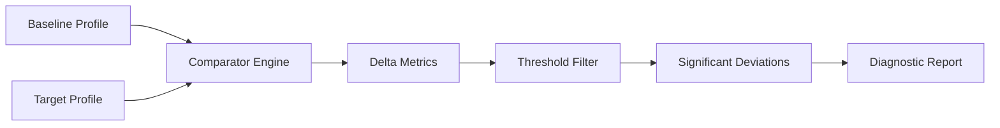

> **Академічна доброчесність.** Матеріали відповідають вимогам [Закону України № 4742-IX](../DISCLAIMER.md). Використання ШІ — [протокол](../10_ai_lectures.md). Оцінювання — [Risk & Reward](../06_grading_experiment.md). Джерела курсу: [sources.md](./sources.md).

# Архітектура порівняльного аналізу: A/B Testing на стероїдах

## Пролог: Історія двох серверів

Уявіть: ваш production-сервер працював стабільно місяцями. Latency: 150ms. CPU: 40%. Все добре. Але після останнього релізу latency підскочила до 350ms. Що змінилося?

Класичний підхід: перевірити логи, метрики, код. Але якщо система складна (мікросервіси, бази даних, кеші), знайти причину — це як шукати голку в стозі сіна.

**Рішення:** Порівняти "здорову" версію (Baseline) з "хворою" (Target) систематично, автоматично, на рівні архітектури.

---

## Архітектурний патерн: Differential Analysis Module

### Концепція: Comparator Engine

Comparator Engine — це архітектурний компонент, що реалізує патерн **Differential Analysis**. Він порівнює два стани системи та виявляє значущі відхилення.



### Компоненти архітектури

#### 1. Профілі системи (System Profiles)

Профіль — це структурований знімок стану системи в певний момент часу.

```python
from dataclasses import dataclass
from typing import Dict, Any
import json

@dataclass
class SystemProfile:
    """Профіль системи: знімок метрик у момент часу"""
    timestamp: str
    metrics: Dict[str, float]
    metadata: Dict[str, Any]
    
    @classmethod
    def from_json(cls, json_path: str) -> 'SystemProfile':
        """Завантаження профілю з JSON"""
        with open(json_path, 'r') as f:
            data = json.load(f)
        return cls(
            timestamp=data['timestamp'],
            metrics=data['metrics'],
            metadata=data.get('metadata', {})
        )
    
    def to_dict(self) -> Dict[str, Any]:
        """Серіалізація в словник"""
        return {
            'timestamp': self.timestamp,
            'metrics': self.metrics,
            'metadata': self.metadata
        }
```

**Приклад JSON-профілю:**

```json
{
  "timestamp": "2024-01-15T10:30:00Z",
  "metrics": {
    "cpu_usage": 0.42,
    "memory_usage": 0.68,
    "db_calls": 125,
    "network_latency": 45,
    "request_latency_p50": 150,
    "request_latency_p95": 280,
    "request_latency_p99": 420,
    "error_rate": 0.001
  },
  "metadata": {
    "version": "v2.3",
    "environment": "production",
    "region": "eu-west-1"
  }
}
```

#### 2. Delta Metrics: Абсолютна та відносна різниця

Comparator Engine обчислює два типи дельт:

```python
from typing import Optional

@dataclass
class DeltaMetric:
    """Метрика дельти між Baseline та Target"""
    metric_name: str
    baseline_value: float
    target_value: float
    abs_diff: float  # Абсолютна різниця
    rel_diff: float  # Відносна різниця (%)
    
    @classmethod
    def compute(cls, name: str, baseline: float, target: float) -> 'DeltaMetric':
        """Обчислення дельти"""
        abs_diff = target - baseline
        rel_diff = (abs_diff / baseline * 100) if baseline != 0 else float('inf')
        
        return cls(
            metric_name=name,
            baseline_value=baseline,
            target_value=target,
            abs_diff=abs_diff,
            rel_diff=rel_diff
        )
    
    def is_significant(self, abs_threshold: Optional[float] = None, 
                      rel_threshold: Optional[float] = None) -> bool:
        """Перевірка, чи дельта значуща"""
        if abs_threshold is not None:
            if abs(self.abs_diff) >= abs_threshold:
                return True
        
        if rel_threshold is not None:
            if abs(self.rel_diff) >= rel_threshold:
                return True
        
        return False
```

**Приклад обчислення:**

```python
# Baseline: latency = 150ms
# Target: latency = 350ms

delta = DeltaMetric.compute("request_latency_p50", 150, 350)
print(f"Абсолютна різниця: {delta.abs_diff}ms")  # 200ms
print(f"Відносна різниця: {delta.rel_diff:.1f}%")  # 133.3%

# Перевірка значущості
is_significant = delta.is_significant(
    abs_threshold=50,  # Мінімум 50ms
    rel_threshold=10   # Або мінімум 10%
)
# True (133.3% > 10%)
```

#### 3. Thresholding: М'які та жорсткі пороги

У реальних системах не всі зміни рівнозначні. Деякі метрики критичні (latency), інші — менш важливі (CPU, якщо він не bottleneck).

```python
from enum import Enum
from typing import Dict, Optional

class ThresholdType(Enum):
    """Тип порогу"""
    HARD = "hard"  # Жорсткий: будь-яке порушення = проблема
    SOFT = "soft"  # М'який: порушення = попередження

@dataclass
class MetricThreshold:
    """Пороги для метрики"""
    metric_name: str
    abs_threshold: Optional[float] = None
    rel_threshold: Optional[float] = None
    threshold_type: ThresholdType = ThresholdType.SOFT
    
    def check(self, delta: DeltaMetric) -> tuple[bool, str]:
        """
        Перевірка порогу
        
        Returns:
            (is_violated, reason)
        """
        if self.abs_threshold is not None:
            if abs(delta.abs_diff) >= self.abs_threshold:
                reason = f"Абсолютна різниця {delta.abs_diff:.2f} >= {self.abs_threshold}"
                return True, reason
        
        if self.rel_threshold is not None:
            if abs(delta.rel_diff) >= self.rel_threshold:
                reason = f"Відносна різниця {delta.rel_diff:.1f}% >= {self.rel_threshold}%"
                return True, reason
        
        return False, "Поріг не порушено"
```

**Конфігурація порогів:**

```python
# Конфігурація для різних типів метрик
THRESHOLDS = {
    "request_latency_p50": MetricThreshold(
        metric_name="request_latency_p50",
        abs_threshold=50,      # +50ms
        rel_threshold=20,      # або +20%
        threshold_type=ThresholdType.HARD
    ),
    "cpu_usage": MetricThreshold(
        metric_name="cpu_usage",
        rel_threshold=30,      # +30% відносно
        threshold_type=ThresholdType.SOFT
    ),
    "error_rate": MetricThreshold(
        metric_name="error_rate",
        abs_threshold=0.01,    # +1% абсолютно
        threshold_type=ThresholdType.HARD
    )
}
```

#### 4. Comparator Engine: Головний компонент

```python
from typing import List, Dict

class ComparatorEngine:
    """Движок порівняльного аналізу"""
    
    def __init__(self, thresholds: Dict[str, MetricThreshold]):
        self.thresholds = thresholds
    
    def compare(self, baseline: SystemProfile, 
                target: SystemProfile) -> Dict[str, Any]:
        """
        Порівняння двох профілів
        
        Returns:
            Словник з результатами порівняння
        """
        # Знаходимо спільні метрики
        common_metrics = set(baseline.metrics.keys()) & set(target.metrics.keys())
        
        deltas = []
        violations = []
        
        for metric_name in common_metrics:
            baseline_val = baseline.metrics[metric_name]
            target_val = target.metrics[metric_name]
            
            # Обчислюємо дельту
            delta = DeltaMetric.compute(metric_name, baseline_val, target_val)
            deltas.append(delta)
            
            # Перевіряємо пороги
            if metric_name in self.thresholds:
                threshold = self.thresholds[metric_name]
                is_violated, reason = threshold.check(delta)
                
                if is_violated:
                    violations.append({
                        'metric': metric_name,
                        'delta': delta,
                        'reason': reason,
                        'severity': threshold.threshold_type.value
                    })
        
        return {
            'baseline_timestamp': baseline.timestamp,
            'target_timestamp': target.timestamp,
            'deltas': deltas,
            'violations': violations,
            'summary': {
                'total_metrics': len(common_metrics),
                'violations_count': len(violations),
                'hard_violations': sum(1 for v in violations 
                                     if v['severity'] == 'hard')
            }
        }
    
    def generate_report(self, comparison_result: Dict[str, Any]) -> str:
        """Генерація текстового звіту"""
        report = []
        report.append("=" * 60)
        report.append("ЗВІТ ПОРІВНЯЛЬНОГО АНАЛІЗУ")
        report.append("=" * 60)
        report.append(f"Baseline: {comparison_result['baseline_timestamp']}")
        report.append(f"Target: {comparison_result['target_timestamp']}")
        report.append("")
        
        # Підсумок
        summary = comparison_result['summary']
        report.append(f"Всього метрик: {summary['total_metrics']}")
        report.append(f"Порушень: {summary['violations_count']}")
        report.append(f"Критичних: {summary['hard_violations']}")
        report.append("")
        
        # Деталі порушень
        if comparison_result['violations']:
            report.append("ПОРУШЕННЯ ПОРОГІВ:")
            report.append("-" * 60)
            for violation in comparison_result['violations']:
                delta = violation['delta']
                report.append(f"\nМетрика: {delta.metric_name}")
                report.append(f"  Baseline: {delta.baseline_value:.2f}")
                report.append(f"  Target: {delta.target_value:.2f}")
                report.append(f"  Абс. різниця: {delta.abs_diff:.2f}")
                report.append(f"  Відн. різниця: {delta.rel_diff:.1f}%")
                report.append(f"  Причина: {violation['reason']}")
                report.append(f"  Серйозність: {violation['severity']}")
        
        return "\n".join(report)
```

---

## Практичний приклад: Парсинг та порівняння

```python
import pandas as pd

def load_and_compare(baseline_path: str, target_path: str, 
                    thresholds_config: Dict[str, MetricThreshold]) -> pd.DataFrame:
    """Завантаження профілів та порівняння"""
    
    # Завантаження профілів
    baseline = SystemProfile.from_json(baseline_path)
    target = SystemProfile.from_json(target_path)
    
    # Створення Comparator Engine
    comparator = ComparatorEngine(thresholds_config)
    
    # Порівняння
    result = comparator.compare(baseline, target)
    
    # Конвертація в DataFrame для аналізу
    deltas_data = []
    for delta in result['deltas']:
        deltas_data.append({
            'metric': delta.metric_name,
            'baseline': delta.baseline_value,
            'target': delta.target_value,
            'abs_diff': delta.abs_diff,
            'rel_diff': delta.rel_diff,
            'is_violation': any(v['metric'] == delta.metric_name 
                              for v in result['violations'])
        })
    
    df = pd.DataFrame(deltas_data)
    df = df.sort_values('rel_diff', key=abs, ascending=False)
    
    return df, result

# Використання
df, result = load_and_compare(
    'baseline_profile.json',
    'target_profile.json',
    THRESHOLDS
)

print(df.head(10))
print("\n" + comparator.generate_report(result))
```

**Вихід:**

```
                    metric  baseline  target  abs_diff  rel_diff  is_violation
0      request_latency_p50     150.0   350.0     200.0    133.3          True
1         request_latency_p95     280.0   520.0     240.0     85.7          True
2              db_calls       125.0   280.0     155.0    124.0          True
3         request_latency_p99     420.0   680.0     260.0     61.9          True
4            cpu_usage         0.42    0.58      0.16     38.1          True
...
```

---

## Архітектурні принципи

### 1. Розділення відповідальності (Separation of Concerns)

- **SystemProfile:** Зберігання даних
- **DeltaMetric:** Обчислення дельт
- **MetricThreshold:** Правила порогів
- **ComparatorEngine:** Оркестрація порівняння

### 2. Стратегія порогів (Strategy Pattern)

Пороги можна налаштовувати динамічно залежно від контексту (production vs staging, різні сервіси).

### 3. Розширюваність (Extensibility)

Легко додати нові типи метрик або способи обчислення значущості.

---

## Висновок: Фундамент для XAI

Comparator Engine дає нам **"ЩО"** (що змінилося), але не **"ЧОМУ"** (чому це сталося). Це фундамент, на якому ми побудуємо шари інтерпретації:

1. **Detection (Comparator):** Виявлення деградації
2. **Diagnosis (SHAP/LIME):** Пояснення причини
3. **Prescription (Counterfactual):** Рекомендації виправлення

У [Блоці 2](./02_game_theory_shapley.md) ми додамо математичний інструментарій для відповіді на питання "Чому?".

---

## Домашнє завдання

1. Реалізуйте `ComparatorEngine` з підтримкою вкладених метрик (наприклад, `metrics.request_latency.p50`).
2. Додайте підтримку статистичної значущості (t-test для перевірки, чи різниця випадкова).
3. Створіть візуалізацію порівняння (heatmap дельт, waterfall chart).


