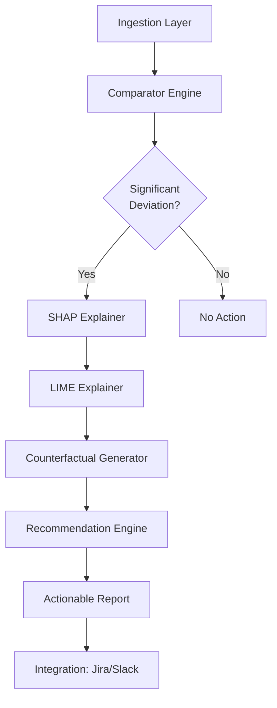

# Побудова Performance Doctor: Інтеграція всіх компонентів

## Пролог: Автоматичний "лікар" для систем

Уявіть систему, яка:
1. Автоматично виявляє деградацію продуктивності
2. Пояснює, чому це сталося (SHAP/LIME)
3. Генерує конкретні рекомендації для виправлення (Counterfactual)

Це і є **Performance Doctor** — повноцінна прескриптивна система на базі XAI.

---

## Архітектура системи

### Високорівнева архітектура



### Компоненти

1. **Ingestion Layer:** Завантаження профілів (JSON, Prometheus, тощо)
2. **Comparator Engine:** Виявлення деградації
3. **XAI Layer:** SHAP + LIME для пояснення
4. **Prescription Layer:** Генерація контрфактуалів
5. **Report Generator:** Створення звітів та тікетів

---

## Реалізація: Клас PerformanceDoctor

### Основний клас

```python
from typing import Dict, List, Optional, Any
import pandas as pd
import numpy as np
import json
from dataclasses import dataclass, asdict
from comparator_engine import ComparatorEngine, SystemProfile, THRESHOLDS
import shap
from lime import lime_tabular
import dice_ml
from dice_ml import Dice

@dataclass
class DiagnosticReport:
    """Звіт діагностики"""
    timestamp: str
    baseline_timestamp: str
    target_timestamp: str
    
    # Detection
    violations: List[Dict[str, Any]]
    
    # Diagnosis
    shap_contributions: Dict[str, float]
    lime_explanation: Dict[str, float]
    
    # Prescription
    recommendations: List[Dict[str, Any]]
    
    # Metadata
    model_version: str
    confidence_score: float

class PerformanceDoctor:
    """
    Performance Doctor: повна система діагностики та прескрипції
    """
    
    def __init__(self, model, feature_names: List[str],
                 thresholds: Dict[str, Any],
                 background_data: pd.DataFrame):
        """
        Ініціалізація Performance Doctor
        
        Args:
            model: навчена ML-модель (регресія або класифікація)
            feature_names: назви ознак
            thresholds: конфігурація порогів для Comparator
            background_data: background data для SHAP/LIME
        """
        self.model = model
        self.feature_names = feature_names
        self.thresholds = thresholds
        
        # Ініціалізація компонентів
        self.comparator = ComparatorEngine(thresholds)
        
        # SHAP explainer
        if hasattr(model, 'predict_proba'):
            # Tree-based модель
            self.shap_explainer = shap.TreeExplainer(model)
        else:
            # Універсальний Kernel SHAP
            self.shap_explainer = shap.KernelExplainer(
                model.predict,
                background_data.iloc[:100]
            )
        
        # LIME explainer
        self.lime_explainer = lime_tabular.LimeTabularExplainer(
            background_data.values,
            feature_names=feature_names,
            mode='regression' if not hasattr(model, 'predict_proba') else 'classification'
        )
        
        # DiCE explainer (для контрфактуалів)
        dice_data = dice_ml.Data(
            background_data,
            continuous_features=feature_names,
            outcome_name='target'  # Потрібно додати target до background_data
        )
        dice_model = dice_ml.Model(model=model, backend='sklearn')
        self.dice_explainer = Dice(dice_data, dice_model, method='random')
    
    def diagnose(self, baseline_profile: SystemProfile,
                target_profile: SystemProfile,
                target_metric: str = 'request_latency_p50',
                target_value: Optional[float] = None) -> DiagnosticReport:
        """
        Повна діагностика: Detection → Diagnosis → Prescription
        
        Args:
            baseline_profile: профіль baseline
            target_profile: профіль target (проблемний)
            target_metric: метрика, яку треба оптимізувати
            target_value: бажане значення (якщо None, використовується baseline)
        
        Returns:
            DiagnosticReport
        """
        # ========== 1. DETECTION ==========
        comparison = self.comparator.compare(baseline_profile, target_profile)
        
        if not comparison['violations']:
            return DiagnosticReport(
                timestamp=target_profile.timestamp,
                baseline_timestamp=baseline_profile.timestamp,
                target_timestamp=target_profile.timestamp,
                violations=[],
                shap_contributions={},
                lime_explanation={},
                recommendations=[],
                model_version='1.0',
                confidence_score=1.0
            )
        
        # Конвертація профілів у feature vectors
        baseline_features = pd.DataFrame([baseline_profile.metrics])
        target_features = pd.DataFrame([target_profile.metrics])
        
        # ========== 2. DIAGNOSIS ==========
        
        # SHAP
        if hasattr(self.shap_explainer, 'shap_values'):
            shap_values = self.shap_explainer.shap_values(target_features)
            if isinstance(shap_values, list):
                shap_values = shap_values[0]  # Для класифікації беремо перший клас
        else:
            shap_values = self.shap_explainer.shap_values(target_features.iloc[0].values)
        
        shap_contributions = dict(zip(
            self.feature_names,
            shap_values[0] if len(shap_values.shape) > 1 else shap_values
        ))
        
        # LIME
        lime_exp = self.lime_explainer.explain_instance(
            target_features.iloc[0].values,
            self.model.predict_proba if hasattr(self.model, 'predict_proba') else self.model.predict,
            num_features=len(self.feature_names)
        )
        lime_explanation = dict(lime_exp.as_list())
        
        # ========== 3. PRESCRIPTION ==========
        
        # Визначення target value
        if target_value is None:
            target_value = baseline_features[target_metric].iloc[0]
        
        # Генерація контрфактуалів
        try:
            counterfactuals = self.dice_explainer.generate_counterfactuals(
                target_features,
                total_CFs=3,
                desired_range=[target_value * 0.9, target_value * 1.1]
            )
            
            recommendations = self._extract_recommendations(
                target_features.iloc[0],
                counterfactuals,
                target_metric
            )
        except Exception as e:
            print(f"Помилка генерації контрфактуалів: {e}")
            recommendations = []
        
        # Обчислення confidence score
        confidence = self._compute_confidence(
            comparison, shap_contributions, lime_explanation
        )
        
        return DiagnosticReport(
            timestamp=target_profile.timestamp,
            baseline_timestamp=baseline_profile.timestamp,
            target_timestamp=target_profile.timestamp,
            violations=comparison['violations'],
            shap_contributions=shap_contributions,
            lime_explanation=lime_explanation,
            recommendations=recommendations,
            model_version='1.0',
            confidence_score=confidence
        )
    
    def _extract_recommendations(self, current_state: pd.Series,
                                counterfactuals,
                                target_metric: str) -> List[Dict[str, Any]]:
        """Витягування рекомендацій з контрфактуалів"""
        recommendations = []
        
        try:
            cf_df = counterfactuals.cf_examples_list[0].final_cfs_df
            
            for idx, cf_row in cf_df.iterrows():
                changes = {}
                for feature in self.feature_names:
                    old_val = current_state[feature]
                    new_val = cf_row[feature]
                    if abs(old_val - new_val) > 1e-6:
                        changes[feature] = {
                            'old': float(old_val),
                            'new': float(new_val),
                            'delta': float(new_val - old_val),
                            'delta_pct': float((new_val - old_val) / old_val * 100) if old_val != 0 else 0
                        }
                
                # Прогноз для контрфактуального стану
                predicted = self.model.predict([cf_row[self.feature_names].values])[0]
                
                recommendations.append({
                    'id': idx + 1,
                    'changes': changes,
                    'predicted_value': float(predicted),
                    'feasibility_score': self._compute_feasibility(changes)
                })
        except Exception as e:
            print(f"Помилка витягування рекомендацій: {e}")
        
        return recommendations
    
    def _compute_feasibility(self, changes: Dict[str, Dict[str, float]]) -> float:
        """
        Обчислення "реалістичності" рекомендації
        
        Проста евристика: чим менше змін, тим реалістичніше
        """
        n_changes = len(changes)
        max_delta_pct = max(abs(c['delta_pct']) for c in changes.values()) if changes else 0
        
        # Нормалізація: менше змін + менші зміни = вища реалістичність
        feasibility = 1.0 / (1.0 + n_changes * 0.1 + max_delta_pct * 0.01)
        return min(1.0, feasibility)
    
    def _compute_confidence(self, comparison: Dict,
                           shap_contributions: Dict[str, float],
                           lime_explanation: Dict[str, float]) -> float:
        """
        Обчислення confidence score діагностики
        
        Враховує:
        - Кількість порушень
        - Узгодженість SHAP та LIME
        - Величину внесків
        """
        # Базова confidence від кількості порушень
        n_violations = len(comparison['violations'])
        base_confidence = 1.0 - min(0.5, n_violations * 0.1)
        
        # Узгодженість SHAP та LIME
        agreement = 0.0
        common_features = set(shap_contributions.keys()) & set(lime_explanation.keys())
        if common_features:
            shap_vals = [shap_contributions[f] for f in common_features]
            lime_vals = [lime_explanation[f] for f in common_features]
            
            # Кореляція знаків
            sign_agreement = sum(
                1 for s, l in zip(shap_vals, lime_vals) 
                if (s > 0 and l > 0) or (s < 0 and l < 0)
            ) / len(common_features)
            agreement = sign_agreement
        
        confidence = (base_confidence + agreement) / 2
        return confidence
    
    def generate_report(self, report: DiagnosticReport, 
                       format: str = 'text') -> str:
        """
        Генерація звіту
        
        Args:
            report: DiagnosticReport
            format: 'text', 'json', 'markdown'
        """
        if format == 'json':
            return json.dumps(asdict(report), indent=2, ensure_ascii=False)
        
        elif format == 'markdown':
            return self._generate_markdown_report(report)
        
        else:  # text
            return self._generate_text_report(report)
    
    def _generate_text_report(self, report: DiagnosticReport) -> str:
        """Генерація текстового звіту"""
        lines = []
        lines.append("=" * 80)
        lines.append("ЗВІТ PERFORMANCE DOCTOR")
        lines.append("=" * 80)
        lines.append(f"Час: {report.timestamp}")
        lines.append(f"Baseline: {report.baseline_timestamp}")
        lines.append(f"Target: {report.target_timestamp}")
        lines.append(f"Confidence Score: {report.confidence_score:.2%}")
        lines.append("")
        
        # Detection
        lines.append("🔍 DETECTION (Виявлення проблем)")
        lines.append("-" * 80)
        if report.violations:
            for v in report.violations[:5]:  # Топ-5
                delta = v['delta']
                lines.append(f"  ⚠️  {delta.metric_name}:")
                lines.append(f"     Baseline: {delta.baseline_value:.2f}")
                lines.append(f"     Target: {delta.target_value:.2f}")
                lines.append(f"     Відхилення: {delta.rel_diff:+.1f}%")
        else:
            lines.append("  ✅ Проблем не виявлено")
        lines.append("")
        
        # Diagnosis
        lines.append("🔬 DIAGNOSIS (Діагностика причин)")
        lines.append("-" * 80)
        lines.append("  SHAP Contributions:")
        for feat, contrib in sorted(
            report.shap_contributions.items(),
            key=lambda x: abs(x[1]),
            reverse=True
        )[:5]:
            lines.append(f"    {feat}: {contrib:+.2f}")
        
        lines.append("  LIME Explanation:")
        for feat, weight in sorted(
            report.lime_explanation.items(),
            key=lambda x: abs(x[1]),
            reverse=True
        )[:5]:
            lines.append(f"    {feat}: {weight:+.3f}")
        lines.append("")
        
        # Prescription
        lines.append("💊 PRESCRIPTION (Рекомендації)")
        lines.append("-" * 80)
        if report.recommendations:
            for rec in report.recommendations:
                lines.append(f"  Варіант {rec['id']} (Feasibility: {rec['feasibility_score']:.2%}):")
                for feat, change in rec['changes'].items():
                    lines.append(f"    {feat}:")
                    lines.append(f"      {change['old']:.2f} → {change['new']:.2f} "
                               f"(Δ {change['delta']:+.2f}, {change['delta_pct']:+.1f}%)")
                lines.append(f"    Прогнозоване значення: {rec['predicted_value']:.2f}")
                lines.append("")
        else:
            lines.append("  ⚠️  Рекомендації не згенеровано")
        
        return "\n".join(lines)
    
    def _generate_markdown_report(self, report: DiagnosticReport) -> str:
        """Генерація Markdown звіту"""
        md = []
        md.append(f"# Performance Doctor Report")
        md.append(f"**Timestamp:** {report.timestamp}")
        md.append(f"**Confidence:** {report.confidence_score:.2%}")
        md.append("")
        
        md.append("## 🔍 Detection")
        if report.violations:
            md.append("| Metric | Baseline | Target | Deviation |")
            md.append("|--------|----------|--------|-----------|")
            for v in report.violations[:10]:
                delta = v['delta']
                md.append(f"| {delta.metric_name} | {delta.baseline_value:.2f} | "
                         f"{delta.target_value:.2f} | {delta.rel_diff:+.1f}% |")
        else:
            md.append("✅ No issues detected")
        md.append("")
        
        md.append("## 🔬 Diagnosis")
        md.append("### SHAP Contributions")
        md.append("| Feature | Contribution |")
        md.append("|---------|--------------|")
        for feat, contrib in sorted(
            report.shap_contributions.items(),
            key=lambda x: abs(x[1]),
            reverse=True
        )[:10]:
            md.append(f"| {feat} | {contrib:+.2f} |")
        md.append("")
        
        md.append("## 💊 Prescription")
        if report.recommendations:
            for rec in report.recommendations:
                md.append(f"### Recommendation {rec['id']}")
                md.append(f"**Feasibility:** {rec['feasibility_score']:.2%}")
                md.append("| Feature | Old | New | Delta |")
                md.append("|---------|-----|-----|-------|")
                for feat, change in rec['changes'].items():
                    md.append(f"| {feat} | {change['old']:.2f} | {change['new']:.2f} | "
                             f"{change['delta']:+.2f} |")
                md.append(f"**Predicted Value:** {rec['predicted_value']:.2f}")
                md.append("")
        else:
            md.append("⚠️ No recommendations generated")
        
        return "\n".join(md)
```

---

## Приклад використання

```python
# Підготовка
from sklearn.ensemble import RandomForestRegressor

# Навчання моделі (на історичних даних)
model = RandomForestRegressor()
model.fit(X_train, y_train)

# Створення Performance Doctor
doctor = PerformanceDoctor(
    model=model,
    feature_names=['cpu_usage', 'db_calls', 'memory_usage', 'network_latency'],
    thresholds=THRESHOLDS,
    background_data=X_train
)

# Завантаження профілів
baseline = SystemProfile.from_json('baseline_profile.json')
target = SystemProfile.from_json('target_profile.json')

# Діагностика
report = doctor.diagnose(
    baseline_profile=baseline,
    target_profile=target,
    target_metric='request_latency_p50'
)

# Генерація звіту
print(doctor.generate_report(report, format='text'))

# Експорт у JSON
with open('diagnostic_report.json', 'w') as f:
    f.write(doctor.generate_report(report, format='json'))
```

---

## Інтеграція з зовнішніми системами

### Генерація Jira тікетів

```python
from jira import JIRA

def create_jira_ticket(report: DiagnosticReport, jira_client: JIRA):
    """Створення Jira тікету з рекомендаціями"""
    
    description = f"""
    Performance degradation detected.
    
    Baseline: {report.baseline_timestamp}
    Target: {report.target_timestamp}
    
    Top Violations:
    {chr(10).join(f"- {v['delta'].metric_name}: {v['delta'].rel_diff:+.1f}%" 
                  for v in report.violations[:3])}
    
    Recommended Actions:
    {chr(10).join(f"- {rec['id']}: {', '.join(rec['changes'].keys())}" 
                  for rec in report.recommendations[:3])}
    """
    
    issue = jira_client.create_issue(
        project='PERF',
        summary=f'Performance Issue: {report.target_timestamp}',
        description=description,
        issuetype={'name': 'Bug'}
    )
    
    return issue
```

### Відправка в Slack

```python
import requests

def send_slack_notification(report: DiagnosticReport, webhook_url: str):
    """Відправка повідомлення в Slack"""
    
    violations_text = "\n".join(
        f"• {v['delta'].metric_name}: {v['delta'].rel_diff:+.1f}%"
        for v in report.violations[:3]
    )
    
    payload = {
        "text": "🚨 Performance Issue Detected",
        "blocks": [
            {
                "type": "section",
                "text": {
                    "type": "mrkdwn",
                    "text": f"*Performance Doctor Report*\n\n"
                           f"*Violations:*\n{violations_text}\n\n"
                           f"*Confidence:* {report.confidence_score:.2%}"
                }
            }
        ]
    }
    
    requests.post(webhook_url, json=payload)
```

---

## Висновок: Від концепції до production

Performance Doctor демонструє, як об'єднати всі компоненти XAI в повноцінну систему:

1. **Архітектурна ясність:** Кожен компонент має чітку відповідальність
2. **Розширюваність:** Легко додати нові explainers або інтеграції
3. **Практичність:** Генерує дійові рекомендації, а не просто пояснення

У [фінальному блоці](./06_future_causal_inference.md) ми розглянемо наступний крок: від кореляції до причинності.

---

## Домашнє завдання

1. Розширте `PerformanceDoctor` підтримкою streaming даних (real-time моніторинг).
2. Додайте систему A/B тестування рекомендацій: чи дійсно вони виправляють проблему?
3. Створіть dashboard (наприклад, на Streamlit) для візуалізації діагностики.


