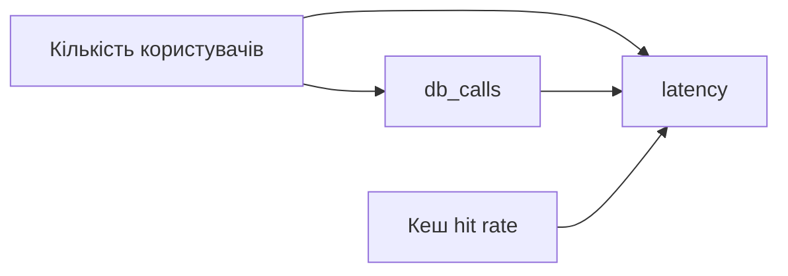

# Кореляція ≠ Причинність: Майбутнє Causal Inference

## Пролог: Парадокс морозива та втоплення

Уявіть статистику: коли продажі морозива зростають, кількість втоплень теж зростає. Чи означає це, що морозиво викликає втоплення?

**Ні.** Прихована змінна — це **температура**: влітку і морозиво продається більше, і люди більше купаються.

Це класичний приклад **плутанини (confounding)**. XAI (SHAP, LIME) показує кореляції, але не причинність. Для справжнього розуміння потрібен **Causal Inference**.

---

## Обмеження XAI: Кореляція, а не причинність

### Що показує SHAP?

SHAP показує **маржинальний внесок** ознаки в прогноз. Але це не означає, що ознака **викликає** результат.

**Приклад:**

```python
# Модель навчена на даних:
# - db_calls високе → latency висока
# - Але чи db_calls ВИКЛИКАЄ latency?

# SHAP каже: "db_calls додає +95ms"
# Але реальність може бути:
# - db_calls високе ← спільна причина (наприклад, кількість користувачів)
# - latency висока ← спільна причина
# Тобто db_calls та latency корелюють, але не мають причинно-наслідкового зв'язку
```

### Проблема плутанини (Confounding)

**Плутанина** — це ситуація, коли дві змінні корелюють не через причинний зв'язок, а через третю змінну (confounder).

```
Confounder (кількість користувачів)
    ↓              ↓
db_calls      latency
```

Якщо ми не врахуємо confounder, ми помилково вважаємо, що `db_calls` викликає `latency`.

---

## Вступ до Causal Inference

### Три рівні причинності (Judea Pearl)

1. **Association (Асоціація):** "Коли A, то B" — це кореляція
2. **Intervention (Втручання):** "Якщо я змінюю A, що станеться з B?" — це причинність
3. **Counterfactual (Контрфактуаль):** "Що було б з B, якби A було іншим?" — це глибша причинність

**XAI працює на рівні 1 (Association).** Causal Inference працює на рівнях 2 та 3.

### Causal Graph (DAG)

**Directed Acyclic Graph (DAG)** — це спосіб представлення причинно-наслідкових зв'язків.



**Інтерпретація:**
- `Кількість користувачів` → `db_calls` (більше користувачів = більше запитів)
- `Кількість користувачів` → `latency` (більше користувачів = більше навантаження)
- `db_calls` → `latency` (більше запитів = вища затримка)
- `Кеш hit rate` → `latency` (низький кеш = вища затримка)

### Do-calculus: Математика втручання

**Do-operator** $do(X=x)$ означає: "Я втручаюся та встановлюю $X=x$", на відміну від спостереження $P(Y|X=x)$.

**Приклад:**

- $P(latency | db\_calls = 300)$ — спостереження: "Якщо я бачу db_calls=300, яка latency?"
- $P(latency | do(db\_calls = 300))$ — втручання: "Якщо я примусово встановлюю db_calls=300, яка latency?"

**Різниця критична:** спостереження може бути спотворене confounders, а втручання — ні.

---

## Практичний приклад: Causal Discovery

### Бібліотека: Causal-learn

```python
from causallearn.search.ConstraintBased.PC import pc
from causallearn.utils.GraphUtils import GraphUtils
import numpy as np
import pandas as pd

# Дані: метрики сервера
data = pd.DataFrame({
    'user_count': np.random.poisson(1000, 1000),
    'db_calls': None,
    'cache_hit_rate': np.random.beta(5, 2, 1000),
    'latency': None
})

# Генерація даних з причинно-наслідковою структурою
data['db_calls'] = data['user_count'] * 0.15 + np.random.normal(0, 10, 1000)
data['latency'] = (
    50 + 
    data['db_calls'] * 0.5 +  # db_calls викликає latency
    (1 - data['cache_hit_rate']) * 100 +  # низький кеш викликає latency
    data['user_count'] * 0.02 +  # користувачі викликають latency
    np.random.normal(0, 5, 1000)
)

# Causal Discovery: знаходження DAG
cg = pc(data.values, alpha=0.05)

# Візуалізація
pdy = GraphUtils.to_pydot(cg.G)
pdy.write_png('causal_graph.png')
```

**Результат:** Алгоритм PC знайде структуру:
- `user_count` → `db_calls`
- `user_count` → `latency`
- `db_calls` → `latency`
- `cache_hit_rate` → `latency`

### Causal Effect Estimation

Після того, як ми знаємо DAG, можемо оцінити **causal effect**.

```python
from causallearn.utils.cit import CIT

# Causal effect: db_calls → latency
# Треба врахувати confounders (user_count)

# Метод: Adjustment Formula
# P(latency | do(db_calls)) = Σ P(latency | db_calls, user_count) P(user_count)

def estimate_causal_effect(data, treatment, outcome, confounders):
    """
    Оцінка causal effect через adjustment
    """
    # Групування за confounders
    effect = 0
    for conf_values in data[confounders].drop_duplicates().values:
        mask = (data[confounders] == conf_values).all(axis=1)
        subset = data[mask]
        
        if len(subset) > 0:
            # Локальний effect
            local_effect = subset.groupby(treatment)[outcome].mean().diff().mean()
            # Вага
            weight = len(subset) / len(data)
            effect += local_effect * weight
    
    return effect

# Causal effect db_calls → latency
effect = estimate_causal_effect(
    data,
    treatment='db_calls',
    outcome='latency',
    confounders=['user_count']
)

print(f"Causal effect: {effect:.2f}ms per db_call")
```

---

## Інтеграція Causal Inference з XAI

### Гібридний підхід: Causal-Aware XAI

```python
class CausalAwareExplainer:
    """
    XAI explainer, що враховує причинно-наслідкову структуру
    """
    
    def __init__(self, model, causal_graph, data):
        self.model = model
        self.causal_graph = causal_graph
        self.data = data
        
        # Звичайний SHAP explainer
        self.shap_explainer = shap.TreeExplainer(model)
    
    def explain_with_causality(self, instance):
        """
        Пояснення з урахуванням причинності
        """
        # 1. Звичайне SHAP пояснення
        shap_values = self.shap_explainer.shap_values([instance])[0]
        
        # 2. Визначення confounders для кожної ознаки
        causal_contributions = {}
        for i, feature in enumerate(self.data.columns):
            # Знаходимо confounders для цієї ознаки
            confounders = self._find_confounders(feature)
            
            # Causal effect (без confounders)
            causal_effect = self._estimate_causal_effect(
                feature, confounders
            )
            
            # Корекція SHAP значення
            # Якщо є confounders, SHAP може переоцінювати внесок
            if confounders:
                # Adjustment: віднімаємо частину, що пояснюється confounders
                adjusted_contribution = shap_values[i] * (1 - self._confounding_bias(feature, confounders))
            else:
                adjusted_contribution = shap_values[i]
            
            causal_contributions[feature] = {
                'shap_value': shap_values[i],
                'causal_effect': causal_effect,
                'adjusted_contribution': adjusted_contribution,
                'confounders': confounders
            }
        
        return causal_contributions
    
    def _find_confounders(self, feature):
        """Знаходження confounders для ознаки"""
        # Спрощено: шукаємо спільних предків у DAG
        confounders = []
        for other_feature in self.data.columns:
            if other_feature != feature:
                # Перевірка, чи є спільний предок
                if self._has_common_ancestor(feature, other_feature):
                    confounders.append(other_feature)
        return confounders
    
    def _estimate_causal_effect(self, treatment, confounders):
        """Оцінка causal effect"""
        # Використовуємо adjustment formula
        # Спрощена версія
        return estimate_causal_effect(
            self.data,
            treatment=treatment,
            outcome='target',  # Припускаємо, що є target
            confounders=confounders
        )
```

---

## Приклад: Causal Performance Analysis

### Сценарій: Чи викликає db_calls latency?

```python
# Дані з реальною причинно-наслідковою структурою
np.random.seed(42)

n = 1000
user_count = np.random.poisson(1000, n)
db_calls = user_count * 0.15 + np.random.normal(0, 10, n)
cache_hit_rate = np.random.beta(5, 2, n)
latency = (
    50 + 
    db_calls * 0.5 +  # Causal effect: +0.5ms per db_call
    (1 - cache_hit_rate) * 100 +
    user_count * 0.02 +
    np.random.normal(0, 5, n)
)

df = pd.DataFrame({
    'user_count': user_count,
    'db_calls': db_calls,
    'cache_hit_rate': cache_hit_rate,
    'latency': latency
})

# Навчання моделі
from sklearn.ensemble import RandomForestRegressor
model = RandomForestRegressor()
X = df[['user_count', 'db_calls', 'cache_hit_rate']]
y = df['latency']
model.fit(X, y)

# SHAP пояснення
explainer = shap.TreeExplainer(model)
shap_values = explainer.shap_values(X.iloc[0:1])[0]

print("SHAP Contributions (кореляція):")
for i, feat in enumerate(X.columns):
    print(f"  {feat}: {shap_values[i]:+.2f}ms")

# Causal effect (причинність)
print("\nCausal Effects (причинність):")
print(f"  db_calls → latency: {0.5:.2f}ms per db_call")  # Реальний effect
print(f"  user_count → latency: {0.02:.2f}ms per user")
print(f"  cache_hit_rate → latency: {-100:.2f}ms per 1% cache hit")

# Порівняння
print("\nПорівняння:")
print("  SHAP може показувати більший внесок db_calls, бо не враховує user_count як confounder")
```

**Висновок:** SHAP показує **асоціацію** (кореляцію), але не **causal effect**. Якщо ми хочемо знати, чи дійсно зменшення `db_calls` зменшить `latency`, потрібен causal inference.

---

## Майбутнє: Causal Prescriptive Analytics

### Від Causal Inference до Causal Prescription

```python
class CausalPrescriptiveAnalyst:
    """
    Прескриптивний аналітик на базі causal inference
    """
    
    def __init__(self, causal_graph, data, model):
        self.causal_graph = causal_graph
        self.data = data
        self.model = model
    
    def recommend_intervention(self, current_state, target_outcome):
        """
        Рекомендація втручання на базі causal structure
        
        Відрізняється від контрфактуалів тим, що враховує причинність
        """
        # 1. Знаходимо actionable features (ті, що можна змінювати)
        actionable = self._find_actionable_features()
        
        # 2. Для кожної actionable feature обчислюємо causal effect
        interventions = []
        for feature in actionable:
            causal_effect = self._estimate_causal_effect(
                treatment=feature,
                outcome='latency',
                confounders=self._find_confounders(feature)
            )
            
            # Обчислюємо необхідну зміну
            current_value = current_state[feature]
            current_outcome = self.model.predict([current_state])[0]
            needed_change = (target_outcome - current_outcome) / causal_effect
            
            new_value = current_value + needed_change
            
            interventions.append({
                'feature': feature,
                'current': current_value,
                'recommended': new_value,
                'causal_effect': causal_effect,
                'expected_outcome': target_outcome
            })
        
        # 3. Ранжування за feasibility та causal effect
        interventions.sort(
            key=lambda x: abs(x['causal_effect']),
            reverse=True
        )
        
        return interventions
```

---

## Висновок: Від кореляції до причинності

### Еволюція розуміння

1. **Descriptive:** "Що сталося?" — статистика
2. **Predictive:** "Що буде?" — ML моделі
3. **Diagnostic:** "Чому сталося?" — XAI (SHAP, LIME)
4. **Prescriptive:** "Що робити?" — Counterfactuals
5. **Causal Prescriptive:** "Що робити, знаючи причинність?" — Causal Inference

### Ключові висновки

1. **XAI показує кореляції, а не причинність.** SHAP/LIME показують асоціації, але не гарантують причинно-наслідковий зв'язок.

2. **Causal Inference — наступний крок.** Для справжнього розуміння та надійних рекомендацій потрібна причинно-наслідкова структура.

3. **Гібридний підхід найкращий.** Поєднання XAI (швидкість, інтерпретаційність) та Causal Inference (точність, причинність) дає найкращі результати.

### Практичні рекомендації

- **Для швидкої діагностики:** використовуйте XAI (SHAP, LIME)
- **Для критичних рішень:** додайте Causal Inference для перевірки причинності
- **Для production систем:** починайте з XAI, поступово додавайте causal analysis

---

## Додаткові матеріали

- **Книга:** "The Book of Why" by Judea Pearl
- **Бібліотека:** [Causal-learn](https://github.com/cmu-phil/causal-learn)
- **Стаття:** ["Causal Inference in the Wild"](https://arxiv.org/abs/2103.04647)
- **Курс:** "Causal Inference" by Miguel Hernán (Harvard)

---

## Фінальні думки

Ми пройшли шлях від "чорної скриньки" до системи, що не тільки пояснює свої рішення, але й генерує дійові рекомендації. Але це лише початок. Майбутнє — за **Causal AI**, де ми розуміємо не просто кореляції, а справжні причинно-наслідкові зв'язки.

**Від "Чому?" до "Що робити?" до "Чому це спрацює?"** — це еволюція від описового до прескриптивного до причинного аналізу.


