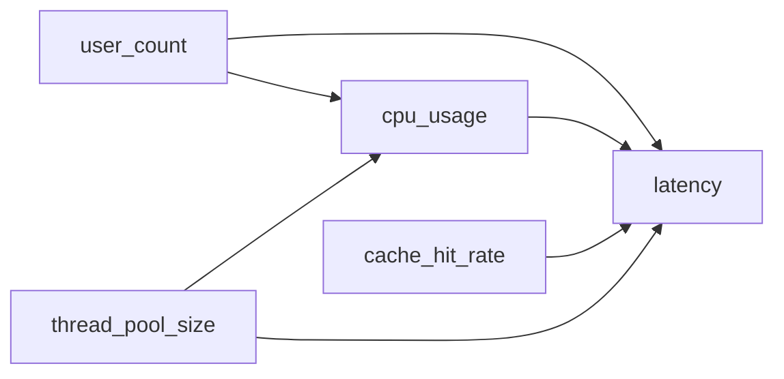

# Семінар 3: Контрфактуальна терапія та прескриптивний аналіз

> **Частина курсу:** [Інтерпретований ШІ (XAI) та Прескриптивний Аналіз](./index.md)  
> **Попередній семінар:** [Семінар 2: Діагностика через SHAP та LIME](./08_seminar2_shap_lime.md)  
> **Повний цикл:** [Семінар 1](./07_seminar1_invariant_discovery.md) → [Семінар 2](./08_seminar2_shap_lime.md) → Семінар 3

## Методологічний контекст

### Від діагностики до терапії

**Семінар 1** відповідає на питання **"Що не так?"**:
- ✅ Інваріант порушено
- ✅ Residual перевищує поріг

**Семінар 2** відповідає на питання **"Чому це сталося?"**:
- ✅ SHAP показує: `cpu_usage` додав +200ms до latency
- ✅ LIME підтверджує: `cpu_usage` — найважливіша ознака

**Семінар 3** відповідає на питання **"Що змінити?"**:
- ✅ Зменшити `cpu_usage` на 15%
- ✅ Або збільшити `thread_pool_size` на 20%

### Концепція контрфактуального мислення

**Контрфактуал** — це альтернативна реальність, яка відрізняється від поточної мінімально, але призводить до бажаного результату.

**Приклад:**
- **Поточний стан:** `cpu_usage = 95%`, `latency = 500ms` (інваріант порушено)
- **Контрфактуал:** `cpu_usage = 80%`, `latency = 200ms` (інваріант відновлено)
- **Зміна:** Зменшити `cpu_usage` на 15%

---

## Математична формалізація

### Задача оптимізації

Нехай:
- $\mathbf{x} \in \mathbb{R}^d$ — поточний стан системи
- $f: \mathbb{R}^d \to \mathbb{R}$ — функція інваріанта (прогноз $y$ компоненти)
- $y_{\text{target}}$ — цільове значення (нормальний стан)
- $\mathcal{A} \subseteq \{1, \ldots, d\}$ — індекси дієвих ознак (actionable features)

**Задача:** Знайти контрфактуал $\mathbf{x}_{\text{cf}}$ такий, що:

1. **Мінімізує відстань від поточного стану:**
   $$\mathbf{x}_{\text{cf}} = \arg\min_{\mathbf{x}'} D(\mathbf{x}, \mathbf{x}')$$

2. **Задовольняє інваріант:**
   $$|f(\mathbf{x}_{\text{cf}}) - y_{\text{target}}| \leq \tau$$

3. **Змінює лише дієві ознаки:**
   $$x'_{\text{cf},i} = x_i \quad \forall i \notin \mathcal{A}$$

4. **Дотримується обмежень:**
   $$x'_{\text{cf},i} \in [x_{\min,i}, x_{\max,i}] \quad \forall i \in \mathcal{A}$$

### Функція відстані

Найпоширеніші виміри відстані:

#### L2 норма (Евклідова відстань)
$$D_2(\mathbf{x}, \mathbf{x}') = \sqrt{\sum_{i \in \mathcal{A}} (x_i - x'_i)^2}$$

#### L1 норма (Манхеттенська відстань)
$$D_1(\mathbf{x}, \mathbf{x}') = \sum_{i \in \mathcal{A}} |x_i - x'_i|$$

#### Зважена відстань
$$D_w(\mathbf{x}, \mathbf{x}') = \sqrt{\sum_{i \in \mathcal{A}} w_i (x_i - x'_i)^2}$$

де $w_i$ — ваги, що відображають "важливість" зміни ознаки $i$.

### Цільова функція

Комбінована функція втрат:

$$\mathcal{L}(\mathbf{x}') = \underbrace{D(\mathbf{x}, \mathbf{x}')}_{\text{відстань}} + \lambda \underbrace{(f(\mathbf{x}') - y_{\text{target}})^2}_{\text{штраф за відхилення}}$$

де $\lambda > 0$ — параметр регуляризації.

**Задача оптимізації:**
$$\mathbf{x}_{\text{cf}} = \arg\min_{\mathbf{x}' \in \mathcal{C}} \mathcal{L}(\mathbf{x}')$$

де $\mathcal{C}$ — допустима множина (обмеження на значення ознак).

---

## Алгоритм пошуку контрфактуалів

### Градієнтний спуск

Якщо функція $f$ диференційовна, можна використати градієнтний спуск:

$$\mathbf{x}'^{(t+1)} = \mathbf{x}'^{(t)} - \alpha \nabla_{\mathbf{x}'} \mathcal{L}(\mathbf{x}'^{(t)})$$

де $\alpha$ — крок навчання.

**Градієнт:**
$$\frac{\partial \mathcal{L}}{\partial x'_i} = \frac{\partial D}{\partial x'_i} + 2\lambda (f(\mathbf{x}') - y_{\text{target}}) \frac{\partial f}{\partial x'_i}$$

### Обмежена оптимізація

Для обмежень використовуємо **L-BFGS-B** (Limited-memory BFGS with Bounds) або **SLSQP** (Sequential Least Squares Programming).

**Псевдокод:**

```
АЛГОРИТМ: FindCounterfactual

ВХІД:
  - x: поточний стан
  - f: функція інваріанта
  - y_target: цільове значення
  - A: множина дієвих ознак
  - bounds: обмеження [x_min, x_max] для кожної ознаки

ВИХІД:
  - x_cf: контрфактуал

1. ІНІЦІАЛІЗАЦІЯ:
   x' ← x
   λ ← 10.0  // вага штрафу

2. ФУНКЦІЯ ВТРАТ:
   L(x') = D(x, x') + λ·(f(x') - y_target)²

3. ОПТИМІЗАЦІЯ:
   x_cf ← minimize(L, x', method='L-BFGS-B', bounds=bounds)

4. ПЕРЕВІРКА:
   ЯКЩО |f(x_cf) - y_target| ≤ τ:
      ПОВЕРНУТИ x_cf
   ІНАКШЕ:
      Збільшити λ та повторити крок 3
```

---

## DiCE: Diverse Counterfactual Explanations

### Проблема: потреба в різноманітності

Один контрфактуал може бути нереалістичним або незручним для реалізації. Краще мати **кілька альтернативних рішень**.

### Формалізація DiCE

**Задача:** Знайти $k$ різноманітних контрфактуалів $\{\mathbf{x}_{\text{cf}}^{(1)}, \ldots, \mathbf{x}_{\text{cf}}^{(k)}\}$ таких, що:

1. Кожен задовольняє інваріант
2. Всі близькі до поточного стану
3. Всі різні між собою

**Цільова функція:**

$$\min_{\mathbf{x}'^{(1)}, \ldots, \mathbf{x}'^{(k)}} \sum_{j=1}^{k} \mathcal{L}(\mathbf{x}'^{(j)}) + \lambda_{\text{diversity}} \sum_{i \neq j} \frac{1}{D(\mathbf{x}'^{(i)}, \mathbf{x}'^{(j)})}$$

Другий доданок забезпечує різноманітність: штрафує за близькість між контрфактуалами.

### Алгоритм DiCE

#### Варіант 1: Послідовна генерація

```
1. Знайти перший контрфактуал x_cf^(1)
2. ДЛЯ j = 2 до k:
   a. Додати штраф за близькість до попередніх:
      L'(x') = L(x') + λ_div · Σ 1/D(x', x_cf^(i)) для i < j
   b. Знайти x_cf^(j) мінімізуючи L'
```

#### Варіант 2: Паралельна оптимізація

Одночасно оптимізувати всі $k$ контрфактуалів з додаванням штрафу за різноманітність.

---

## Фільтрація дієвих ознак

### Критерії дієвості

Ознака є **дієвою (actionable)**, якщо:
1. ✅ Її можна змінити вручну або через конфігурацію
2. ✅ Зміна має сенс в контексті системи
3. ✅ Зміна не порушує інші обмеження

**Приклади дієвих ознак:**
- `cpu_usage` (можна зменшити через оптимізацію коду)
- `thread_pool_size` (конфігураційний параметр)
- `cache_size` (можна збільшити)
- `memory_limit` (можна налаштувати)

**Приклади недієвих ознак:**
- `timestamp` (не можна змінити)
- `user_id` (не має сенсу змінювати)
- `request_id` (ідентифікатор, не параметр)

### Автоматичне визначення

```python
def is_actionable(feature_name: str, data: pd.DataFrame) -> bool:
    """
    Визначає, чи є ознака дієвою.
    """
    # Паттерни недієвих ознак
    non_actionable_patterns = [
        'timestamp', 'id', 'time', 'date',
        'user_id', 'session_id', 'request_id'
    ]
    
    feature_lower = feature_name.lower()
    
    # Перевірка паттернів
    if any(pattern in feature_lower for pattern in non_actionable_patterns):
        return False
    
    # Перевірка на числовість (дієві ознаки зазвичай числові)
    if not pd.api.types.is_numeric_dtype(data[feature_name]):
        return False
    
    return True
```

---

## Обмеження на значення ознак

### Визначення діапазонів

#### Метод 1: Історичні дані

$$\text{min}_i = \min_{j=1,\ldots,n} x_{j,i}$$
$$\text{max}_i = \max_{j=1,\ldots,n} x_{j,i}$$

#### Метод 2: Відсоткові квантилі

$$\text{min}_i = Q_{0.05}(x_{:,i})$$
$$\text{max}_i = Q_{0.95}(x_{:,i})$$

#### Метод 3: Відхилення від поточного значення

$$\text{min}_i = x_i \cdot (1 - \delta)$$
$$\text{max}_i = x_i \cdot (1 + \delta)$$

де $\delta$ — максимальне відносне відхилення (наприклад, 0.5 = ±50%).

### Фізичні обмеження

Деякі ознаки мають фізичні обмеження:
- `cpu_usage ∈ [0, 100]` (відсотки)
- `memory_limit > 0` (позитивне значення)
- `thread_pool_size ∈ {1, 2, 4, 8, 16, ...}` (дискретні значення)

---

## Реалізація в Python

### Клас PerformanceDoctor

```python
from seminar3_performance_doctor import PerformanceDoctor, Prescription

# Створення об'єкта
doctor = PerformanceDoctor(
    actionable_features=['cpu_usage', 'ram_usage', 'thread_pool_size'],
    non_actionable_features=['timestamp', 'user_id'],
    feature_bounds={
        'cpu_usage': (0, 100),
        'ram_usage': (0, 100),
        'thread_pool_size': (1, 64)
    },
    n_counterfactuals=5
)

# Генерація рекомендації
prescription = doctor.prescribe_solution(
    invariant=violated_invariant,
    current_state=anomaly_data,
    row_idx=0,
    background_data=normal_data,
    diagnosis="Порушення інваріанта через високе CPU"
)

# Форматування повідомлення
message = doctor.format_prescription_message(prescription)
print(message)
```

### Структура Prescription

```python
@dataclass
class Prescription:
    invariant_id: int
    diagnosis: str
    actionable_features: List[str]
    recommended_changes: Dict[str, float]  # Зміни у відсотках
    expected_improvement: float
    confidence: float
    alternative_solutions: List[Counterfactual]
```

### Приклад виводу

```
🔍 Діагноз: Порушення інваріанта через високе CPU

💡 Рекомендації для відновлення стабільності інваріанта:
  • Зменшити параметр 'cpu_usage' на 15.3%
  • Збільшити параметр 'thread_pool_size' на 20.0%

📊 Очікуване покращення: 0.0234
🎯 Впевненість: 87.5%

🔄 Альтернативні рішення: 4 варіантів
```

---

## Метрики якості контрфактуалів

### 1. Відстань (Proximity)

Мінімізуємо відстань від поточного стану:
$$\text{proximity} = D(\mathbf{x}, \mathbf{x}_{\text{cf}})$$

**Краще:** менша відстань.

### 2. Валідність (Validity)

Контрфактуал задовольняє інваріант:
$$\text{validity} = \begin{cases}
1 & \text{якщо } |f(\mathbf{x}_{\text{cf}}) - y_{\text{target}}| \leq \tau \\
0 & \text{інакше}
\end{cases}$$

**Краще:** validity = 1.

### 3. Різноманітність (Diversity)

Для множини контрфактуалів:
$$\text{diversity} = \frac{1}{k(k-1)} \sum_{i \neq j} D(\mathbf{x}_{\text{cf}}^{(i)}, \mathbf{x}_{\text{cf}}^{(j)})$$

**Краще:** більша різноманітність.

### 4. Реалістичність (Realism)

Контрфактуал схожий на реальні спостереження:
$$\text{realism} = \min_{j=1,\ldots,n} D(\mathbf{x}_{\text{cf}}, \mathbf{x}_j)$$

**Краще:** менша відстань до реальних даних.

### 5. Впевненість (Confidence)

Ймовірність того, що рекомендація спрацює:
$$\text{confidence} = \begin{cases}
0.9 \cdot \exp(-D(\mathbf{x}, \mathbf{x}_{\text{cf}})) & \text{якщо validity = 1} \\
0.5 & \text{інакше}
\end{cases}$$

**Краще:** вища впевненість.

---

## Causal Awareness: Чи спрацює рекомендація в production?

### Критична проблема: Кореляція ≠ Причинність

**Важливе застереження:** Математично знайдений контрфактуал не гарантує, що зміна призведе до бажаного результату в реальній системі.

**Приклад проблеми:**

```python
# Контрфактуал каже: "Зменши cpu_usage на 15%"
# Але чи cpu_usage ВИКЛИКАЄ порушення інваріанта?

# Можливі сценарії:
# 1. Causal: cpu_usage → latency (зменшення CPU справді допоможе)
# 2. Confounding: user_count → cpu_usage, user_count → latency
#    (зменшення CPU не допоможе, бо спільна причина — user_count)
# 3. Reverse causation: latency → cpu_usage (висока latency викликає високе CPU)
```

### Три рівні причинності (Judea Pearl)

1. **Association (Асоціація):** "Коли A, то B" — це кореляція
   - Контрфактуали базуються на асоціації
   - Не гарантують причинно-наслідковий зв'язок

2. **Intervention (Втручання):** "Якщо я змінюю A, що станеться з B?" — це причинність
   - Потрібно для справжніх рекомендацій
   - Вимагає causal inference

3. **Counterfactual (Контрфактуаль):** "Що було б з B, якби A було іншим?" — глибша причинність
   - Найвищий рівень розуміння

### Проблема плутанини (Confounding)

**Плутанина** — це ситуація, коли дві змінні корелюють не через причинний зв'язок, а через третю змінну (confounder).

**Приклад:**

```
Confounder (кількість користувачів)
    ↓              ↓
cpu_usage      latency
```

Якщо ми не врахуємо confounder, ми помилково вважаємо, що `cpu_usage` викликає `latency`. Насправді обидві змінні залежать від `user_count`.

### Causal Graph (DAG) для оцінки контрфактуалів

**Directed Acyclic Graph (DAG)** — спосіб представлення причинно-наслідкових зв'язків.



**Інтерпретація:**
- `user_count` → `cpu_usage` (більше користувачів = більше CPU)
- `user_count` → `latency` (більше користувачів = вища затримка)
- `cpu_usage` → `latency` (більше CPU = вища затримка) — **causal effect**
- `thread_pool_size` → `cpu_usage` (більше потоків = менше CPU на потік)
- `thread_pool_size` → `latency` (більше потоків = менша затримка)

### Оцінка Causal Effect

Для оцінки, чи дійсно зміна ознаки призведе до бажаного результату, потрібно обчислити **causal effect**.

#### Adjustment Formula

Якщо є confounders, використовуємо **adjustment formula**:

$$P(Y | do(X=x)) = \sum_{z} P(Y | X=x, Z=z) P(Z=z)$$

де:
- $do(X=x)$ — втручання (встановлення $X=x$)
- $Z$ — confounders
- $P(Y | X=x, Z=z)$ — умовна ймовірність з урахуванням confounders

#### Causal Effect Estimation

```python
def estimate_causal_effect(
    data: pd.DataFrame,
    treatment: str,
    outcome: str,
    confounders: List[str]
) -> float:
    """
    Оцінка causal effect через adjustment formula.
    
    Parameters:
    -----------
    data : pd.DataFrame
        Дані для аналізу
    treatment : str
        Ознака, яку ми змінюємо (наприклад, 'cpu_usage')
    outcome : str
        Результат, який ми хочемо змінити (наприклад, 'latency')
    confounders : List[str]
        Список confounders (наприклад, ['user_count'])
        
    Returns:
    --------
    causal_effect : float
        Causal effect: на скільки зміниться outcome при зміні treatment на 1
    """
    # Групування за confounders
    effect = 0.0
    total_weight = 0.0
    
    for conf_values in data[confounders].drop_duplicates().values:
        # Фільтрація даних з однаковими значеннями confounders
        mask = (data[confounders].values == conf_values).all(axis=1)
        subset = data[mask]
        
        if len(subset) > 1:
            # Локальний effect: різниця в outcome при різних значеннях treatment
            grouped = subset.groupby(treatment)[outcome].mean()
            if len(grouped) > 1:
                local_effect = grouped.diff().mean()
                weight = len(subset) / len(data)
                effect += local_effect * weight
                total_weight += weight
    
    if total_weight > 0:
        effect = effect / total_weight
    
    return effect
```

### Інтеграція Causal Awareness в оцінку контрфактуалів

#### Метрика Causal Validity

Додаємо метрику **causal validity** до оцінки контрфактуалів:

$$\text{causal\_validity} = \begin{cases}
1 & \text{якщо } |\text{causal\_effect}| > \theta_{\text{causal}} \\
0.5 & \text{якщо } |\text{causal\_effect}| \in (0, \theta_{\text{causal}}) \\
0 & \text{якщо } \text{causal\_effect} = 0 \text{ або невизначений}
\end{cases}$$

де $\theta_{\text{causal}}$ — поріг значущості causal effect.

#### Оновлена функція втрат

Додаємо штраф за відсутність причинності:

$$\mathcal{L}_{\text{causal}}(\mathbf{x}') = \mathcal{L}(\mathbf{x}') + \lambda_{\text{causal}} \cdot (1 - \text{causal\_validity})$$

де $\lambda_{\text{causal}} > 0$ — вага causal awareness.

### Практичний приклад: Causal-Aware Performance Doctor

```python
from seminar3_performance_doctor import PerformanceDoctor

# Створення об'єкта з causal awareness
doctor = PerformanceDoctor(
    actionable_features=['cpu_usage', 'ram_usage', 'thread_pool_size'],
    non_actionable_features=['timestamp', 'user_id'],
    causal_graph={
        'user_count': ['cpu_usage', 'latency'],  # confounder
        'cpu_usage': ['latency'],                 # causal effect
        'thread_pool_size': ['cpu_usage', 'latency']  # causal effects
    },
    n_counterfactuals=5
)

# Генерація рекомендації з causal validation
prescription = doctor.prescribe_solution(
    invariant=violated_invariant,
    current_state=anomaly_data,
    row_idx=0,
    background_data=normal_data,
    diagnosis="Порушення інваріанта через високе CPU",
    validate_causality=True  # Включити перевірку причинності
)

# Результат містить causal validity
print(f"Causal validity: {prescription.causal_validity}")
print(f"Recommended changes with causal effects:")
for feature, change in prescription.recommended_changes.items():
    causal_effect = prescription.causal_effects.get(feature, None)
    if causal_effect:
        print(f"  {feature}: {change:+.1f}% (causal effect: {causal_effect:.4f})")
    else:
        print(f"  {feature}: {change:+.1f}% (⚠️ causal effect невизначений)")
```

### Правила для Causal-Aware рекомендацій

1. **Перевірка confounders:** Якщо є confounders, враховувати їх при оцінці
2. **Валідація causal effect:** Перевіряти, чи causal effect значущий
3. **Попередження про кореляцію:** Якщо causal effect невизначений, додавати попередження
4. **Ранжування за причинністю:** Віддавати перевагу рекомендаціям з високим causal validity

### Обмеження та обережності

#### 1. Нелінійність інваріантів

### 1. Нелінійність інваріантів

Метод припускає, що інваріант можна "відновити" через зміну дієвих ознак. Але якщо порушення викликане зовнішніми факторами (наприклад, DDoS атака), зміна конфігурації може не допомогти.

### 2. Кореляції між ознаками

Якщо ознаки сильно корельовані, зміна однієї може призвести до несподіваних змін інших. Потрібно враховувати обмеження на кореляції.

### 3. Каузальність vs кореляція

Контрфактуали базуються на кореляціях, а не на причинно-наслідкових зв'язках. Зміна `cpu_usage` може не вирішити проблему, якщо вона спричинена іншим фактором.

### 4. Стабільність рішень

Різні запуски оптимізації можуть давати різні контрфактуали. Потрібно перевіряти стабільність та узгодженість результатів.

---

## Практичні рекомендації

### Підготовка даних

1. **Визначення дієвих ознак:** Проаналізуйте, які параметри можна змінити в реальній системі
2. **Встановлення обмежень:** Визначте фізичні та логічні межі для кожної ознаки
3. **Валідація інваріантів:** Переконайтеся, що інваріанти коректні перед генерацією контрфактуалів

### Налаштування оптимізації

1. **Параметр регуляризації $\lambda$:** Починайте з $\lambda = 10$ та збільшуйте, якщо контрфактуал не задовольняє інваріант
2. **Кількість контрфактуалів:** 3-5 альтернатив зазвичай достатньо
3. **Метод оптимізації:** L-BFGS-B для обмежених задач, SLSQP для складних обмежень

### Валідація рекомендацій

1. **A/B тестування:** Перевіряйте, чи дійсно рекомендації виправляють проблему
2. **Моніторинг:** Відстежуйте, чи інваріанти відновлюються після застосування змін
3. **Зворотний зв'язок:** Збирайте інформацію про ефективність рекомендацій

---

## Висновок

Контрфактуальна терапія перетворює діагностику на дієві рекомендації. Замість просто пояснення "чому сталося", система надає конкретні інструкції "що змінити".

**Повний цикл:**
1. **Detection** (Семінар 1): Виявлення порушення інваріанта
2. **Diagnosis** (Семінар 2): Пояснення причин через SHAP/LIME
3. **Prescription** (Семінар 3): Генерація рекомендацій через контрфактуали
4. **Causal Validation** (Семінар 3): Перевірка, чи дійсно рекомендації спрацюють
5. **Stability Evaluation** ([Блок 10](./10_stability_evaluation.md)): **Обов'язкова** перевірка стабільності пояснень

### Ключові висновки

#### 1. Causal Awareness

**Важливо розуміти:** Не кожна математично знайдена зміна призведе до реального результату в production. Контрфактуали базуються на **кореляціях**, а не на **причинності**.

**Приклад:**
- Контрфактуал каже: "Зменши `cpu_usage` на 15%"
- Але якщо `cpu_usage` та `latency` корелюють через confounder (наприклад, `user_count`), зменшення CPU не допоможе
- Causal awareness виявляє це та попереджає: "⚠️ causal effect незначний"

**Рекомендації:**
1. ✅ Завжди використовуйте causal awareness при оцінці контрфактуалів
2. ✅ Перевіряйте causal validity перед застосуванням змін у production
3. ✅ Для критичних систем додайте повний Causal Inference (див. [Блок 6](./06_future_causal_inference.md))

#### 2. Stability Evaluation (Обов'язковий етап)

**Критично важливо:** Пояснення (SHAP, LIME) можуть бути нестабільними. Без перевірки стабільності неможливо гарантувати надійність рекомендацій.

**Мінімальні вимоги:**
- ✅ Robustness Score ≥ 0.7
- ✅ CV Score < 0.2
- ✅ Rank Stability ≥ 0.8
- ✅ Agreement Score ≥ 0.6 (узгодженість SHAP/LIME)

**Детальніше:** Див. [Блок 10: Stability Evaluation](./10_stability_evaluation.md)

---

Разом ці три семінари + Stability Evaluation створюють повноцінну систему **Performance Doctor** — автоматичного "лікаря" для IT-інфраструктур з:
- ✅ **Causal awareness** для надійних рекомендацій
- ✅ **Stability evaluation** для валідації пояснень

---

## Додаткові матеріали

- **Counterfactual Explanations:** Wachter, S., et al. (2017). "Counterfactual explanations without opening the black box." *Harvard Law Review*.
- **DiCE:** Mothilal, R. K., et al. (2020). "Explaining machine learning classifiers through diverse counterfactual explanations." *FAT*.
- **Actionable Explanations:** Karimi, A. H., et al. (2020). "Model-agnostic counterfactual explanations for consequential decisions." *AISTATS*.

