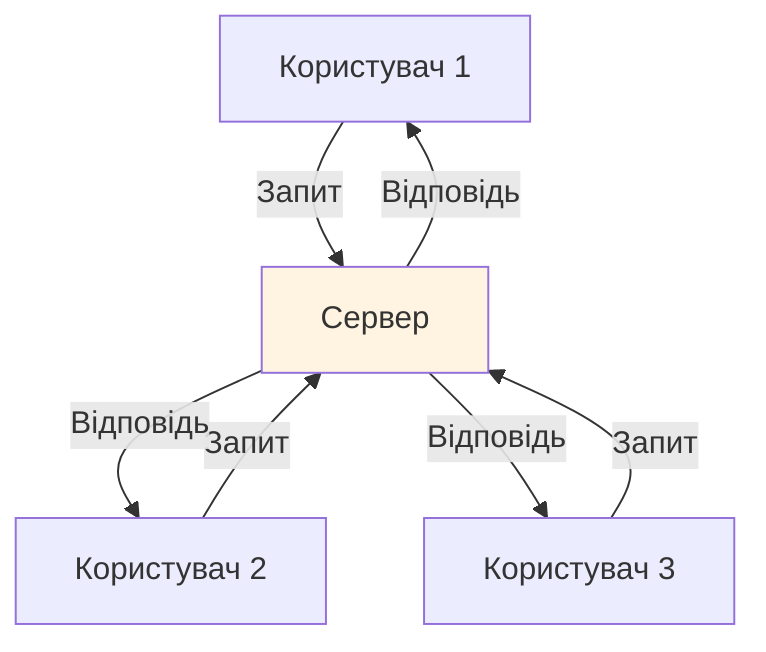
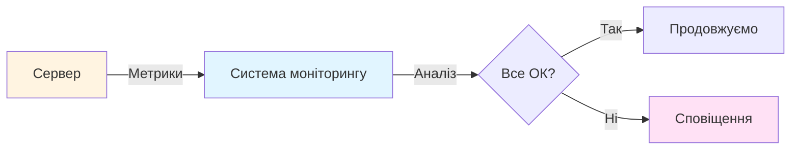

> **Академічна доброчесність.** Матеріали відповідають вимогам [Закону України № 4742-IX](../DISCLAIMER.md). Використання ШІ — [протокол](../10_ai_lectures.md). Оцінювання — [Risk & Reward](../06_grading_experiment.md). Джерела курсу: [sources.md](./sources.md).

# Глосарій курсу: Від математики до DevOps

> **Для кого:** Студенти 2-го курсу технічного університету  
> **Мета:** Зрозуміти терміни курсу через аналогії та приклади  
> **Стиль:** Як на університетському воркшопі — просто, зрозуміло, з прикладами

---

##  Зміст

1. [Хибні друзі: Терміни, що означають різне](#хибні-друзі-терміни-що-означають-різне)
2. [Доменні знання: Контекст DevOps](#доменні-знання-контекст-devops)
3. [XAI Primer: Математична інтуїція](#xai-primer-математична-інтуїція)
4. [Python бібліотеки: Що це таке?](#python-бібліотеки-що-це-таке)

---

## Хибні друзі: Терміни, що означають різне

###  Regression (Регресія)

#### У математиці (що ви знаєте):
**Лінійна регресія** — це метод знаходження лінії, яка найкраще описує залежність між змінними.

**Приклад:** Знайти пряму $y = ax + b$, що найкраще проходить через точки $(x_1, y_1), (x_2, y_2), \ldots$.

```python
# Математична регресія
from sklearn.linear_model import LinearRegression
model = LinearRegression()
model.fit(X, y)  # Знаходимо коефіцієнти a та b
```

#### У DevOps (що ви НЕ знаєте):
**Regression** (деградація) — це коли система працює гірше, ніж раніше.

**Аналогія:** Якщо ваш автомобіль раніше розганявся до 100 км/год за 10 секунд, а тепер за 15 секунд — це регресія продуктивності.

**Приклад:**
```
Раніше: latency = 150ms
Тепер:   latency = 350ms
→ Це регресія (деградація) продуктивності
```

**Як розрізнити в контексті:**
- "Linear regression" = математика
- "Performance regression" = DevOps (проблема)
- "Regression testing" = тестування (перевірка, що нічого не зламалося)

---

###  Latency (Затримка)

#### У мережах (що ви знаєте):
**Latency** — це час, за який пакет даних доходить від точки A до точки B.

**Аналогія:** Як час доставки листа поштою.

#### У DevOps (що ви НЕ знаєте):
**Latency** — це час від моменту, коли користувач надіслав запит, до моменту отримання відповіді.

**Аналогія:** Ви замовляєте каву в кафе. Latency — це час від моменту замовлення до отримання кави.


**Приклад:**
- `request_latency_p50 = 150ms` означає: 50% запитів обробляються швидше за 150 мілісекунд
- `request_latency_p95 = 280ms` означає: 95% запитів обробляються швидше за 280 мілісекунд

**Чому це важливо:** Високий latency = користувачі чекають довго = поганий досвід.

---

###  Threshold (Поріг)

#### У математиці (що ви знаєте):
**Threshold** — це граничне значення, межа.

**Приклад:** Якщо $x > \theta$, то виконується умова.

#### У DevOps (що ви НЕ знаєте):
**Threshold** — це значення метрики, при перевищенні якого спрацьовує сповіщення (alert).

**Аналогія:** Як термометр з будильником. Якщо температура піднімається вище 38°C — спрацьовує сигнал.

**Приклад:**
```python
# Якщо latency перевищує 200ms → сповіщення
if latency > 200:  # 200ms - це threshold
    send_alert("Latency too high!")
```

**Типи порогів:**
- **Hard threshold (жорсткий):** Будь-яке порушення = критична проблема
- **Soft threshold (м'який):** Порушення = попередження, але не критично

---

###  Baseline (Базовий рівень)

#### У математиці (що ви знаєте):
**Baseline** — це початкове значення для порівняння.

**Приклад:** У експерименті baseline = контрольна група.

#### У DevOps (що ви НЕ знаєте):
**Baseline** — це "здоровий" стан системи, з яким порівнюємо поточний стан.

**Аналогія:** Як фото "до" та "після" в рекламі. Baseline = фото "до" (нормальний стан).

**Приклад:**
```
Baseline (здоровий стан):
  - latency: 150ms
  - CPU: 40%
  - Memory: 60%

Target (поточний стан, можливо хворий):
  - latency: 350ms  ← Проблема!
  - CPU: 70%
  - Memory: 85%
```

**Чому це важливо:** Без baseline ми не знаємо, чи є проблема. Може, 350ms — це нормально для цієї системи?

---

## Доменні знання: Контекст DevOps

###  Сервер (Server)

**Що це:** Комп'ютер, який обробляє запити від користувачів.

**Аналогія:** Як офіціант у ресторані. Користувачі (клієнти) надсилають запити (замовлення), сервер (офіціант) обробляє їх і повертає відповідь (страви).



**Приклад:** Коли ви відкриваєте сайт, ваш браузер надсилає запит до сервера, сервер обробляє його і повертає HTML-сторінку.

---

###  CPU (Central Processing Unit)

**Що це:** Процесор — "мозок" комп'ютера, який виконує обчислення.

**Аналогія:** Як кухня в ресторані. CPU usage = наскільки завантажена кухня. 100% = кухня працює на повну, не може прийняти більше замовлень.

**Метрики:**
- `cpu_usage = 0.42` означає: CPU використовується на 42%
- `cpu_usage = 1.0` означає: CPU завантажений на 100% (проблема!)

**Чому це важливо:** Високий CPU = система повільніша, може не встигати обробляти запити.

---

###  RAM (Random Access Memory) / Memory

**Що це:** Оперативна пам'ять — швидка пам'ять, де зберігаються дані, з якими комп'ютер працює зараз.

**Аналогія:** Як робочий стіл. Чим більше на столі (більше пам'яті), тим більше можна працювати одночасно. Якщо стіл переповнений (пам'ять закінчилася), треба щось прибрати (використати жорсткий диск, але він повільніший).

**Метрики:**
- `memory_usage = 0.68` означає: використовується 68% пам'яті
- `memory_usage = 1.0` означає: пам'ять повністю заповнена (проблема!)

**Що таке "Memory Leak":**
**Аналогія:** Як раковина, яка не закривається. Вода (пам'ять) постійно тече, навіть коли не потрібно. Через деякий час вся пам'ять "витікає", система сповільнюється.

---

###  Метрики (Metrics)

**Що це:** Числові показники, які описують стан системи.

**Аналогія:** Як показники на панелі автомобіля: швидкість, обороти двигуна, температура. Метрики сервера — це те саме, але для комп'ютера.

**Приклади метрик:**
- `cpu_usage` — використання процесора (0.0 до 1.0)
- `memory_usage` — використання пам'яті (0.0 до 1.0)
- `latency` — затримка відповіді (мілісекунди)
- `db_calls` — кількість запитів до бази даних (число)
- `error_rate` — частка помилок (0.0 до 1.0)

**Чому це важливо:** Метрики показують, чи система працює нормально. Якщо метрики відхиляються від норми — є проблема.

---

###  Профіль системи (System Profile)

**Що це:** Знімок всіх метрик системи в певний момент часу.

**Аналогія:** Як аналіз крові в медицині. Ви здаєте кров, отримуєте звіт з усіма показниками (гемоглобін, лейкоцити, тощо). Профіль системи — це те саме, але для комп'ютера.

**Приклад JSON-профілю:**
```json
{
  "timestamp": "2024-01-15T10:30:00Z",
  "metrics": {
    "cpu_usage": 0.42,
    "memory_usage": 0.68,
    "db_calls": 125,
    "latency": 150
  }
}
```

**Чому це важливо:** Порівнюючи два профілі (baseline vs target), ми можемо знайти, що саме змінилося.

---

###  Реліз (Release) / Версія

**Що це:** Нова версія програмного забезпечення, яку випускають для користувачів.

**Аналогія:** Як нове видання книги. Версія 1.0, потім 1.1 (виправлення помилок), потім 2.0 (великі зміни).

**Приклад:**
- `v2.3` — версія 2.3
- `v2.4` — нова версія 2.4

**Що означає "відкати реліз":**
**Аналогія:** Якщо нове видання книги має помилки, повертаємося до попереднього видання. "Відкатити реліз v2.4" = повернутися до версії v2.3.

**Чому це важливо:** Після нового релізу можуть з'явитися проблеми. Якщо проблема критична, відкатують до попередньої версії.

---

###  База даних (Database) / DB

**Що це:** Місце, де зберігаються дані (користувачі, товари, замовлення, тощо).

**Аналогія:** Як величезна бібліотека з книгами. Коли потрібна інформація, ви йдете до бібліотеки (бази даних) і шукаєте книгу (запит).

**Що таке `db_calls`:**
**Аналогія:** Кількість разів, коли ви ходили до бібліотеки за інформацією. Якщо ви робите багато `db_calls`, це як ходити до бібліотеки 100 разів замість того, щоб взяти всі книги одразу.

**Чому це важливо:** Кожен `db_calls` займає час. Багато викликів = висока latency.

---

###  Garbage Collection (GC)

**Що це:** Автоматичне очищення пам'яті від непотрібних даних.

**Аналогія:** Як прибиральник, який періодично прибирає сміття зі столу. Ви працюєте, накопичується сміття (непотрібні дані в пам'яті), прибиральник (GC) періодично прибирає.

**Проблема:** Якщо прибиральник працює занадто часто або занадто рідко, це може сповільнити роботу.

**Що означає "збільшити GC rate":**
**Аналогія:** Попросити прибиральника прибирати частіше, щоб стіл не переповнювався сміттям.

---

###  Моніторинг (Monitoring)

**Що це:** Постійне спостереження за метриками системи.

**Аналогія:** Як моніторинг здоров'я в лікарні. Пацієнт (сервер) підключений до приладів (метрики), які постійно вимірюють показники (пульс, тиск, температура). Якщо щось не так — спрацьовує сигнал.



---

###  Performance Doctor

**Що це:** Система, яка автоматично діагностує проблеми та пропонує рішення.

**Аналогія:** Як лікар-терапевт:
1. **Detection (Виявлення):** "У вас підвищена температура" — виявлено проблему
2. **Diagnosis (Діагностика):** "Це через інфекцію" — знайдено причину
3. **Prescription (Рецепт):** "Приймайте антибіотики" — запропоновано рішення

**У нашому курсі:**
1. **Detection:** Comparator Engine виявляє, що latency зросла
2. **Diagnosis:** SHAP показує, що причина — `db_calls`
3. **Prescription:** Counterfactual аналіз пропонує зменшити `db_calls` до 150

---

###  A/B Testing

**Що це:** Порівняння двох версій системи, щоб зрозуміти, яка краща.

**Аналогія:** Як тестування двох рецептів торта. Ви готуєте торт A та торт B, даєте їх спробувати людям і дивитеся, який смачніший.

**У DevOps:**
- Версія A (baseline): стара версія, що працює нормально
- Версія B (target): нова версія, яку тестуємо

**"A/B Testing on Steroids":**
**Аналогія:** Замість простого "який краще", ми автоматично порівнюємо сотні метрик і знаходимо всі відмінності.

---

###   JSON (JavaScript Object Notation)

**Що це:** Формат зберігання даних у вигляді тексту.

**Аналогія:** Як структурований список покупок:
```json
{
  "молоко": 2,
  "хліб": 1,
  "яйця": 10
}
```

**У нашому курсі:** Профілі системи зберігаються у форматі JSON.

**Що означає "парсинг JSON":**
**Аналогія:** Як читання списку покупок. Ви читаєте текст і розумієте, що там написано. "Парсинг" = читання та розуміння структури.

---

###  Production / Staging

**Production (продакшн):** Реальна система, якою користуються справжні користувачі.

**Staging:** Тестова копія production, де перевіряють зміни перед випуском.

**Аналогія:**
- **Production** = справжній ресторан, де їдять клієнти
- **Staging** = тестова кухня, де перевіряють нові страви перед додаванням до меню

**Чому це важливо:** Зміни спочатку тестують на staging, щоб не зламати production.

---

## XAI Primer: Математична інтуїція

###  Shapley Values (Значення Шеплі)

#### Аналогія: Справедливий розподіл рахунку в таксі

**Сценарій:** Троє друзів їдуть в таксі. Вартість поїздки — 100 гривень. Як чесно розділити рахунок?

**Варіанти:**
- Гравець A сам: 30 грн
- Гравець B сам: 50 грн
- Гравець C сам: 0 грн (не може доїхати сам)
- Разом (A+B+C): 100 грн

**Питання:** Як розділити 100 грн між A, B та C?

**Рішення Шеплі:** Враховуємо внесок кожного в усі можливі комбінації:

1. A їде сам: платить 30 грн
2. B їде сам: платить 50 грн
3. C їде сам: не може (0 грн)
4. A+B їдуть разом: платять, скажімо, 70 грн (A додає 20 грн до B)
5. A+C їдуть разом: платять 30 грн (C не додає вартості)
6. B+C їдуть разом: платять 50 грн (C не додає вартості)
7. A+B+C їдуть разом: платять 100 грн

**Формула Шеплі:** Середньозважений внесок кожного гравця.

**У машинному навчанні:**
- **Гравці** = ознаки (CPU, DB_calls, Memory)
- **Виграш** = прогноз моделі (latency = 350ms)
- **Питання:** Який внесок кожної ознаки в прогноз?

**Приклад:**
```
Базове значення (середній прогноз): 244ms
Поточний прогноз: 350ms
Різниця: 106ms

Внесок кожної ознаки (Shapley Values):
- DB_calls: +95.2ms  ← Найбільший внесок!
- CPU_usage: +28.5ms
- Memory_usage: +12.3ms
- Network_latency: -30.0ms (зменшує latency)

Сума: 95.2 + 28.5 + 12.3 - 30.0 = 106ms ✓
```

**Чому це важливо:** Тепер ми знаємо, що проблема в `DB_calls`, а не в `CPU_usage`.

---

###  LIME (Local Interpretable Model-agnostic Explanations)

#### Аналогія: Локальна апроксимація гори

**Сценарій:** Ви стоїте на складній горі. Щоб зрозуміти форму гори, ви не намагаєтеся описати всю гору одразу. Замість цього ви дивитеся на невелику ділянку навколо себе та апроксимуєте її плоскою поверхнею (дотичною площиною).

**У машинному навчанні:**
- **Гора** = складна модель (нейромережа)
- **Ділянка навколо вас** = один конкретний приклад
- **Плоска поверхня** = проста лінійна модель

**Як працює LIME:**

1. **Генерація зразків:** Створюємо багато варіантів навколо поточного прикладу
2. **Прогнози:** Отримуємо прогнози від складної моделі для цих зразків
3. **Навчання простої моделі:** Навчаємо просту лінійну модель, яка апроксимує складну модель локально

**Приклад:**
```python
# Складна модель (нейромережа)
complex_model.predict(instance) = 350ms

# LIME будує просту модель навколо цього прикладу:
simple_model = 244 + 95.2*db_calls + 28.5*cpu_usage + ...

# Тепер ми розуміємо, чому модель передбачила 350ms
```

**Чому це важливо:** Навіть якщо модель складна, ми можемо пояснити її рішення локально.

---

###  Counterfactual (Контрфактуальне мислення)

#### Аналогія: Паралельні всесвіти

**Сценарій:** Ви прокинулися з головним болем. Ви думаєте: "Що, якби я вчора не пив алкоголь? Чи був би у мене головний біль?"

**Це і є контрфактуальне мислення:** "Що, якби X було іншим? Який був би результат?"

**У машинному навчанні:**
- **Поточний стан:** `db_calls = 280`, `latency = 350ms` (проблема)
- **Контрфактуальне питання:** "Що, якби `db_calls = 150`? Яка була б latency?"
- **Відповідь:** Модель передбачає `latency ≈ 185ms` (норма!)

**Математична задача:**
$$\min_{x_{cf}} \quad d(x, x_{cf}) + \lambda \cdot L(f(x_{cf}), y^*)$$

Де:
- $x$ — поточний стан
- $x_{cf}$ — контрфактуальний стан (що треба змінити)
- $y^*$ — бажаний результат (latency < 200ms)
- $d(x, x_{cf})$ — мінімальна зміна
- $L(f(x_{cf}), y^*)$ — наскільки близько до бажаного результату

**Приклад:**
```
Поточний стан:
  db_calls: 280
  latency: 350ms (проблема)

Контрфактуали (що треба змінити):
CF1: db_calls: 150 → latency: 185ms ✓
CF2: db_calls: 180, cpu_usage: 0.45 → latency: 195ms ✓
CF3: db_calls: 200, memory_usage: 0.70 → latency: 198ms ✓
```

**Чому це важливо:** Замість просто пояснення ("чому так сталося"), ми отримуємо дієву пораду ("що треба змінити").

---

###  PCA (Principal Component Analysis)

#### Аналогія: Спрощення багатовимірного простору

**Сценарій:** У вас є 100 різних метрик (CPU, Memory, Network, тощо). Як зрозуміти, які з них найважливіші?

**PCA робить:** Знаходить "головні напрямки" (principal components), які пояснюють більшість варіативності.

**Аналогія:** Якщо ви дивитеся на тривимірний об'єкт збоку, він виглядає двовимірним. PCA знаходить найкращий "кут огляду", з якого об'єкт найбільш інформативний.

**Математика:**
1. **Стандартизація:** Нормалізуємо дані
2. **Коваріаційна матриця:** Знаходимо, як метрики корелюють між собою
3. **Власні значення та вектори:** Знаходимо головні напрямки
4. **Вибір компонент:** Беремо стільки компонент, щоб пояснити ≥95% варіативності

**Приклад:**
```
Вхідні метрики (10 штук):
  cpu_usage, cpu_freq, cpu_temp, memory_usage, ...

PCA знаходить:
  Component 1: пояснює 60% варіативності
  Component 2: пояснює 25% варіативності
  Component 3: пояснює 10% варіативності
  → Разом: 95% варіативності

Вихід: 3 компоненти замість 10 метрик
```

**Чому це важливо:** Замість працювати з 10 метриками, ми працюємо з 3 компонентами, які містять майже всю інформацію.

---

###  Лінійна регресія (Linear Regression)

#### Що ви вже знаєте:
Знаходження прямої $y = ax + b$, яка найкраще описує залежність між $x$ та $y$.

#### У нашому курсі:
Використовується для знаходження **інваріантів** — стійких лінійних залежностей між метриками.

**Приклад інваріанта:**
```
temperature = 0.5 × cpu_usage + 40°C
```

Це означає: якщо CPU використовується на 50%, температура буде 65°C. Якщо ця залежність порушується — це аномалія!

**Метод найменших квадратів (OLS):**
$$a = \frac{\text{Cov}(x, y)}{\text{Var}(x)} = \frac{\sum_{i=1}^{n}(x_i - \bar{x})(y_i - \bar{y})}{\sum_{i=1}^{n}(x_i - \bar{x})^2}$$

$$b = \bar{y} - a \cdot \bar{x}$$

**Коефіцієнт кореляції Пірсона:**
$$r = \frac{\text{Cov}(x, y)}{\sigma_x \sigma_y}$$

Якщо $|r| > 0.93$, спостерігається сильна лінійна залежність (strong linear dependence).

---

###  Кореляція vs Причинність

#### Аналогія: Парасолька та дощ

**Кореляція:** Коли йде дощ, багато людей розкривають парасольки. Є зв'язок між дощем та парасольками.

**Причинність:** Дощ **викликає** використання парасольок, а не навпаки.

**Помилка:** Якщо ми бачимо кореляцію "парасольки → дощ", це не означає, що парасольки викликають дощ!

**У машинному навчанні:**
- **Кореляція:** Модель бачить зв'язок між ознаками та результатом
- **Причинність:** Реальна фізична залежність

**Приклад з курсу:**
- Модель може вивчити: "сніг на фоні = вовк" (кореляція)
- Але реальна причинність: "вовк живе в сніговому кліматі"

**Чому це важливо:** XAI пояснює кореляції, але для справжнього розуміння потрібна причинність (causal inference).

---

## Python бібліотеки: Що це таке?

###  NumPy

**Що це:** Бібліотека для роботи з масивами та матрицями.

**Аналогія:** Як калькулятор, але для масивів чисел.

**Приклад:**
```python
import numpy as np

# Масив чисел
arr = np.array([1, 2, 3, 4, 5])

# Матриця
matrix = np.array([[1, 2], [3, 4]])

# Операції
result = matrix @ matrix  # Множення матриць
```

**У нашому курсі:** Використовується для обчислень з метриками.

---

###  Pandas

**Що це:** Бібліотека для роботи з таблицями даних (DataFrame).

**Аналогія:** Як Excel, але в Python.

**Приклад:**
```python
import pandas as pd

# Створення таблиці
df = pd.DataFrame({
    'cpu_usage': [0.42, 0.58, 0.35],
    'latency': [150, 350, 120]
})

# Читання даних
print(df['cpu_usage'])  # Колонка
print(df.iloc[0])       # Рядок
```

**У нашому курсі:** Використовується для зберігання та обробки метрик.

---

###  Scikit-learn (sklearn)

**Що це:** Бібліотека для машинного навчання.

**Аналогія:** Як набір інструментів для будівництва. Кожен інструмент (клас) робить свою роботу.

**Основні класи:**
- `LinearRegression` — лінійна регресія
- `PCA` — Principal Component Analysis
- `StandardScaler` — стандартизація даних
- `RandomForestRegressor` — випадковий ліс (складна модель)

**Приклад:**
```python
from sklearn.linear_model import LinearRegression
from sklearn.decomposition import PCA

# Лінійна регресія
model = LinearRegression()
model.fit(X, y)

# PCA
pca = PCA(n_components=3)
pca.fit(X)
```

**У нашому курсі:** Використовується для навчання моделей та обробки даних.

---

###  SHAP (бібліотека)

**Що це:** Бібліотека для обчислення Shapley Values.

**Аналогія:** Як калькулятор, який автоматично обчислює справедливий розподіл рахунку в таксі.

**Приклад:**
```python
import shap

# Створення explainer
explainer = shap.TreeExplainer(model)

# Обчислення SHAP-значень
shap_values = explainer.shap_values(X)

# Візуалізація
shap.waterfall_plot(shap_values[0])
```

**У нашому курсі:** Використовується для пояснення прогнозів моделей.

---

### 🍋 LIME (бібліотека)

**Що це:** Бібліотека для локального пояснення моделей.

**Аналогія:** Як інструмент, який будує просту модель навколо складного об'єкта.

**Приклад:**
```python
import lime
import lime.lime_tabular

# Створення explainer
explainer = lime.lime_tabular.LimeTabularExplainer(
    X_train.values,
    feature_names=feature_names
)

# Пояснення
explanation = explainer.explain_instance(
    instance,
    model.predict_proba
)
```

**У нашому курсі:** Використовується як альтернатива SHAP для пояснення моделей.

---

###  DiCE (бібліотека)

**Що це:** Бібліотека для генерації контрфактуалів.

**Аналогія:** Як генератор альтернативних сценаріїв "що, якби".

**Приклад:**
```python
import dice_ml
from dice_ml import Dice

# Створення explainer
explainer = Dice(data, model)

# Генерація контрфактуалів
counterfactuals = explainer.generate_counterfactuals(
    query_instance,
    total_CFs=5,
    desired_range=[0, 200]
)
```

**У нашому курсі:** Використовується для генерації рекомендацій виправлення.

---

##  Підсумок: Швидкий довідник

### Терміни, які ви вже знаєте (математика):
- ✅ **Регресія** (лінійна) — знаходження прямої
- ✅ **Кореляція** — зв'язок між змінними
- ✅ **Матриці** — двовимірні масиви чисел
- ✅ **Похідні** — швидкість зміни функції

### Терміни, які ви НЕ знаєте (DevOps):
- ❓ **Регресія** (деградація) — система працює гірше
- ❓ **Latency** — час відповіді системи
- ❓ **CPU/RAM** — ресурси комп'ютера
- ❓ **Метрики** — показники стану системи
- ❓ **Профіль** — знімок метрик
- ❓ **Моніторинг** — спостереження за системою

### Терміни XAI (новий матеріал):
- 🆕 **Shapley Values** — справедливий розподіл внеску
- 🆕 **LIME** — локальна апроксимація
- 🆕 **Counterfactual** — "що, якби"
- 🆕 **PCA** — зменшення розмірності
- 🆕 **SHAP/LIME/DiCE** — бібліотеки Python

---

## 📖 Як користуватися цим глосарієм

1. **Під час читання курсу:** Якщо зустріли незрозумілий термін, знайдіть його тут
2. **Перед семінаром:** Перечитайте відповідні розділи
3. **Під час виконання завдань:** Використовуйте як довідник

---

##  Додаткові ресурси

- **NumPy Tutorial:** [numpy.org/doc/stable/user/quickstart.html](https://numpy.org/doc/stable/user/quickstart.html)
- **Pandas Tutorial:** [pandas.pydata.org/docs/getting_started/intro_tutorials/](https://pandas.pydata.org/docs/getting_started/intro_tutorials/)
- **Scikit-learn Guide:** [scikit-learn.org/stable/user_guide.html](https://scikit-learn.org/stable/user_guide.html)

---

**Приємного навчання! 🚀**

Якщо знайшли термін, якого тут немає, повідомте викладача — додамо його до глосарію.
